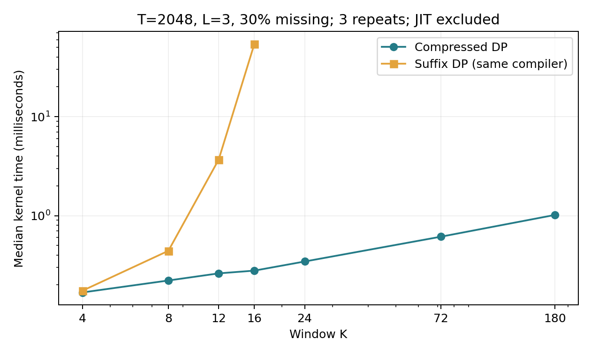
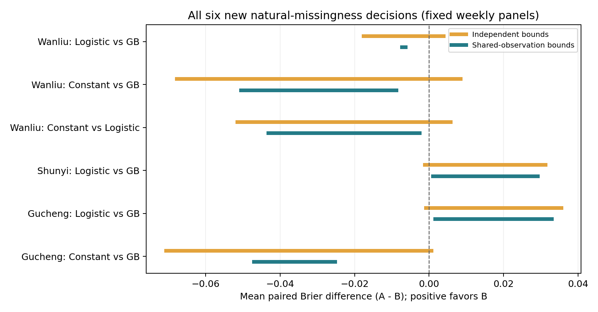

# 候选 A：共享缺测持续事件的首轮科研验证

2026-09-16 · FreeSakura。目标是检验共享底层缺测是否影响持续事件预警模型的胜负判断，以及能否高效计算精确范围。本轮已完成推导、实现、公开数据资格检查和真实实验；未恢复旧六折任务。

**结论：计算可行性已建立，并出现有限但真实的局部决策价值。尚未证明普遍的模型选择收益，也未建立足够充分的新颖性证据。** 后续应聚焦“局部有限面板的比较证书与长窗口精确计算”，不能把结果扩张为整体排行榜改进。

## 1. 本轮产物

| 产物 | 已完成内容 |
|---|---|
| 算法 | 用末尾游程长度和最近完整游程的年龄压缩状态，精确求配对损失最小/最大值 |
| 推导 | 状态充分性、精确性、复杂度、分量同号判据、独立端点可达性的充要条件及冲突解释 |
| 正确性 | 4,647 个穷举案例、250 个旧 V3 DP 对照；6 个真实决策改变用独立整数规划复核 |
| 数据 | 两个 UCI 官方完整压缩包已取得并通过 CRC；流式提取的功率前缀与完整原包逐字节一致 |
| 首轮实验 | 4 组固定数据集×窗口设置，8 个拟合分类器及常数参考，完整报告1,278个模型对×面板 |
| 资格补充 | 功率前缀从90天延至180天，另4个分类器、78个模型对×面板；保留原轮结果 |

首轮三种预测器为训练频率常数、L2逻辑回归和固定参数的直方图梯度提升树。训练只使用窗口标签已由观测确定的样本；这可能有选择偏差，因此不把预测器视为充分调优的领域最佳系统。评价算法比较的是这些已固定预测。

## 2. 数学与算法

预测 A、B 的 Brier 损失差可写为固定常数加 `2(b−a)×事件标签`。未知底层观测在重叠窗口间必须取一致值。

对 K 长窗口内含 L 个连续高值记录这一特定事件，保存 `(r,d)` 即可：r 为截断的末尾连续高值数，d 为截断的最近完整游程年龄。状态槽上界从 `2^(K−1)` 变为 `L(K−L+2)`；时间上界为 `O(T L(K−L+2))`，不是对任意事件都成立的通用多项式保证。

所有 T≤5 的三值观测及合法 K、L 均进入穷举；每组使用固定随机系数，再枚举全部合法补全。加上250组与原 V3 的差分对照，最大绝对误差为 **3.55×10⁻¹⁵**。这与[完整归纳证明](../../theory/SHARED_MISSING_EVENTS_COMPRESSION.md)共同支撑实现正确性。

相同 Numba 编译方式、T=2048、L=3、30%未知、预热后重复3次的内核计时：K=16 时压缩 DP 约 **0.278 ms**，后缀 DP 约 **54.295 ms**，约 **195倍**。K=24/72/180 的压缩 DP 均已运行；没有执行旧算法对应大窗口，未把理论状态数比当成实测加速。



来源：[正确性回执](../../../artifacts/summaries/shared_missing_events_ap0/verification.json)、[完整计时表](../../../artifacts/summaries/shared_missing_events_ap0/algorithm_timings.csv)。这些是本机特定输入的计时，不是通用硬件加速承诺。

## 3. 数据、时序与泄漏控制

| 数据范围 | 记录数 | 缺失数 | 事件 |
|---|---:|---:|---|
| 北京12站首年 | 105,120 | 1,753 | PM2.5≥75，K=24/72，L=3 |
| 家庭功率首90天 | 129,600 | 8 | 分钟平均功率≥3kW，K=60/180，L=5 |
| 家庭功率首180天补充 | 259,200 | 3,772 | 同一阈值、K、L和预测器规则 |

这些是高值记录事件，不是法定污染预警、设备过载或采样间连续高值的证明。时间格点及前缀资格检查见[首轮数据表](../../../artifacts/summaries/shared_missing_events_ap0/data_qualification.csv)、[补充数据表](../../../artifacts/summaries/shared_missing_events_ap0/power_extension/data_qualification.csv)和[文件完整性记录](../../../artifacts/summaries/shared_missing_events_ap0/data_integrity.json)。

首轮训练/保留/评价按时间切分，训练标签必须完整结束于训练终点。保留段未用于调参。各原点输入只使用严格更早的观测，加上预先可知的日历和站点标识；前向填充用于预测器输入，不替代评价标签真值。

人工遮蔽采用固定 IID 10%、IID 30%及名义10%成块遮蔽，实际遮蔽量逐行记录。先删除被遮蔽的原始观测，再计算因果输入；原完整标签仅用于检查界的包含关系。所有模型对均报告，未根据评价结果选择阈值、模型或后处理。

**180天功率数据是首轮结果之后的探索性资格补充。** 原90天前缀只有8个缺失，评价段只有2个且没有模糊事件标签，无法检验自然缺测价值。补充扩大时间前缀，覆盖发布方事先说明的2007年4月缺测；没有改阈值或模型。它不能算作未接触过的独立确认性验证。[补充协议](../../../configs/research/SHARED_MISSING_EVENTS_AP0_POWER_EXTENSION_20260916.json)

## 4. 比较价值：完整分母与负结果

| 评价范围 | 比较数 | 独立界有宽度 | 联合界严格缩窄 | 新增严格胜负判断 |
|---|---:|---:|---:|---:|
| 首轮完整站点评价段 | 78 | 42 | 31 | **0** |
| 首轮固定7天局部块 | 966 | 57 | 33 | **6** |
| 首轮人工遮蔽 | 234 | 213 | 182 | **8** |
| 功率补充完整评价段 | 6 | 6 | 6 | **0** |
| 功率补充固定7天局部块 | 54 | 18 | 8 | **0** |
| 功率补充人工遮蔽 | 18 | 18 | 5 | **0** |

每条是一个模型对×面板，不是独立统计重复。局部块按固定长度从评价起点划分，非事后寻找有利日期，也不一定与日历周对齐。整段和局部块是不同评价对象，不能相互替代。

首轮6个自然新增判断均来自北京 K=24、起点7914的同一局部时段，涉及 Gucheng、Shunyi、Wanliu 三站。**其中3个是逻辑回归与梯度提升树之间的比较，另3个涉及常数参考。** 它们存在跨站时间聚集，不能声称6次独立确认或跨场景普遍成功。

例如 Gucheng 的逻辑回归减梯度提升树，独立界为约 `[−0.000848, 0.035525]`，无法给出严格胜负；联合界为 `[0.001696, 0.032981]`，在该有限面板的所有相容补全下，梯度提升树损失更低。Wanliu 同一模型对则得到相反方向的确定判断，方法没有固定偏好某种预测器。



这6例全部用不同建模方式的整数线性规划求最小/最大值：分别为底层位、L游程和K窗口事件建立二元变量及 AND/OR 约束。求解达到零 MIP gap，重构可行端点，和压缩 DP 的最大端点差约为 **9.71×10⁻¹⁷**。[独立复核](../../../artifacts/summaries/shared_missing_events_ap0/independent_milp_verification.json)

234+18个人工遮蔽比较中，已知完整真值的实际配对差全部落在联合界内，违反数为0。这验证已知真值条件下的包含性，不等于恢复了自然缺测真值，也不是95%置信覆盖率。

所有主表、逐站、局部块及人工遮蔽结果见[首轮全表](../../../artifacts/summaries/shared_missing_events_ap0/paired_bounds.csv)、[首轮整段合并](../../../artifacts/summaries/shared_missing_events_ap0/pooled_bounds.csv)、[补充全表](../../../artifacts/summaries/shared_missing_events_ap0/power_extension/paired_bounds.csv)。

## 5. 为什么很多情形没有收益

除“整个面板的标签系数同号”外，本轮推导了更强的条件：只连接共享未知位的模糊窗口；若每个依赖分量内部同号，逐窗独立界已经精确。不同分量可以独立选择全低/全高补全，因此全局存在正负系数也不一定需要联合 DP。

在首轮57个有模糊标签的局部比较中，该判据直接证明 **24个**独立界已精确；功率补充对应 **10/18**。完整评价段对应首轮 **11/42**、补充 **0/6**。全部已保存自然比较均与该判据一致。[分量诊断](../../../artifacts/summaries/shared_missing_events_ap0/component_sign_summary.json)

“同一分量存在正负系数”只是严格缩窄的必要条件，不能保证有收益。这个解释比“缺失率越高就一定越有用”准确，也提供了跳过不必要联合计算的依据。

进一步的充要条件是：**独立端点精确，当且仅当各窗口为该端点选出的极端标签能由同一个底层补全同时实现。** 我们用布尔可达性而非数值优化检查，并删除多余要求来提取冲突核。本轮6个自然新增判断，均能用仅两个窗口的互不相容要求展示问题；例如 Gucheng 的一个独立下界要求相邻窗口23为真、24为假，但给定观测下无法同时实现。[全部冲突证书](../../../artifacts/summaries/shared_missing_events_ap0/independent_endpoint_conflicts.json)

这是对界缩窄原因的可检查解释，不是额外模型筛选。一般提取算法只保证删除意义下最小，不保证最小基数；本轮没有用人工指定的冲突去构造预测器。

## 6. 对候选 A 的研究判断

**已得到的证据：** 精确对象可以用紧凑状态求解；相对本仓库指数后缀算法的计算范围明显扩展；真实自然缺测中存在模型对胜负从未确定到确定的案例，并非只存在于人为构造或常数基线。

**仍然缺少的证据：** 全局排名没有新增判断；功率补充没有复现决策改变；北京收益集中在一个时段；三种轻量预测器并不覆盖充分调优的强预警系统。不能据此宣称普遍实用性或独立跨域确认。

**新颖性是当前最重要的未决问题。** 缺失标签指标界、游程有限状态、滑动窗口自动机和图上的极值递推都有既有研究。本轮尚未核实完整等价方案，但压缩状态及配对损失组合是否超过直接应用，需要更明确地对照一般加权自动机和部分轨迹评价。[近邻核查](../../reviews/SHARED_MISSING_EVENTS_LITERATURE_20260916.md)

因此，本轮支持继续研究 A，重点限定在“何时共享缺测改变局部模型比较、何时独立界已足够，以及怎样在长窗口精确计算”。它尚不足以宣称已形成具备 JCR Q2 投稿质量的完整论文；下一项科学工作应补最近邻算法对照及跨时段自然缺测证据，不恢复旧六折或并行启动 B/C。

## 7. 复现与投入

在仓库根目录安装 CPU 依赖，不需要基础模型权重或GPU：

```bash
python -m pip install -e ".[test,evidence]"
python scripts/research/fetch_shared_missing_data.py --output local-data/shared-events-data
python scripts/research/verify_persistent_events.py --output local-data/shared-events-verify
python scripts/research/run_shared_missing_p0.py --data local-data/shared-events-data --private local-data/shared-events-run --output local-data/shared-events-results
python scripts/research/run_shared_missing_p0.py --config configs/research/SHARED_MISSING_EVENTS_AP0_POWER_EXTENSION_20260916.json --data local-data/shared-events-data --private local-data/shared-events-run-extension --output local-data/shared-events-results-extension
python scripts/research/check_shared_missing_decisions.py --data local-data/shared-events-data --private local-data/shared-events-run --results local-data/shared-events-results
python -m pytest tests/test_persistent_events.py tests/test_shared_missing_pilot.py
```

两个真实数据流程分别约12.29秒和12.47秒墙钟、16.56秒和16.30秒CPU时间；不包括下载、文献阅读、推导、测试和绘图。数字来自本轮回执，不是所有机器的耗时保证。下载是本轮主要等待项；已取得的原包与前缀保存在本地研究工作目录。

原始数据及预测数组留在本地；仓库新增的是方法、配置、汇总、验证记录和图表。配置在首次结果之前写入，功率资格补充单独保存；原实验表没有被新结果替换。
