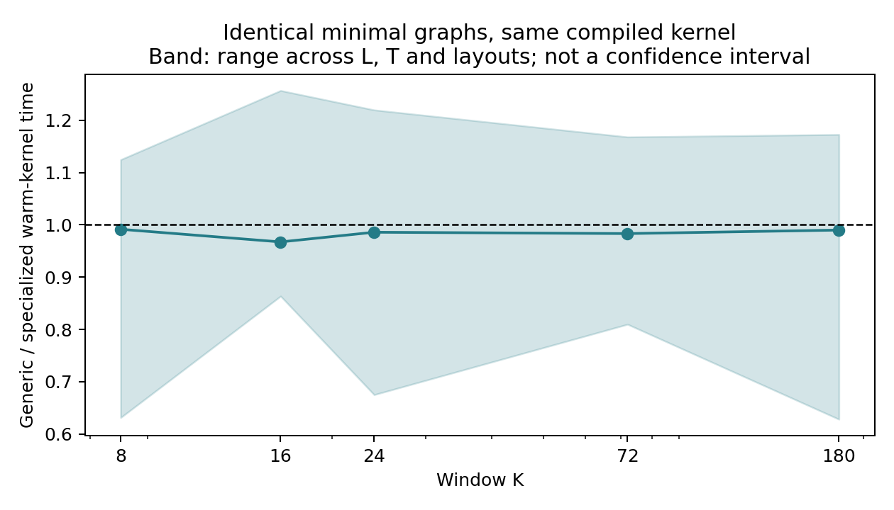
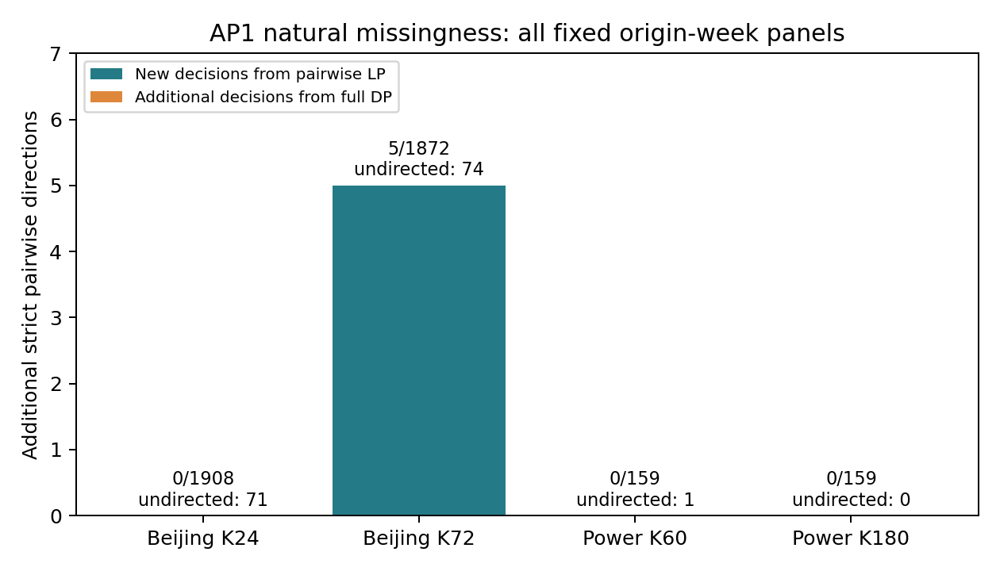

# AP1 完整结果：低阶一致性解释了已观察到的新增判断

2026-09-16。本轮执行收到的 [AP1计划](../../protocols/SHARED_MISSING_EVENTS_AP1_PLAN_20260916.md)，保留AP0结果，完成最近邻算法对照、全部旧自然面板重算、指定新年份评价、人工遮蔽和主张锁定。

**决定：将工作稿锁定为“一致性评价层次、低阶约束作用与适用边界”。撤回独立高效算法首创，以及完整轨迹优化带来额外真实模型选择收益的主张。** [论文主张锁定 v1](../../research/SHARED_MISSING_EVENTS_AP1_CLAIMS_LOCK.md)

## 1. 执行范围

| 项目 | 实际执行 |
|---|---|
| AP0回顾 | 首轮与功率180天补充的全部1,104个自然模型对×面板，沿用原预测和原原点 |
| 北京拟合/选择 | 2013-03—11月拟合，2013-12—2014-02月选择 |
| 北京新评价 | 2014-03-01至2015-03-01，右端点不含；12站 |
| 功率拟合/选择 | 已曝光前135天拟合，之后45天选择 |
| 功率新评价 | 2007-07-01至2008-07-01，右端点不含；单家庭 |
| 事件 | 北京K24/72、L3、阈值75；功率K60/180、L5、阈值3，均未改变 |
| 预测器 | 常数、LR、HGB；LR C=.01/.1/1/10，HGB叶规模7/15/31/63；仅旧验证Brier选取 |
| 调参实际工作量 | 32次学习器拟合，选出8个模型；另4个常数参考；无收敛警告 |
| 新评价输出 | 4,176个自然比较＋234个人工遮蔽比较，共4,410行 |
| 保留范围 | 北京2015-03起、功率2008-07起的AP2标签未用于本轮拟合、选择或评价 |

所有预测模型在新评价之前选定，不按证书数量、界宽或新年份分数选择。训练及选择只使用已识别标签，选择偏差没有因此消失；按季度和原点高/低/缺测状态的识别情况完整登记。[选择表](../../../artifacts/summaries/shared_missing_events_ap1/selection.csv) · [识别率](../../../artifacts/summaries/shared_missing_events_ap1/label_identification_rates.csv)

AP1局部块按预测原点定义：P个原点使用P+K−1条底层记录。最后不满7天的原点块也保留；年度界独立求解，未把可能共享缺失位的周界相加。AP0重算仍沿用旧的实际原点，不追改旧结果。[原点支持与跨块共享](../../../artifacts/summaries/shared_missing_events_ap1/origin_support_and_overlap.csv)

## 2. 最近邻算法：相同状态与相近内核成本

通用实现由NFA和普通语言运算生成事件语言，进行确定化、Hopcroft最小化，再计算加权路径；没有注入手写 `(r,d)` 状态。25组K/L包含K8/16/24/72/180及L1、3、5、中间值、L=K，均得到与手写图同构的最小DFA。最大测试图K180/L90有4,186个状态，全部构建完成。

150组T、K、L及IID/成块/自然功率布局上，端点一致。同一个编译内核下，通用图/手写图耗时比中位数 **0.986**，范围约0.628—1.257；这是计时波动范围，不是置信区间或显著性证据。**没有独立的求解内核优势。** 手写构图较快，但通用图能复用，不能把冷编译开销反复计入对手而给手写方法免费缓存。



构建、确定化、最小化与内核分别登记；JIT项明确是首次调用/磁盘缓存载入时间。冷图＋热内核端到端表是实测组成的相加，不冒称全新进程完整冷启动。内存表报告显式图数组与滚动DP数组，不是进程峰值RSS。

证据：[构建表](../../../artifacts/summaries/shared_missing_events_ap1/compiler_benchmark.csv)、[阶段剖分](../../../artifacts/summaries/shared_missing_events_ap1/compiler_stage_profiles.csv)、[150组计时](../../../artifacts/summaries/shared_missing_events_ap1/algorithm_benchmark.csv)、[端到端组成](../../../artifacts/summaries/shared_missing_events_ap1/end_to_end_component_accounting.csv)。

“低阶”也不自动代表每种输入上成本更低。计入每面板一次构图与三个模型对求解，当前北京年度LP中位耗时约27—38ms，DP约5—7ms；功率年度LP约65—97ms，DP约376—950ms。局部块多数可用简单情形直接求界。这里把LP作为逻辑层级对照，不提出“永远先跑LP”的部署策略。[分面板成本](../../../artifacts/summaries/shared_missing_events_ap1/algorithm_cost_summary.csv)

[Cost-Regular原文第3节及脚注1](https://hanalog.ca/wp-content/uploads/2016/09/DPR_CostReg.pdf)已包含随位置、取值和状态变化的弧成本。结合实测，本轮不再把“仿射化＋自动机最短/最长路径”作为新通用算法。[完整对应与状态证明](../../theory/SHARED_MISSING_EVENTS_AP1_THEORY.md)

## 3. AP0六例：两两LP已经足够

在全部旧自然面板上生成完整的两两蕴含关系，不针对赢家手工加约束。6个自然新增判断全部由两两LP获得，端点与完整DP一致。首轮固定局部块中真正的独立未定向分母是 **28**，所以描述性比例为6/966或6/28；原6/57只表示模糊标签比较中的占比。

候选集合在3个旧面板缩小：Gucheng、Wanliu新确认为常数最佳，Shunyi为HGB最佳。故不能说六例毫无选择意义，但它们没有证明高阶优化不可替代。[旧层级全表](../../../artifacts/summaries/shared_missing_events_ap1/ap0_hierarchy.csv) · [旧候选集合](../../../artifacts/summaries/shared_missing_events_ap1/ap0_candidate_sets.csv)

## 4. 新年份自然结果

| 设置与范围 | 比较数 | 独立未严格定向 | 两两LP新增 | 完整DP新增 | DP超过LP的新增 |
|---|---:|---:|---:|---:|---:|
| 北京K24，周原点块 | 1,908 | 71 | 0 | 0 | 0 |
| 北京K72，周原点块 | 1,872 | 74 | 5 | 5 | 0 |
| 功率K60，周原点块 | 159 | 1 | 0 | 0 | 0 |
| 功率K180，周原点块 | 159 | 0 | 0 | 0 | 0 |
| 所有站点年度面板 | 78 | 14 | 1 | 1 | 0 |

因此主报告的周级总数为 **5/4,098（0.122%）**；在独立未定向比较中为 **5/146（3.42%）**。独立未定向包括边界情形，完整分类另有单独表。年度的1/78不应加到周级次数后当作新的独立复现。



五个周级判断均在预先指定的北京K72补充设置：Guanyuan 2014-04-26与07-05，Gucheng 07-19，Huairou 05-31，Wanliu 11-01。对应5个不同时间块、4站，分布于第二、三、四季度。它们不再集中于AP0的同一个时段，但也不能视为5次统计独立复制。北京主设置K24无新增。

5个周级未被确定支配的候选集合均缩小，其中3个新确认为唯一最佳：Guanyuan 04-26和Huairou 05-31为HGB，Wanliu 11-01为常数；另2个只移除了HGB，保留常数与LR。站点年度Guanyuan/K72另移除了HGB，但没有产生唯一最佳。**两两LP已取得全部这些变化。**

跨站按完整年度面板同分母合并后，没有新增严格判断。[新增案例](../../../artifacts/summaries/shared_missing_events_ap1/new_natural_decisions.csv)、[候选集合汇总](../../../artifacts/summaries/shared_missing_events_ap1/candidate_summary.csv)、[年度合并](../../../artifacts/summaries/shared_missing_events_ap1/pooled_annual_bounds.csv)、[全部分类](../../../artifacts/summaries/shared_missing_events_ap1/decision_categories.csv)。

## 5. 更紧的界为何没有进一步改变判断

AP1的4,176个自然比较中，有49个在数值端点上显示完整DP相对两两LP进一步缩窄（阈值1e−10），但没有一个转化为额外严格判向。Gamma记录把逻辑不一致代价与原独立区间距零的余量分开；缩窄本身不等于跨零。

完整LP包含所有两两关系，仍不普遍等于完整轨迹集合：四个未知位、K2/L1的三窗反例中，两两界仍为`[-.25,.75]`，轨迹界为`[1/12,.75]`。**数学上可以需要高阶约束，与本轮真实判断是否需要它，是不同结论。**

所有端点保存Gamma、W_ind、模糊标签权重、混号分量、原零余量、LP规模和成本。[新年份全表](../../../artifacts/summaries/shared_missing_events_ap1/new_year_hierarchy.csv)。冲突分类区分二元核、高阶核和未提取精确大小，不把删除最小核说成最小基数，也不把共享核的权重重复相加。[冲突分类](../../../artifacts/summaries/shared_missing_events_ap1/endpoint_conflict_classification.csv)

## 6. 自然缺失、人工试验和标签选择偏差

新北京年度有2,498个缺失站点小时；新功率年度仅168个缺失分钟。功率负结果不能推出所有功率缺失情形都无效，但本轮不再延长年份寻找正例。缺失游程、跨站共现和相邻块共享位均按原数据描述，不推断共同故障原因。[缺失形态](../../../artifacts/summaries/shared_missing_events_ap1/missing_morphology.csv) · [共现表](../../../artifacts/summaries/shared_missing_events_ap1/beijing_missing_cooccurrence.csv)

人工试验维持原IID10%、IID30%、名义10%成块三机制。234个比较中，独立界、两两界及联合界对已知完整差值均无违反；LOCF标签插补错误定向10次，已识别标签点比较错误定向24次。两两和联合界均新增6个判断，没有高阶额外判断。不能把人工结果抵销自然数据的零结果，也不把零违反解释为95%置信覆盖率。[人工比较表](../../../artifacts/summaries/shared_missing_events_ap1/artificial_comparison.csv)

模型选择全部留在旧范围；识别标签训练/选择的偏差没有被本方法修复。模型不是领域充分调优的最强系统。当前用途是标签成熟后的回顾性报告，不能由此断言下一周部署收益、自动回滚收益或报警成本下降。

## 7. 独立核对与预算

按预定结果/缺测分层及字典序，轮流覆盖不同阶段、数据集和K，选出24个面板，每个检查全部3个模型对。保存采样清单后再运行MILP。9个面板完成全范围核对；15个完整面板超过预先声明的表示规模预算，明确记录未尝试，再对其固定前128个原点作独立诊断。

实际72个模型对（144个端点）均达到最优且与DP一致，最大平均端点误差约 **1.78×10⁻¹⁵**。没有将规模截尾写成OOM、无限耗时或全大面板已经被MILP核验。[分层清单](../../../artifacts/summaries/shared_missing_events_ap1/milp_sample_plan.csv)、[限制](../../../artifacts/summaries/shared_missing_events_ap1/milp_resource_policy.json)、[逐项回执](../../../artifacts/summaries/shared_missing_events_ap1/stratified_milp.csv)。

新年份流程约90.42秒墙钟、143.97秒CPU；算法基准约67.06秒墙钟；分层MILP约61.10秒墙钟。它们是分项计时，部分任务可并行，不能相加当作整个研究耗时；编码、推导、检索和报告不包含在这些数值中。未使用GPU或新增付费算力。

数值判断使用LP对偶外界及DP近零整数网格包络，严格判向阈值1e−10；没有把浮点误差当成新判断。实际新增案例的余量远高于该阈值。

## 8. 锁定论文主张与收缩路线

工作题目锁定为：**《共享缺测下持续事件预测比较的可识别性层次：低阶约束的作用与完整轨迹优化的边界》**。

可以写：三级可行集与冲突代价解释；最近邻通用方法复现相同最小图；预设新年份中低阶约束获得少量但明确的候选集合变化；高阶约束的理论必要性与实测决策价值不应混同。

不可以写：新的通用高效DP、相对一般算法195倍加速、完整轨迹不可替代、跨领域普遍选择改善、整体排行榜或未来运营收益。**目前锁定的是证据支持的工作稿边界，尚未确认具有足够独立新颖性和JCR Q2投稿成熟度。** 后续只按锁定主张使用原计划保留范围，不为扩大正例新增模型、阈值或自选时段。

## 9. 复现

```bash
python -m pip install -e ".[test,evidence]"
python scripts/research/run_shared_missing_ap1.py --phase ap0 --data DATA --ap0 AP0_WORK --private AP1_RUN --output AP1_RESULTS
python scripts/research/run_shared_missing_ap1.py --phase new --data DATA --ap0 AP0_WORK --private AP1_RUN --output AP1_RESULTS
python scripts/research/benchmark_shared_missing_ap1.py --data DATA --output AP1_RESULTS
python scripts/research/verify_shared_missing_ap1_milp.py --data DATA --ap0 AP0_WORK --private AP1_RUN --output AP1_RESULTS
python scripts/research/explain_shared_missing_ap1.py --data DATA --ap0 AP0_WORK --private AP1_RUN --output AP1_RESULTS
python scripts/research/summarize_shared_missing_ap1.py --data DATA --results AP1_RESULTS
python -m pytest tests/test_ap1_baselines.py tests/test_persistent_events.py tests/test_shared_missing_pilot.py
```

DATA含已下载的两个UCI原包；AP0_WORK指原首轮工作目录；AP1_RUN保存本轮选中模型及预测。首次复现使用新的运行目录；AP0回顾还需要原预测文件。原始数据与私有预测没有放入公开汇总目录。
