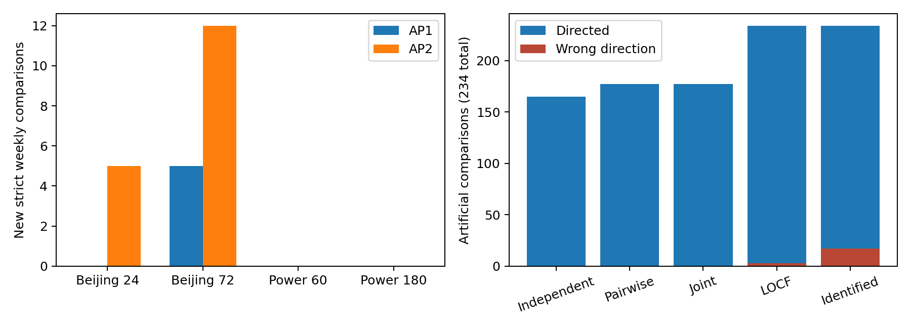

# AP2：结构解释与固定时间复制

2026-09-17 · FreeSakura。**本轮已完成 AP1 全范围解释、结构诊断、固定 AP2 年份评价与独立核对。建议继续形成方法与结果工作稿，停止追加年份、模型及阈值；尚不将其等同于已达到 JCR Q2 投稿成熟度。**

新的关键认识是：大多数剩余未定比较确实缺少信息；低阶约束解决了大多数新增判断，但存在一个经独立复核的真实高阶必要案例。不能再将 AP1 的“两两层取得全部决策收益”概括到后续年份。

## 1. 方案、数据与模型

[方案](../../../refine-logs/EXPERIMENT_PLAN.md)及[配置](../../../configs/research/SHARED_MISSING_EVENTS_AP2_20260917.json)在读取 AP2 范围、生成预测之前提交（配置 e6b7d74，方案 570a1d6）。北京 12 站评价 [2015-03-01,2016-03-01)，家庭功率评价 [2008-07-01,2009-07-01)。加载 AP1 已选定的四组模型文件，**新拟合次数为 0**；模型哈希见[冻结回执](../../../artifacts/summaries/shared_missing_events_ap2/frozen_models.json)。

保持原阈值、K/L、特征、训练中位数、站点顺序和遮蔽种子。北京 K24 仍为主设置，K72 仍为补充设置。七天原点块从各年度评价起点开始，保留最后不足周块；每个 P 原点块带 P+K−1 条标签支持。年度界另求，不相加周界；跨站按窗口数加权。AP2 后续年份未使用。

本轮分析当前固定系统的回顾性比较。长期固定模型可能受漂移影响，不能解释为最佳滚动训练策略或未来部署收益。

## 2. AP1 的所有未定比较得到了什么解释？

| AP1 自然比较类别 | 数量 |
|---|---:|
| 无模糊标签 | 3,576 |
| 有模糊标签，独立界已判向 | 440 |
| 需要两两一致性才能判向 | 6 |
| 完整轨迹也不能统一判向，已提供相反见证 | 154 |
| 合计 | 4,176 |

**154 个未定比较全部具有严格相反符号的两条合法补全**。这已经证明现有观测容许不同胜负；不是求解器没找到足够强的界。每个模糊比较的两端均保存未知位赋值、原预测哈希和精确 Brier 差分子，共 1,200 条见证。[逐项解释](../../../artifacts/summaries/shared_missing_events_ap2/ap1_explanations.csv) · [见证](../../../artifacts/summaries/shared_missing_events_ap2/ap1_completion_witnesses.jsonl)

原 49 个高阶收紧比较完整保留在[差异表](../../../artifacts/summaries/shared_missing_events_ap2/ap1_higher_order_gaps.csv)，列出两端收紧量和到零的距离。它们的高阶数值差异没有改变 AP1 判向。1,200 个端点中，1,142 个找到可实现的 LP 最优模式且数值目标匹配；58 个端点数值不同。这里的 LP 最优性仍是数值验证，不冒充精确有理最优性证明。

## 3. 结构充分性：明确覆盖范围

[理论说明](../../theory/SHARED_MISSING_EVENTS_AP2_CERTIFICATES.md)给出序多面体整数性、AND/OR 封闭刻画、依赖分量组合与信息不足见证。它们基于经典数学；本轮贡献不能靠重新命名这些结论成立。

只统计含模糊标签的面板，避免用大量无缺测面板夸大结构方法覆盖率：

| 年份 | 模糊面板 | 证明两两结构充分 | 证明存在高阶结构差异 | 预算内仍未判定 |
|---|---:|---:|---:|---:|
| AP1 | 200 | 91 | 41 | 68 |
| AP2 | 270 | 175 | 48 | 47 |

充分性来自单未知位/至多双标签条件，或小分量全部补全的封闭性检查。高阶差异来自不封闭反例或一个两两可行但完整轨迹不可实现的模式。后者不单独证明当前目标严格有差距。大分量没有用有限抽样冒充充分性。[结构汇总](../../../artifacts/summaries/shared_missing_events_ap2/ambiguous_panel_structure_summary.csv)

这些判据提供了部分可检查解释，但尚未形成对任意缺测布局的高效完整分类。

## 4. AP2 固定复制结果

自然评价仍是 4,176 个模型对×面板：4,098 个周级，78 个站点年度。另有 234 个人工遮蔽比较，单独报告。

| 自然设置 | 比较数 | 独立界未定 | 两两新增判向 | 完整轨迹新增判向 | 高阶额外判向 |
|---|---:|---:|---:|---:|---:|
| 北京 K24，周级 | 1,908 | 68 | 5 | 5 | 0 |
| 北京 K72，周级 | 1,872 | 78 | 11 | 12 | 1 |
| 功率 K60，周级 | 159 | 4 | 0 | 0 | 0 |
| 功率 K180，周级 | 159 | 4 | 0 | 0 | 0 |
| 北京 K24，站点年度 | 36 | 3 | 0 | 0 | 0 |
| 北京 K72，站点年度 | 36 | 1 | 1 | 1 | 0 |
| 功率 K60，年度 | 3 | 1 | 0 | 0 | 0 |
| 功率 K180，年度 | 3 | 0 | 0 | 0 | 0 |

周级新增为 **17/4,098（0.415%）**，在原独立未定比较中为 **17/154（11.04%）**。分母不同，不能互换为一个“成功率”。这些判断涉及 12 站、13 个时间块；同期多站和相邻支持仍有关联，不作为独立重复。

**13 个周块的未被确定支配集合缩小，10 个新确认唯一最佳**。其中 1 个集合变化及唯一最佳必须使用完整轨迹约束；每个唯一最佳对所有对手的最坏优势均为正，见[逐对优势](../../../artifacts/summaries/shared_missing_events_ap2/unique_best_advantages.csv)。年度新增的一个判向没有进一步改变候选集合。未被确定支配不等于“存在同一个补全让该模型同时最优”。

跨站全年聚合仍无新增判向。功率范围有 3,505 个缺失分钟，比 AP1 的 168 个更多，但 9 个原本未定的自然比较仍都能构造相反胜负。因此不能只以“缺测很少”解释本轮功率负结果，也不能推出该领域普遍无价值。

AP2 自然比较中，61 个存在高阶进一步收紧（35 周级、26 年度），仅 1 个增加判向。剩余 **141 个未定比较全部有严格相反胜负见证**。共生成 1,620 条合法端点轨迹，见[解释汇总](../../../artifacts/summaries/shared_missing_events_ap2/ap2_explanation_summary.json)。



## 5. 唯一高阶新增案例：昌平 2015-10-04 原点周

K72/L3，168 个原点及 239 条支持记录，其中有 **153 条连续缺失**。A 为常数预测，B 为 HGB，比较的是 A−B 的平均 Brier 损失：

| 层次 | 下界 | 上界 |
|---|---:|---:|
| 独立 | −0.0452950194 | +0.0017365406 |
| 两两 | −0.0449371884 | +0.0017365406 |
| 完整轨迹 | −0.0381157676 | **−0.0005900871** |

只有完整约束能确认常数优于 HGB，并把 {常数,HGB} 缩为 {常数}。全范围 MILP 复核一致。

提取到最小基数为 3 的冲突：原点偏移 80、145、150 的标签要求分别为 0、1、0。任意两项可行，三项不可行。两端无事件窗口覆盖中间事件的所有可能游程起点，因此该组合违反 e₁₄₅≤e₈₀+e₁₅₀。

**一个三元冲突并不解释整个判向收益。** 事后仅把这一条覆盖约束加入 LP，上界仍约 +0.0014827686，尚未跨零；必须如实保留这个负诊断。完整优化排除了更多不相容模式。该补充是结果出现后的解释，不当作新方法的确认性实验。[完整案例](../../../artifacts/summaries/shared_missing_events_ap2/higher_order_case.json)

此例证明高阶真实必要性有时存在，不能支持常见、普遍或经济重要的主张。它还提示该价值可能依赖长连续缺测；单例尚不足以认定普遍机制。

## 6. 人工遮蔽：可靠性与信息量一起报告

| 方法 | 比较数 | 严格定向 | 错向 | 未定向 |
|---|---:|---:|---:|---:|
| 独立界 | 234 | 165 | 0 | 69 |
| 两两界 | 234 | 177 | 0 | 57 |
| 完整轨迹界 | 234 | 177 | 0 | 57 |
| LOCF 标签插补 | 234 | 234 | 3 | 0 |
| 仅已确定标签点估计 | 234 | 234 | 17 | 0 |

三种界均包含全部 234 个已知完整差值。人工比较没有高阶额外判向。该结果说明保留拒绝判断可以避免部分错误，不能以零错误代替信息量，也不是 95% 统计覆盖率。自然缺失没有完整真值，不计算自然错向率。[逐机制表](../../../artifacts/summaries/shared_missing_events_ap2/artificial_direction_tradeoff.csv)

## 7. 核对与执行成本

相关科学与仓库维护测试共37项通过；资料链接、登记覆盖和文件哈希检查通过，AP0/AP1原始数值证据未修改。[验证回执](../../../artifacts/summaries/shared_missing_events_ap2/validation.json)

- 新回溯/封闭性算法在 T≤5 的全部三值观测和合法 K/L 上与所有补全比较；另外核对 LP 二元模式、不可行模式和精确损失符号。
- 对 AP1 的 1,200 条及 AP2 的 1,620 条公开未知位赋值重放，独立累积和标签实现、观测一致性与精确有理分子全部匹配。[重放回执](../../../artifacts/summaries/shared_missing_events_ap2/witness_replay.json)
- 所有自然新判向进入独立 MILP 计划；同时纳入高阶案例的全部模型对及四组负对照。24 个计划模型对中，21 个全范围核对达到最优，最大平均端点差 **1.11×10⁻¹⁶**；另 3 个因明确的 300,000 约束规模预算未尝试（1 个北京年度、2 个功率负对照周块）。不能将它们写成全数 MILP 通过。[回执](../../../artifacts/summaries/shared_missing_events_ap2/decision_milp_summary.json)
- AP1 解释约 43.20 秒，AP2 复制约 55.63 秒，AP2 解释约 48.11 秒，MILP 约 7.85 秒，均为各流程记录的墙钟时间，不含编码/理论/报告，也不相加作为整个研究耗时。未启动 GPU 训练或旧六折。

## 8. 更新后的论文主张与下一步

建议工作题目：**《共享缺测下持续事件预测的比较证书：何时约束足够，何时信息不足》**。

可以写：在声明的补全集合中，结构证据、可实现端点和相反胜负见证区分三类原因；固定时间复制出现有限回顾性候选变化；两两约束取得大多数新增判断，但一个经复核的长缺测案例需要高阶一致性。

不能写：新的通用 DP/序多面体算法、两两层普遍充分、高阶普遍必要、跨领域稳定收益、整体排行榜改善、未来运营收益或已确认 Q2 可发表。K24 在 AP1 为零、AP2 为正，也不能改写为主设置每年稳定有效。

**下一步进入有限范围的方法/结果写稿和最近邻贡献核对，不再开展年份或模型搜索。** 优先明确相对缺标签评价及 Cost-Regular 的新增评价问题，整理三窗口解释与信息不足证书的使用方式；若这些仍只能构成一般工具应用，暂缓整篇论文扩张。现有进展支持继续写工作稿，但原创贡献强度仍需实质审查。

## 9. 复现入口

安装 `python -m pip install -e ".[test,evidence]"`。DATA 为原两个 UCI 压缩包目录，AP1_RUN 为首轮已选模型与预测目录，AP2_RUN 为新的私有输出目录，RESULTS 为本轮公开汇总目录。

```bash
python scripts/research/explain_shared_missing_ap2.py --phase AP1 --data DATA --private AP1_RUN --results artifacts/summaries/shared_missing_events_ap1 --output RESULTS
python scripts/research/run_shared_missing_ap2.py --data DATA --ap1 AP1_RUN --private AP2_RUN --output RESULTS
python scripts/research/explain_shared_missing_ap2.py --phase AP2 --data DATA --private AP2_RUN --results RESULTS --output RESULTS
python scripts/research/verify_shared_missing_ap2.py --data DATA --private AP2_RUN --results RESULTS
python scripts/research/replay_shared_missing_witnesses.py --data DATA --ap1 AP1_RUN --ap2 AP2_RUN --results RESULTS
python scripts/research/summarize_shared_missing_ap2.py --data DATA --private AP2_RUN --results RESULTS
```

AP1 模型可按 [AP1 报告](SHARED_MISSING_EVENTS_AP1_REPORT.md)从原训练/选择范围重建。使用新输出目录保留原证据；原始数据、逐点预测与模型未纳入公开汇总。
