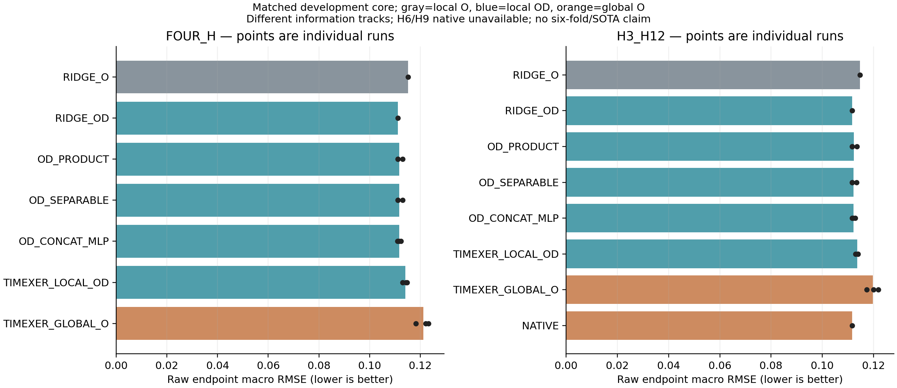

# 已有成果统一比较：历史覆盖、共同样本与新核心对照

> 阶段记录：下文保留原研究时点的结论和执行范围；当前公开状态见[项目状态](../../PROJECT_STATUS.md)。目录迁移不改变原结果。

本轮执行范围为**已有授权开发区间**，不是官方六折完整测试。本报告分别交付历史覆盖、锁定预测重算和新同协议核心表；不将这三种完整性混为一谈。正式六折、全部近期强方法的同任务复现仍有明确缺口，因此不能称“完整最新SOTA基准已完成”。

## 1. 完整覆盖已有成果，保留所有失败

成果清点覆盖近期时长/空间/分位适配、有限步长、volume、长历史、交互及固定参考实验，也包括早期CAPER、固定融合、路由、蒸馏和六折Chronos资格记录。旧registry有1,224个配置：865完成、340未执行、19失败；这些历史状态不改写成新的SOTA评级。

oracle使用目标值，只作诊断；方向导数、人工HMM及识别性反例不是可部署预测成绩；Paris属于其他数据集。止于1056的候选不补造1392结果。使用1392选参的结果不能进入该窗口的未参与选择评价表。CAPER是本地项目实现，未建立官方论文到代码的身份对应，不能改称作者源码复现。

七个近期实验登记83份最终raw预测文件，展开为86个逻辑身份，全部在读取前由既有公开清单冻结文件名、角色、SHA256及形状。相同SHA去重解码；底座别名保留逻辑记录，但不算独立方法证据。原权重、epoch、alpha、种子和NO_GO均不重新选择。

早期资料已存在六折测试类结果与前序折标签参与融合的记录，不能把未来重新做的六折比较称为全局首次盲测。新比较应声明历史曝光，并通过固定协议、强对照及适当的不确定性证据约束结论。

## 2. 三类比较表的含义

| 表 | 能回答什么 | 不能据此声称什么 |
|---|---|---|
| candidate_coverage.csv | 每项成果进入何处，缺失或不适用的原因 | 所有历史运行都属于同一个实验总体 |
| archive_common_scores.csv | 原先锁定的预测在相同1392目标上的成绩 | 原先不同训练、信息和选择规则已变成相同 |
| matched_core_scores.csv | 本轮固定数据、原点、损失和训练预算下的核心比较 | 官方六折、全球最新方法已经全覆盖 |

历史重算的公共目标为275区域占用率、1392…1548的14个原点（stride12），H3/H6/H9/H12末点及完整前H步分别评分。训练与选择合同按cohort保留，旧2种子和新3种子不混成“五种子赢家”。相同底座在多个实验中重建不算多次独立证据。

## 3. 新核心同协议设计

FIT统一169…1044、stride1，共876原点；SELECT1056…1212、DEV1392…1548各14原点、stride12。联合预测未来12小时，主分数为四个H末点RMSE的等权平均；MAE、raw/clip、terminal/path全部分列。它不是每个H单独训练的官方实验逐位复现。

| 系统 | 信息轨道 | 新拟合/训练 |
|---|---|---:|
| RIDGE_O | 本区域O168＋五维上下文 | 1 |
| RIDGE_OD | 本区域O168、滞后D168＋上下文 | 1 |
| OD_PRODUCT | LOCAL_OD_168，冻结RIDGE_OD＋乘积残差 | 3种子 |
| OD_SEPARABLE | LOCAL_OD_168，同底座＋可分离残差 | 3种子 |
| OD_CONCAT_MLP | LOCAL_OD_168，同底座＋普通MLP残差 | 3种子 |
| TimeXer LOCAL-OD | LOCAL_OD_168，作者MS核心适配 | 3种子 |
| TimeXer GLOBAL-O | 全275区域O168，作者M核心 | 3种子 |

LOCAL与GLOBAL目标相同但信息不同，跨轨分数只能评价系统，不能孤立归因为某个结构或协变量。Chronos native只用既有H3/H12缓存，属于GLOBAL_O参考，预训练条件不同；H6/H9缺失不由H12切片填补。TimesFM的权重和环境虽存在，本轮没有新增调用。

共同种子20260915/16/17，40epoch、0/5/10/20/40 checkpoints。每个有效batch有16个原点及全部275区域，microbatch固定2原点，按micro原点数/实际有效batch原点数累积梯度；最后12原点不丢弃。每epoch55步、每次2,200步，总15次33,000步。

原始率单位的MSE覆盖全部12步及区域。残差模型使用float32(Y64−q_ridge64)训练，其原标准化和零输出头保留；TimeXer直接预测率，保留作者窗口内归一化和初始化，不强制零头。AdamW固定余弦学习率0.001→0.0001，矩阵权重衰减1e-4、bias及一维参数不衰减，累积后梯度范数截断1；不启用AMP/TF32/compile。相同步数与样本不等于等参数、等FLOPs或均已收敛。

全部训练结束后才按SELECT的raw四H末点宏RMSE逐模型/种子选checkpoint，完全并列取较早者；不按MAE选模型、不选最好种子、不集成。TimeXer若选中epoch0，则明确为未训练初始化，不冒充ridge别名。

## 4. TimeXer作者代码身份与适配

作者源码固定为[thuml/TimeXer 7601190](https://github.com/thuml/TimeXer/tree/76011909357972bd55a27adba2e1be994d81b327)。本轮从独立外部目录加载该提交的原Model及依赖闭包，逐文件核验SHA，不修改旧本地TimeXer副本。旧副本有任务分支裁剪和无关mask函数删减，不能声称整个文件与作者提交逐字相同。

两轨统一seq_len168、pred_len12、patch_len12、d_model64、4 heads、2 layers、d_ff128、dropout0.1，保留use_norm。LOCAL采用MS/enc_in2，通道为[D滞后历史,O历史]，O是最后目标；五维原点上下文重复为168步marker。GLOBAL采用M/enc_in275、marker=None。

已用人工数据验证MS最后目标通道、全区域输出、输出反归一化、marker身份和microbatch损失权重；GPU两轨均可运行。LOCAL有123,788参数，GLOBAL有141,324参数，三个旧神经族各9,108参数。它们是作者核心的明确本地配置，不是原论文完整运行设置，也不是同名替代网络。

## 5. 最新来源登记及真正的缺口

核查截至2026-09-13的一组可信相关来源，不宣称穷尽全部论文。来源表分别记录作者主张、任务与单位、公开代码、访问深度和本轮实际运行状态。

| 来源 | 本轮核查结论 |
|---|---|
| [UrbanEV官方论文](https://doi.org/10.1038/s41597-025-04874-4) | 六折、任务类别与数据版本须明确；论文表3不能直接与本地14原点混排 |
| [Chronos-2交通基准v2](https://arxiv.org/abs/2602.24238v2) | 代码可查，但计数目标/处理与当前率不同；本轮只有本地H3/H12锁定缓存 |
| [DyConfuse-Net](https://doi.org/10.1016/j.epsr.2026.112765) | 保留文献MAE0.0155等主张，完整处理、单位和视野未对齐，不直接排名 |
| [TriCast](https://doi.org/10.1016/j.patrec.2026.04.028) | 247区、5分钟、2022年6—7月，与当前合同不同 |
| [Urban-CSTPNet](https://doi.org/10.3390/electronics15153297) | 多关系概率预测，部分全文访问受限，未完成本地复现与单位桥接 |
| [MDFANet](https://doi.org/10.1038/s41598-026-38855-3) | 原文ST-EVCDP为247区、5分钟、15—60分钟目标，不是当前小时率任务 |
| [MAGE](https://github.com/PoorOtterBob/MAGE) | 作者代码已检查；论文Table4与正文的UrbanEV节点/时间描述存在不一致，6:2:2与24步设置也不同，未复现本任务 |
| [ST-Attention](https://doi.org/10.3390/en19143411)、[SCLD+FCW](https://doi.org/10.3390/wevj17060288) | 能量/负荷任务，不把kWh整体误差直接换算成占用率误差 |
| DLinear、PatchTST、iTransformer | 作者实现有据，当前同任务适配与运行缺失，明确NOT_RUN |

容量因区域而异时，不能用一个平均容量把论文整体计数RMSE换成占用率RMSE。数据名字相同、论文较新、或者作者写了SOTA，均不能替代协议核验。没有复现的可信工作不会被删掉，但也不会编造同协议成绩。

## 6. 访问与成果完整性

本轮只用原已允许前缀：FIT O1056/D1043，SELECT O1224/D1211，PREDICT O1548/D1547，SCORE O1560；静态仅站点标识、TAZID、容量。全部新预测锁定后才解码历史预测及四份native/truth缓存。原始数组、权重及账户/协作元数据不公开。

正式六折涉及先前暂留范围与更晚数据，当前未将泛称“完整”视为自动开放。正式全基准必须使用独立冻结的范围与协议，不能将本表改名为六折结果。

## 7. 实际结果

**核心开发同比与登记历史重算已完成；完整官方六折和全部最新强基线尚未完成。** 执行状态为`COMPARISON_PARTIAL_WITH_EXPLICIT_GAPS_REVIEW_REQUIRED`。以下结果不能替代正式全基准，也不构成SOTA结论。

### 7.1 新核心：同训练合同的四H raw末点

| 模型 | 信息轨道 | 运行数 | RMSE均值 | MAE均值 | RMSE标准差 |
|---|---|---:|---:|---:|---:|
| RIDGE_O | LOCAL_O_168 | 1 | 0.115240674 | 0.072534384 | — |
| RIDGE_OD | LOCAL_OD_168 | 1 | 0.111146795 | 0.068494595 | — |
| OD_PRODUCT | LOCAL_OD_168 | 3 | 0.111778947 | 0.069094652 | 0.001094919 |
| OD_SEPARABLE | LOCAL_OD_168 | 3 | 0.111772392 | 0.069153041 | 0.001083565 |
| OD_CONCAT_MLP | LOCAL_OD_168 | 3 | 0.111733365 | 0.069234928 | 0.000677250 |
| TIMEXER_LOCAL_OD | LOCAL_OD_168 | 3 | 0.114078650 | 0.070074650 | 0.000966730 |
| TIMEXER_GLOBAL_O | GLOBAL_O_168 | 3 | 0.121226897 | 0.075408422 | 0.002599343 |

RIDGE_OD在本核心集合四H raw宏RMSE和MAE均最低，相对RIDGE_O分别降低3.552460%/5.569482%。这是当前信息表示和估计器的表现，不是时长因果信息量，也不证明其他字段无效。两种ridge重建了同训练数据的既有锚点，不增加独立泛化证据。

| 模型 | 种子 | raw RMSE | raw MAE | 选择epoch |
|---|---:|---:|---:|---:|
| OD_PRODUCT | 20260915 | 0.113043251 | 0.070294765 | 40 |
| OD_PRODUCT | 20260916 | 0.111146795 | 0.068494595 | 0 |
| OD_PRODUCT | 20260917 | 0.111146795 | 0.068494595 | 0 |
| OD_SEPARABLE | 20260915 | 0.113023585 | 0.070469933 | 40 |
| OD_SEPARABLE | 20260916 | 0.111146795 | 0.068494595 | 0 |
| OD_SEPARABLE | 20260917 | 0.111146795 | 0.068494595 | 0 |
| OD_CONCAT_MLP | 20260915 | 0.112456295 | 0.070249071 | 40 |
| OD_CONCAT_MLP | 20260916 | 0.111113643 | 0.068335241 | 5 |
| OD_CONCAT_MLP | 20260917 | 0.111630159 | 0.069120471 | 40 |
| TIMEXER_LOCAL_OD | 20260915 | 0.114873080 | 0.070497133 | 40 |
| TIMEXER_LOCAL_OD | 20260916 | 0.113002298 | 0.069361444 | 40 |
| TIMEXER_LOCAL_OD | 20260917 | 0.114360572 | 0.070365374 | 40 |
| TIMEXER_GLOBAL_O | 20260915 | 0.118294214 | 0.072712001 | 10 |
| TIMEXER_GLOBAL_O | 20260916 | 0.123246512 | 0.077447406 | 20 |
| TIMEXER_GLOBAL_O | 20260917 | 0.122139964 | 0.076065860 | 40 |

PRODUCT和SEPARABLE各有两个种子选择epoch0，共四个RIDGE_OD别名；它们不能被称为独立的稳定改善。CONCAT的种子16相对RIDGE_OD的RMSE低0.029828%、MAE低0.232652%，但三种子均值仍较差，不能事后选出这一种子作主结论。“RIDGE_OD最低”仅指新核心表按预注册种子汇总，不是优于每次神经运行或全部历史成果。TimeXer没有选中未训练epoch0；LOCAL三个种子均选择40，GLOBAL选择10/20/40。

在这次168小时输入、固定小型作者配置、40epoch和raw MSE目标下，两条TimeXer适配轨未超过ridge。不能因此声称TimeXer论文结论被推翻、所有Transformer不如线性模型，或空间信息无用；内部归一化、预测形式、参数量、信息轨道和优化适配均有区别。没有证据证明各模型都收敛。

### 7.2 native仅在H3/H12共同支持比较

| 模型 | 信息轨道 | raw RMSE均值 | raw MAE均值 |
|---|---|---:|---:|
| RIDGE_O | LOCAL_O_168 | 0.114687079 | 0.071336242 |
| RIDGE_OD | LOCAL_OD_168 | 0.111694520 | 0.068687138 |
| OD_PRODUCT | LOCAL_OD_168 | 0.112291106 | 0.069264077 |
| OD_SEPARABLE | LOCAL_OD_168 | 0.112276159 | 0.069223202 |
| OD_CONCAT_MLP | LOCAL_OD_168 | 0.112177346 | 0.069202520 |
| TIMEXER_LOCAL_OD | LOCAL_OD_168 | 0.113626475 | 0.069236040 |
| TIMEXER_GLOBAL_O | GLOBAL_O_168 | 0.119756570 | 0.074059891 |
| NATIVE | GLOBAL_O_168 | 0.111690275 | 0.060337619 |

缓存native在这个共同支持上的RMSE略低于RIDGE_OD，MAE明显更低；它拥有不同的预训练条件。RIDGE_OD raw相对native的RMSE高0.003801%、MAE高13.838000%；clip对clip高0.002829%/13.902281%。接近的点估计不是统计等效，MAE差距也不是RMSE-SOTA必须先通过的门。不能用这两H结果填补native的H6/H9，也不能与四H均值混排。所有模型的clip及path完整分数在CSV中，未按结果选择后处理。

条形表示指标均值，点表示运行；重合点可能是底座别名。颜色标明信息轨道，GLOBAL与LOCAL之间不是严格同信息结构消融。比较只涉及14个开发原点，且按12小时取原点，不等于正式全小时密集评价。

### 7.3 七个历史cohort：共同目标重算，训练合同不合并

83个登记raw文件全部存在且哈希通过，按内容去重后解码67个数组，展开86个逻辑身份得到1,376条评分。能够对应原公开表的1,288条评分误差全部为0；另外88条是短状态有界神经及last/day/week原raw预测的显式clip视图，不是新模型预测。

以下按原cohort顺序列出四H raw端点均值，**不按数值排序成跨训练协议排行榜**。完整各H、各实例、两种后处理与评分范围均在archive_common_scores.csv。

| 原研究cohort | 原模型/系统 | 原实例数 | 不同raw载荷数 | RMSE均值 | MAE均值 |
|---|---|---:|---:|---:|---:|
| short_state_relaxation_v1 | RELAX_SHORT_O | 2 | 2 | 0.132504767 | 0.080076532 |
| short_state_relaxation_v1 | RELAX_SHORT_OD | 2 | 2 | 0.135213344 | 0.080936846 |
| short_state_relaxation_v1 | DIRECT_SHORT_OD | 2 | 2 | 0.134545300 | 0.080523874 |
| short_state_relaxation_v1 | DIRECT_LONG_OD | 2 | 2 | 0.119469292 | 0.068872196 |
| short_state_relaxation_v1 | RIDGE_SHORT_OD | 1 | 1 | 0.131725990 | 0.088754897 |
| short_state_relaxation_v1 | RIDGE_LONG_OD | 1 | 1 | 0.111146795 | 0.068494595 |
| short_state_relaxation_v1 | last | 1 | 1 | 0.141709145 | 0.078815178 |
| short_state_relaxation_v1 | day | 1 | 1 | 0.145824051 | 0.085311210 |
| short_state_relaxation_v1 | week | 1 | 1 | 0.172125954 | 0.116268106 |
| long_history_source_ablation_v1 | S | 1 | 1 | 0.131725990 | 0.088754897 |
| long_history_source_ablation_v1 | O_LONG | 1 | 1 | 0.115495707 | 0.072536820 |
| long_history_source_ablation_v1 | D_LONG | 1 | 1 | 0.115599443 | 0.068499521 |
| long_history_source_ablation_v1 | OD_LONG | 1 | 1 | 0.111146795 | 0.068494595 |
| long_history_source_ablation_v1 | O_LONG_D24 | 1 | 1 | 0.112331247 | 0.070281404 |
| long_history_source_ablation_v1 | O24_D_LONG | 1 | 1 | 0.116228994 | 0.069917217 |
| long_history_source_ablation_v1 | O_LONG_D0 | 1 | 1 | 0.115240674 | 0.072534384 |
| long_history_source_ablation_v1 | O_LONG_DUP | 1 | 1 | 0.115559701 | 0.072575878 |
| duration_lag_regularization_v1 | BASE_OD | 1 | 1 | 0.111146795 | 0.068494595 |
| duration_lag_regularization_v1 | D_NORM_SELECTED | 1 | 1 | 0.111146795 | 0.068494595 |
| duration_lag_regularization_v1 | GLOBAL_RIDGE_SELECTED | 1 | 1 | 0.111146795 | 0.068494595 |
| duration_lag_regularization_v1 | TIME_SELECTED | 1 | 1 | 0.111147123 | 0.068488031 |
| duration_lag_regularization_v1 | SCRAMBLED_SELECTED | 1 | 1 | 0.111099562 | 0.068474516 |
| duration_lag_regularization_v1 | SCRAMBLED_MATCHED | 1 | 1 | 0.111099562 | 0.068474516 |
| conditional_od_interaction_v1 | BASE_OD | 1 | 1 | 0.111146795 | 0.068494595 |
| conditional_od_interaction_v1 | OD_PRODUCT | 2 | 2 | 0.110691575 | 0.069126400 |
| conditional_od_interaction_v1 | OD_SEPARABLE | 2 | 2 | 0.113544600 | 0.070639569 |
| conditional_od_interaction_v1 | OD_CONCAT_MLP | 2 | 2 | 0.112487306 | 0.069075949 |
| conditional_od_interaction_v1 | OO_PRODUCT | 2 | 2 | 0.111980606 | 0.069501911 |
| reference_harm_stability_v1 | BASE_OD | 1 | 1 | 0.111146795 | 0.068494595 |
| reference_harm_stability_v1 | PRODUCT_MSE | 3 | 3 | 0.111326341 | 0.069159118 |
| reference_harm_stability_v1 | PRODUCT_POSREG | 3 | 3 | 0.111233446 | 0.068693831 |
| reference_harm_stability_v1 | PRODUCT_MIX | 3 | 3 | 0.111680392 | 0.068587528 |
| reference_harm_stability_v1 | PRODUCT_L1 | 3 | 3 | 0.111357572 | 0.068792693 |
| reference_harm_stability_v1 | CONCAT_MSE | 3 | 3 | 0.112528269 | 0.069739519 |
| reference_harm_stability_v1 | CONCAT_POSREG | 3 | 3 | 0.111912206 | 0.069188786 |
| forward_residual_transfer_v1 | BASE_OD | 1 | 1 | 0.111146795 | 0.068494595 |
| forward_residual_transfer_v1 | P_IS_X | 3 | 2 | 0.113208086 | 0.070185267 |
| forward_residual_transfer_v1 | P_FWD_X | 3 | 1 | 0.111146795 | 0.068494595 |
| forward_residual_transfer_v1 | P_IS_BC | 3 | 3 | 0.116179830 | 0.072653949 |
| forward_residual_transfer_v1 | P_FWD_BC | 3 | 1 | 0.111146795 | 0.068494595 |
| forward_residual_transfer_v1 | C_IS_BC | 3 | 3 | 0.113176475 | 0.069734849 |
| forward_residual_transfer_v1 | C_FWD_BC | 3 | 1 | 0.111146795 | 0.068494595 |
| fixed_reference_correction_v1 | BASE_FIXED | 1 | 1 | 0.113173665 | 0.071097540 |
| fixed_reference_correction_v1 | LINEAR_REPAIR | 1 | 1 | 0.111834512 | 0.068737133 |
| fixed_reference_correction_v1 | RIDGE_FULL | 1 | 1 | 0.111146795 | 0.068494595 |
| fixed_reference_correction_v1 | FIXED_PRODUCT | 3 | 3 | 0.115683020 | 0.072157207 |
| fixed_reference_correction_v1 | FIXED_SEPARABLE | 3 | 3 | 0.113023432 | 0.070227837 |
| fixed_reference_correction_v1 | FIXED_CONCAT | 3 | 3 | 0.113383213 | 0.071285478 |

“无文件缺失或身份错误”仅覆盖本轮83文件白名单，不意味着全部历史方法和正式评估缺口已经补齐。零误差重算是评分一致性，不是重新训练或新增泛化证据。新增clip视图不是新模型或原实验已选择的输出。

载荷重复说明保存预测完全相同，不构成独立重复证据。不同载荷也不自动等于不同信息或独立模型；训练/选择/基础模型身份仍见各原协议。旧方案有利和不利的数字全部保留，不从中重新挑seed、alpha或checkpoint。

### 7.4 早期六折成果：原报告摘录，不与本轮开发表混排

原registry完整保留1,224配置的执行状态。下面只摘录既有六折汇总，未解码其原始测试预测、未重新评分，输出约定和选择规则以各源文件为准。

| 原cohort | 方法 | 单元数 | 原报告RMSE | 原报告MAE | 角色 |
|---|---|---:|---:|---:|---|
| legacy_fixed_fusion | CAPER | 24 | 0.075506678 | 0.048479747 | HISTORICAL_REPORTED |
| legacy_fixed_fusion | TimeXer | 24 | 0.073708929 | 0.046366866 | HISTORICAL_REPORTED |
| legacy_fixed_fusion | global_fixed | 24 | 0.071366757 | 0.044949417 | HISTORICAL_REPORTED |
| legacy_fixed_fusion | horizon_fixed | 24 | 0.071371779 | 0.044951098 | HISTORICAL_REPORTED |
| legacy_fixed_fusion | oracle | 24 | 0.061232970 | 0.035023478 | ORACLE_DIAGNOSTIC_NOT_DEPLOYABLE |
| legacy_router | CAPER | 24 | 0.075506678 | 0.048479747 | HISTORICAL_REPORTED |
| legacy_router | TimeXer | 24 | 0.073708929 | 0.046366866 | HISTORICAL_REPORTED |
| legacy_router | global_fixed | 24 | 0.071366757 | 0.044949417 | HISTORICAL_REPORTED |
| legacy_router | horizon_fixed | 24 | 0.071371779 | 0.044951098 | HISTORICAL_REPORTED |
| legacy_router | hard_router | 24 | 0.072759108 | 0.044994910 | HISTORICAL_REPORTED |
| legacy_router | soft_router | 24 | 0.070979242 | 0.044302809 | HISTORICAL_REPORTED |
| legacy_router | direct_loss_mlp | 24 | 0.071050310 | 0.044452438 | HISTORICAL_REPORTED |
| legacy_router | oracle | 24 | 0.061232970 | 0.035023478 | ORACLE_DIAGNOSTIC_NOT_DEPLOYABLE |
| legacy_chronos_qualification | Chronos2_native_clipped | 24 | 0.073542295 | 0.042250022 | HISTORICAL_REPORTED |
| legacy_distillation | GT_only | 24 | 0.075567806 | 0.048416584 | HISTORICAL_REPORTED |
| legacy_distillation | aligned_KD | 24 | 0.075477932 | 0.048452422 | HISTORICAL_REPORTED |
| legacy_distillation | shuffled_teacher | 24 | 0.075673567 | 0.048592815 | HISTORICAL_REPORTED |

Oracle是使用目标信息的诊断上限，不是可部署对手。早期路由/蒸馏的旧1%门和NO_GO只保留原协议含义，不作为本轮否定研究价值或判断SOTA的门。原bootstrap结论只属于原数据与方法，不转用为新核心的置信证据。CAPER的论文身份未确立，不能把本地实现包装成官方作者模型。

### 7.5 成本、完整性与核验

| 新神经配置 | 参数数 | 每运行优化步 | 三运行平均秒数 | 最大GPU allocated字节 |
|---|---:|---:|---:|---:|
| OD_PRODUCT | 9108 | 2200 | 36.397 | 411650560 |
| OD_SEPARABLE | 9108 | 2200 | 39.535 | 411650560 |
| OD_CONCAT_MLP | 9108 | 2200 | 35.115 | 411057664 |
| TIMEXER_LOCAL_OD | 123788 | 2200 | 345.752 | 499527168 |
| TIMEXER_GLOBAL_O | 141324 | 2200 | 340.131 | 504762368 |

共2次ridge拟合、15次神经训练、33,000优化步。1,200条神经SELECT与32条ridge参考；新核心280条有效成绩加8条native缺失。17份新raw预测冻结后独立重评分误差0，历史已发表分数对应误差0，native标签误差0，ridge锚点误差0。总执行2467.580秒，后续神经推断累计1.974秒（不含模型构造/checkpoint读取）。GPU峰值包含训练数据缓存，不等于进程总内存或模型内在部署内存。十五次训练运行计时合计约2390.79秒，包含模型/优化器构造、数据传输及checkpoint保存，并非纯前后向内核时间。推断累计1.974208秒涵盖SELECT多个checkpoint和最终DEV，不是单个模型的一次部署延迟，不能据此与native在线延迟排名。

270项本地测试和隐私检查通过。源码、配置、选择、完整分数及缺口可追溯；原数组与权重不上传。时间与参数仅作实际成本披露，不宣称同一步数意味着相同算力或公平收敛。

## 8. 尚未完成的部分及下一执行条件

1. 本次没有执行官方逐月六折的新统一训练/测试；当前14原点结果不能代替它。六折区间和预计原点数量已准备，仍须先明确正式范围并冻结方法/原点/预算。
2. Chronos本轮只有原H3/H12缓存；TimesFM、DLinear、PatchTST、iTransformer、MAGE等没有完成当前同协议的新比较，DyConfuse等还缺完整可比设置。来源已覆盖登记，不等于性能已复现。
3. 历史共同样本表只统一评价，不统一旧训练合同；不能将其与新核心拼成一个SOTA榜。

本轮因此保持“有明确缺口的部分比较”状态，**不将用户要求的完整最新全基准任务标成已完成**。正式范围仍待前述范围选择解决；该步骤不是重新恢复1%或MAE门。现有[SOTA比较规则](../../research/evaluation.md)继续适用。

[全部结果](../../../artifacts/summaries/comprehensive_development_comparison_v1)、[新核心表](../../../artifacts/summaries/comprehensive_development_comparison_v1/matched_core_scores.csv)、[历史重算](../../../artifacts/summaries/comprehensive_development_comparison_v1/archive_common_scores.csv)、[覆盖与缺失](../../../artifacts/summaries/comprehensive_development_comparison_v1/coverage_and_limits.json)、[来源登记](../../../artifacts/summaries/comprehensive_development_comparison_v1/baseline_sources.csv)。没有SOTA声明，定时暂停，未使用额度重置卡。

研究侧已核对公开冻结runner、适配代码与配置，并复算回传数字；未独立读取私有预测或重新执行训练。270项测试和隐私检查由执行侧完成；正式范围问题未得到答复，不将沉默视为开放原保留区间。
