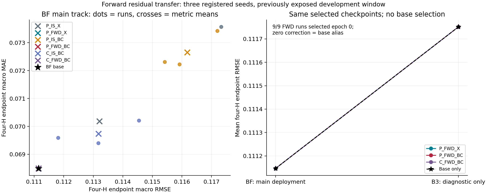

# 前向残差监督与底座预测上下文：迁移研究

> 阶段记录：下文保留原研究时点的结论和执行范围；当前公开状态见[项目状态](../../PROJECT_STATUS.md)。目录迁移不改变原结果。

本轮在[当前SOTA差距评估](../../reviews/SOTA_GAP_ASSESSMENT_20260913.md)之后继续研究：纠错器是否主要适应了底座的样本内残差，前向误差监督能否向完整底座迁移？上轮正增损惩罚有局部减损作用，未建立整体稳定化；本轮停止调整风险惩罚，全部神经模型仅用MSE。

## 1. 理论假说及其反例

对固定设计的线性平滑器ŷ=Sy，在说明性的独立同方差噪声假设Y=μ+ε下，样本内残差方差为

\[
\operatorname{Var}(Y_i-\widehat Y_i)=\sigma^2[1-2S_{ii}+(SS^\top)_{ii}].
\]

同位置独立重复响应减去原拟合预测的误差方差为σ²[1+(SSᵀ)ii]，相差2σ²Sii。训练响应参与拟合可能机械性压低残差波动。UrbanEV不一定满足这些噪声假设，公式不是对已有收益虚假的证明。

训练外预测用于第二层学习属于既有stacked generalization思想，交叉拟合本身不称原创。[Wolpert 1992](https://doi.org/10.1016/S0893-6080(05)80023-1)。时间序列普通交叉验证的有效性依赖额外条件；本轮选择严格前向构造，不默认误差独立。[Bergmeir等的作者页面](https://robjhyndman.com/publications/cv-time-series/)

前向残差也存在新的失配。历史底座qᵏ与完整底座qᶠ满足

\[
e^{FWD}=Y-q^k=e^{IS}+(q^F-q^k).
\]

前向标签同时包含历史底座相对完整底座的不足，不能把其幅度变大当作新增信息。反例：Y=x、早期底座为0、完整底座已学会x；纠错器学f=x，在早期底座上正确，换到完整底座却变成2x。将前向标签再加qᵏ−qᶠ会精确回到样本内残差，本轮禁止这种消除实验差异的修补。

因此引入底座预测上下文a=(q_b−p)/s，p=y[o−1]，预测形式为q=q_b+s fθ(x,a)。在E[Y|X,Q_b]=μ(X)且估计、函数类充分的额外假设下，可表达f*=(μ(x)−q_b)/s，允许不同底座被修正到同一对象。但历史输入可能没有覆盖最终底座的分布，因而不提供迁移保证。

## 2. 固定前向块及同训练行对照

每个原点的12步标签为[o,o+12)，所有区域按共同时间切分：

| 底座 | 训练原点（含端点） | 最大标签 | 前向纠错原点（含端点） | 标签间隔 |
|---|---|---:|---|---|
| B1 | 169…456 | 467 | 480…660 | [468,480) |
| B2 | 169…648 | 659 | 672…852 | [660,672) |
| B3 | 169…840 | 851 | 864…1044 | [852,864) |
| BF | 169…1044 | 1055 | 完整部署底座 | — |

三个历史底座分别拟合79,200、132,000、184,800行，各自产生49,775行前向预测，再拟合BF的240,900行。12小时间隔是本协议防止标签重叠的选择，不是独立性保证。

六个纠错方案都使用同一集合M：543个原点、149,325行。三个前向块等长，行等权即块等权。历史底座仅接收自己的本地O标签前缀468/660/852行与D输入前缀455/647/839行，各自估计标准化和ridge；不共享完整底座统计。前向预测生成后，BF才拟合，并在相同M上产生样本内预测。

纠错网络在FIT结束后另用M输入估计共同变换，六方案共享；这不等于逐时在线训练。IS对照的底座见过M标签，是预设样本内参照，不是DEV泄漏。各底座统一λ=0.01、截距不罚，独立新拟合，不读旧私有权重。

统一尺度s=max(sqrt(mean_M,j((Y−qᶠ)²)),10⁻⁶)直接在float64占用率坐标计算一次。训练目标为float32((Y−q_b)/s)，底座上下文为float32((q_b−p)/s)；不逐折归一化、不借SELECT校正比例、不改变折内权重。底座成熟度差异仍存在，无法单独识别“样本内乐观偏差”。

## 3. 六方案与训练预算

| 方案 | 结构 | 残差来源 | 底座上下文 | 参数 |
|---|---|---|---|---:|
| P_IS_X | PRODUCT | IS | 无 | 9,108 |
| P_FWD_X | PRODUCT | FWD | 无 | 9,108 |
| P_IS_BC | PRODUCT | IS | BF预测 | 9,396 |
| P_FWD_BC（主方法） | PRODUCT | FWD | 各历史底座预测 | 9,396 |
| C_IS_BC | CONCAT | IS | BF预测 | 9,396 |
| C_FWD_BC | CONCAT | FWD | 各历史底座预测 | 9,396 |

PRODUCT的O分支改为u=tanh(A_O[x_O;c]+Ka+b)，D分支和乘积头不变；CONCAT在第一隐藏层加入同样Ka。K为24×12无bias的288参数矩阵，零初始化；旧隐藏层沿用seed+11/+13的Xavier，输出层全零。无上下文与有上下文初始函数一致，但不声称等参数。

主比较P_FWD_BC对P_IS_BC匹配行、架构、参数量及预算；P_FWD_X对P_IS_X及二者BC增量用于检验上下文适配；C对照用于检验是否普通模型已足够。

沿用20260915/16/17三个预注册种子，属于新方案配对而非旧训练独立重复，不合并旧成绩。18次训练均40epoch、batch4096、37步/epoch、1,480步/次，共26,640步；同种子epoch共用行排列。AdamW、固定余弦学习率、权重衰减、全局梯度截断1沿用原规则。全部仅优化归一化残差MSE，神经float32 CUDA RTX4060，底座与统计CPU两线程float64。部署统一在float64合成q_b+s f；训练不clip。

全部四底座与18次训练结束后才读取SELECT，在0/5/10/20/40中按BF部署的raw四H末点宏RMSE选checkpoint，完全并列选较早者。不按MAE、状态组或诊断结果选择，不重训。完整[配置](../../../configs/research/FORWARD_RESIDUAL_TRANSFER_V1.json)登记初始化、源身份、时界和预算。

## 4. 主部署与底座迁移诊断

SELECT1056…1212及DEV1392…1548均使用完整BF，BC输入a_F。模型无论由哪个底座的残差训练，主轨不变。它们是已曝光时段，不能称独立验证。

仅对P_FWD_X、P_FWD_BC、C_FWD_BC各三个种子，另用同一个锁定checkpoint在DEV叠加B3，BC输入相应a_3。加上B3自身，共10个诊断系统，**只报告raw四H末点40条分数**，不按结果改推B3。三个训练块并不都来自B3，这也不是完全同分布检验。

同时记录qᶠ−q³和(qᶠ+s f_F)−(q³+s f_3)的均值、均方。敏感度降低可能抹掉BF的真实改进，必须结合误差解释。IS/FWD残差运输恒等式只做核验，不用来改写目标。

主轨保持raw/clip、末点/path、三个种子与四H完整表；native仅H3/H12共同支持。预测分歧T/V/η、原点损失及四个预设占用/变化状态组沿用原定义，仅做诊断，不进训练或路由。

源文件和外层阶段上限不变：FIT O1056/D1043，SELECT O1224/D1211，PREDICT O1548/D1547，SCORE O1560且D不扩展。最终预测冻结后才扩展SCORE并读四份白名单native/truth缓存。主轨38份raw/clip预测与诊断10份raw预测全部本地保存后独立评分。保护尾部、后续验证/测试及Paris保持关闭。

## 5. 实验结果

**本轮没有取得非零前向纠错收益，未缩小预测成绩上的SOTA差距。** 4个底座和18条神经轨迹全部执行完成，但三个前向方案共9个实例均按SELECT选择epoch0，主方法实际输出等于BF底座。它们相对更差IS对照的表面优势来自回到底座，不能称前向监督、上下文迁移或稳定化成功。

### 5.1 主轨：统一BF部署的四H raw末点

| 方案 | 三种子RMSE均值 | MAE均值 | RMSE标准差 | epoch选择（15/16/17） |
|---|---:|---:|---:|---|
| BF底座 | 0.111146795 | 0.068494595 | — | — |
| P_IS_X | 0.113208086 | 0.070185267 | 0.003570261 | 0 / 0 / 40 |
| P_FWD_X | 0.111146795 | 0.068494595 | 0.000000000 | 0 / 0 / 0 |
| P_IS_BC | 0.116179830 | 0.072653949 | 0.000917705 | 40 / 40 / 40 |
| P_FWD_BC | 0.111146795 | 0.068494595 | 0.000000000 | 0 / 0 / 0 |
| C_IS_BC | 0.113176475 | 0.069734849 | 0.001367487 | 5 / 5 / 10 |
| C_FWD_BC | 0.111146795 | 0.068494595 | 0.000000000 | 0 / 0 / 0 |

| 方案 | 种子 | RMSE | MAE | 是否BF别名 |
|---|---:|---:|---:|---|
| P_IS_X | 20260915 | 0.111146795 | 0.068494595 | 是（epoch0） |
| P_IS_X | 20260916 | 0.111146795 | 0.068494595 | 是（epoch0） |
| P_IS_X | 20260917 | 0.117330668 | 0.073566609 | 否 |
| P_FWD_X | 20260915 | 0.111146795 | 0.068494595 | 是（epoch0） |
| P_FWD_X | 20260916 | 0.111146795 | 0.068494595 | 是（epoch0） |
| P_FWD_X | 20260917 | 0.111146795 | 0.068494595 | 是（epoch0） |
| P_IS_BC | 20260915 | 0.115420694 | 0.072311686 | 否 |
| P_IS_BC | 20260916 | 0.115919112 | 0.072226922 | 否 |
| P_IS_BC | 20260917 | 0.117199684 | 0.073423240 | 否 |
| P_FWD_BC | 20260915 | 0.111146795 | 0.068494595 | 是（epoch0） |
| P_FWD_BC | 20260916 | 0.111146795 | 0.068494595 | 是（epoch0） |
| P_FWD_BC | 20260917 | 0.111146795 | 0.068494595 | 是（epoch0） |
| C_IS_BC | 20260915 | 0.114546372 | 0.070210989 | 否 |
| C_IS_BC | 20260916 | 0.111811411 | 0.069594861 | 否 |
| C_IS_BC | 20260917 | 0.113171642 | 0.069398697 | 否 |
| C_FWD_BC | 20260915 | 0.111146795 | 0.068494595 | 是（epoch0） |
| C_FWD_BC | 20260916 | 0.111146795 | 0.068494595 | 是（epoch0） |
| C_FWD_BC | 20260917 | 0.111146795 | 0.068494595 | 是（epoch0） |

18条轨迹都训练了40epoch，选择epoch0不是未训练。全部有11个BF别名：9个FWD实例和P_IS_X的两个种子。其余7个选中非零实例在本次DEV四H宏RMSE/MAE均高于BF。逐种子指标均值不是集成；标准差零只是预测与底座完全相同，不能称跨种子成功。

选择epoch0也不表示训练将全部参数收敛到零：它表示最后部署的是初始零输出头的预测函数。P_FWD_BC对P_IS_BC的RMSE/MAE低约4.332107%/5.724884%，严格等同于BF优于该组IS修正；不能当作前向方法学得的提升。

### 5.2 SELECT为什么选择零修正

BF的SELECT四H raw端点宏RMSE为0.081426856249。以下只汇总已经计算的固定checkpoint成绩，不新增DEV评价：

| 前向方案 | 种子 | 最好非零checkpoint的SELECT RMSE减BF |
|---|---:|---:|
| P_FWD_X | 20260915 | +0.001761783694 |
| P_FWD_X | 20260916 | +0.001736809835 |
| P_FWD_X | 20260917 | +0.001349517458 |
| P_FWD_BC | 20260915 | +0.001501035521 |
| P_FWD_BC | 20260916 | +0.001109394419 |
| P_FWD_BC | 20260917 | +0.000919718234 |
| C_FWD_BC | 20260915 | +0.000601033842 |
| C_FWD_BC | 20260916 | +0.000220400076 |
| C_FWD_BC | 20260917 | +0.000748741797 |

所有已注册非零checkpoint均严格差于BF，不是浮点并列触发回退。结论只覆盖本轮结构、共同尺度、训练行、优化预算与选择规则；不能推断所有前向残差学习无效。训练MSE的下降也不能替代前向选择期收益；日志是在归一化残差坐标中的遍历平均值。

### 5.3 残差来源确实不同，不能直接推出可用增量

| 块 | IS残差MSE | FWD残差MSE | IS残差MAE | FWD残差MAE | BF与历史底座预测差RMS |
|---|---:|---:|---:|---:|---:|
| B1 | 0.006256879 | 0.006843187 | 0.049590399 | 0.051995800 | 0.019869603 |
| B2 | 0.006106801 | 0.006674983 | 0.049862733 | 0.052903143 | 0.014577456 |
| B3 | 0.006066890 | 0.006576272 | 0.049831567 | 0.052155315 | 0.009507408 |

统一尺度s=0.078380628728117727，未触发下限。前向残差每块的MSE/MAE都比对应IS残差大；运输恒等式误差1.11×10⁻¹⁶。这说明监督标签发生了预期改变，但变化也包括底座训练长度与成熟度差异，不证明额外残差可学习、可迁移或具有因果信息。

三个块等权汇总，FWD相对IS的MSE高9.027795%、MAE高5.204525%。这是纠错训练集合全部12步的统计，不是四H末点宏指标。令δ=qᶠ−qᵏ，则两类残差MSE差等于2E[e_IS δ]+E[δ²]；该差异不能全部命名为样本内过拟合量。

### 5.4 迁移诊断在选中模型下退化

| 轨道 | 无纠错RMSE | 无纠错MAE | 所有前向方案锁定结果 |
|---|---:|---:|---|
| BF主部署 | 0.111146795 | 0.068494595 | 全部等于BF |
| B3诊断部署 | 0.111751190 | 0.069339768 | 全部等于B3 |

前向方案锁定的都是epoch0，因此换到B3后仍为零修正，修正后预测差精确等于底座预测差。这个诊断没有提供非零纠错器适应历史底座还是完整底座的证据；不能宣称已经定位或解决迁移失配。没有转而评价未被选中的checkpoint，也没有改推B3主轨。

所有FWD方案的T=V=0，η=null，记录为全回底座。P_IS_X仅一个种子非零，η在各H恰为2/3，是两个零修正加一个非零修正的代数结果，不是新的稳定性发现。

当FWD方案都等于同一BF时，BC来源差分退化成IS两个对照之间的差；架构来源差分也退化成P_IS_BC与C_IS_BC之间的差。即使这些差分为正，也不证明前向上下文或交互结构取得独特收益。主方法相对BF的四状态组净贡献全部为0，不支持任何状态路由结论。

在固定BF下，底座上下文本身是既有历史输入与冻结参数的函数，并非新增原始观测。它可能改变参数化和优化便利性，本轮没有识别这种作用对非零迁移纠错的增量。

重合点与曲线表示相同预测的别名，不代表多次独立确认。全部逐种子、视野、原点和状态损失仍完整保存。

### 5.5 与native的共同支持及SOTA距离

主方法为BF别名，H3/H12 raw端点RMSE/MAE为0.111694520/0.068687138，缓存native为0.111690275/0.060337619。clip口径分别为0.111690004/0.068670965和0.111686844/0.060289368。RMSE仍接近该局部参考，MAE差距仍在；没有本轮新增模型领先证据。

精确相对变化为：raw对native的RMSE高0.003801%、MAE高13.838000%；clip对clip则高0.002829%/13.902281%。它不是前一轮POSREG低于native约0.1667%的结果，不能沿用前一轮数字描述当前前向方案。

本轮结果不追溯改变[SOTA距离快照](../../reviews/SOTA_GAP_ASSESSMENT_20260913.md)中的前一轮成绩，也不覆盖完整官方六折或最新方法。RMSE主张不要求MAE必须非劣，但必须有明确可比的领先证据；这里尚未建立。

### 5.6 执行核验与成本

四次底座拟合、18次神经训练、26,640步完整完成。1,440条神经选择分数、16条BF参考，主DEV312条有效+8条native缺失，B3诊断40条；38份主轨与10份诊断预测已保存并独立重评分，误差均为0。BF锚点误差2.64×10⁻¹⁶，直接损失还原3.12×10⁻¹⁷。无新基础模型推理或旧私有模型读取。

底座构造/拟合计时6.409秒（包含相应特征和标准化），神经同步训练合计155.487秒，批量推断0.227秒，总执行231.871秒。推断计时不含模型构造、checkpoint读取和CPU底座预测。PyTorch显存allocated/reserved峰值分别298,661,376/304,087,040字节，未测进程总内存，不作跨方法速度排名。

本地253项测试与隐私检查通过，历史署名例外保留；未上传原始数组、标签或模型权重。一次性claim已消费，未因负结果重跑。

## 6. 本轮能支持什么

本轮建立了严格匹配训练行的残差来源比较，实际结果不支持预设前向监督与底座上下文在当前预算中产生可选用的非零修正。IS有些模型在SELECT被选中、在DEV却比BF差，说明选择收益没有保持；但不能把失败单独归因于样本内残差、底座成熟度或网络结构。

完整、已执行的负结果限制了这套具体方案，却不是SOTA突破。唯一留待下一次人工讨论的问题是：固定同一个未使用纠错训练标签拟合的底座时，O–D交互能否学习可外推的非零增量，从而避免把底座迁移和纠错信号混在一起？它不是本轮新增实验授权；不追加非选中checkpoint诊断、新损失或新数据读取。

[全部工件](../../../artifacts/summaries/forward_residual_transfer_v1)、[执行回执](../../../artifacts/summaries/forward_residual_transfer_v1/execution_receipt.json)、[残差来源](../../../artifacts/summaries/forward_residual_transfer_v1/residual_source_report.json)、[完整主轨](../../../artifacts/summaries/forward_residual_transfer_v1/development_scores.csv)、[迁移诊断](../../../artifacts/summaries/forward_residual_transfer_v1/base_transfer_scores.csv)。无SOTA声明，定时保持暂停，未使用额度重置卡。

研究侧已基于回传数字完成数值、理论与解释复核，没有独立访问私有数组或重跑训练。执行侧完成253项测试与隐私核验；一致性检查不等于独立全流程复现。
