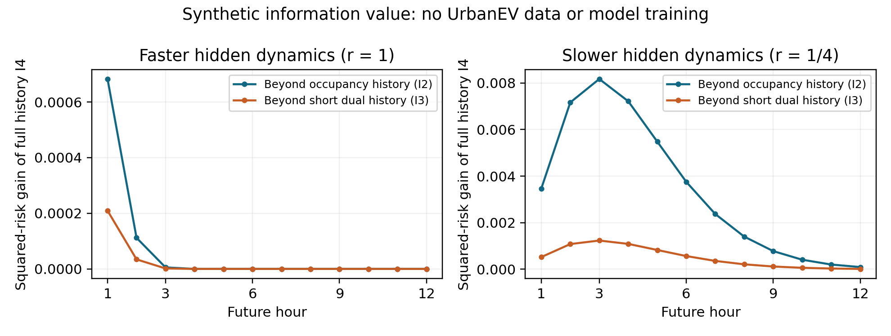

# 粗粒化记忆合成反证：执行结果与交通调度启发

日期：2026-09-13。状态：**SYNTHETIC_MECHANISM_CHECK_COMPLETE**。一次固定有限求和完成，零UrbanEV数值读取、零模型拟合、零基础模型推理、零参数搜索；真实方法门为**NOT_RUN**，没有自动推进至真实数据。

本轮最重要的结果是：**隐藏过程较慢时，滞后累计观测可以提供预测增量；但简单短双观测摘要已解释大部分收益。完整历史与标准HMM过滤一致，不能把经典过滤改名为新机制。**

这回应了物理学、经济学与交通调度三条线的共同问题：观测到的占用量如何由进入、驻留、退出和容量约束形成。严谨推导、八篇研究侧选读与交通补充见[完整理论报告](COARSE_MEMORY_THEORY_REPORT_20260913.md)，来源核查与更多直接先例见[阅读笔记](PHYSICS_ECONOMICS_TRAFFIC_READING_20260913.md)。

## 1. 实际执行了什么

[固定配置](../../../configs/research/COARSE_MEMORY_IDENTIFIABILITY_V1_20260913.json)规定三微状态：E空闲、A活跃、B忙但未充电。M系统的两个忙状态有不同退出结构，L系统提供占用聚合可闭合的负对照。各用r=1和r=1/4两个固定尺度，一步5分钟；没有依结果加尺度。

预测时刻t=3只允许O0、O1、O2、O3、K1、K2，**K3不可用**。比较I0当前占用、I1当前占用加滞后累计量、I2四个占用快照、I3短双观测(O2,O3,K2)、I4全部允许信息。对未来1—12小时逐点算条件概率，再分别汇总前H=3、6、9、12步，四个H等权。

总计枚举10,816个候选观测历史，非零支持9,220个；输出240行系统×信息集×未来小时评分。算法是float64矩阵动态规划与有限求和，**不是符号精确算术，也不是Monte Carlo抽样**。已知人工生成矩阵，不进行参数估计。正式执行耗时约1.17秒，不含后续画图与单元测试；峰值内存未测量。

尺度r同时缩放全部微观转移，包括空闲到活跃的转移，并非只干预隐藏驻留过程。两组固定系统的差异不能推广为“隐藏驻留越慢，记忆必然越有用”的一般定律。

## 2. 结果：对照越强，剩余贡献越小

表中为I4相对各对照的宏RMSE下降百分比。原始数值见[机器可读结果](../../../artifacts/summaries/coarse_memory_identifiability_v1_20260913/memory_value_by_horizon.json)。

| 人工系统 | 当前占用I0 | 当前＋滞后累计I1 | 占用历史I2 | 短双观测I3 |
|---|---:|---:|---:|---:|
| M，r=1 | 0.057079% | 0.050900% | 0.037293% | 0.011442% |
| M，r=1/4 | 1.738718% | 0.800701% | **1.601035%** | **0.246760%** |
| L，r=1 | 数值精度内0 | 数值精度内0 | 数值精度内0 | 数值精度内0 |
| L，r=1/4 | 数值精度内0 | 数值精度内0 | 数值精度内0 | 数值精度内0 |

图中是逐小时平方风险差Γ，不是RMSE百分比。快系统的I4对I2增量由第1小时约6.83×10^-4降至第12小时约1.80×10^-16；慢系统先增加再下降，第12小时仍约9.38×10^-5。**记忆价值未必随视距单调下降，也不能仅由短时正收益推断长视野有效。** 两面板纵轴尺度不同，便于呈现各自时距形状。

| I4人工系统 | 宏RMSE | 同一个条件均值预测的宏MAE |
|---|---:|---:|
| M，r=1 | 0.4315495580 | 0.3724713810 |
| M，r=1/4 | 0.3922612364 | 0.3085649683 |
| L，r=1 | 0.4696700885 | 0.4411818690 |
| L，r=1/4 | 0.4357007613 | 0.3803834413 |

本实验是单容量二元占用。对校准条件均值预测，期望MAE=2×期望MSE；因此指标同步改善是该例的特殊性质，**没有解决275区域占用率的RMSE—MAE冲突**。条件中位数MAE另列在CSV中，不与均值RMSE拼接。

## 3. 数学和实现核验

全历史矩阵求和与独立逐微步HMM计数过滤的预测概率最大差为3.33×10^-16。信息投影风险差恒等式及二元MAE恒等式最大误差8.05×10^-16；总概率误差最大1.89×10^-15，均小于冻结容差。L系统最大记忆Γ约2.50×10^-30，负对照成立。只排除支持为零的历史，没有删除低概率历史。

HMM一致性是已知生成参数下，同一条件概率的两条计算路径一致；不是新模型战胜或打平经过训练的经典基线。独立研究复核接受本轮公式、实现与限定结论，未要求重跑；该复核没有再次执行有限求和或本地测试。

另外两项独立小规模路径穷举单元测试通过，检验计数是否包含目的状态以及K3未被条件化。测试使用不同人工矩阵和更短路径，是代码验证，不是对注册系统新增拟合或改参。

[识别反例](../../../artifacts/summaries/coarse_memory_identifiability_v1_20260913/identifiability_counterexamples.json)记录并核对了三类限制：快照减积分可为负；不同亚小时服务分布可有相同整数小时占用法则；无约束需求冲击可抵消不同价格敏感度，且满载时不同被拒绝到达数可有同一占用。服务分布反例基于明确的平稳泊松模型和独立标记论证，未伪装为真实数据统计检验。

## 4. 交通调度带来的实质帮助

从Daganzo的交通流模型学习“存量变化＝实际接纳−实际离开”和接收容量约束；从Varaiya的max-pressure学习“先明确决策所需状态”。忙碌桩数、等候队列和潜在需求必须分开，区域邻接也不能替代真实车辆转向关系。[CTM](https://doi.org/10.1016/0191-2615(94)90002-7)、[Max-pressure](https://doi.org/10.1016/j.trc.2013.08.014)

停车领域已有仅凭历史占用进行M/M/C/C预测的直接工作。因此，排队建模、历史转移预测、多视野输出本身都不是本项目创新；本轮三状态模型也不是该停车论文的复现。[Xiao等，2018](https://doi.org/10.1016/j.trb.2018.04.001)

可继续凝练的问题是：**在容量限制、驻留阶段隐藏且积分观测滞后的条件下，何种简洁观测摘要对未来占用预测已足够，额外记忆在什么时间尺度上仍有实质价值？** 这是研究问题，不是已经证成的新定理或模型。后续必须比较同历史输入的经典状态空间/HMM/半马尔可夫模型与短摘要，不能只对比当前占用。

调度等待时间、吞吐量和福利属于另一组目标。本轮没有用控制收益替代标准预测指标，没有加入缺少观测支撑的公交时刻表、路网OD、服务年龄或外部队列。

## 5. 阶段判断和成果反哺

- 保留线索：隐藏过程时间尺度与双观测历史共同决定信息增量，机制在固定人工系统中成立。
- 明确问题：慢系统中I4相对短双观测I3仅0.246760%；复杂完整历史表示的必要性尚未建立。快速系统全部增量很小。
- 明确非创新：同信息精确HMM已经达到I4，不能把它作为超越经典方法的实证成果。
- 真实研究未执行：人工1.601035%不能用于通过UrbanEV的1%门，不能替代外推、275区域、噪声、未知参数和模型估计误差的验证。
- 经济路线暂存：价格、可达性与驻留耦合值得研究，但缺少必要识别条件，尚未训练结构需求模型。没有证明其他字段无效。

本次结束于合成机制检查，保留全部旧NO_GO和已消费claim。没有读取尾部、第三折验证/测试或Paris数据；定时任务继续PAUSED，未使用额度重置卡。下一真实阶段需要另立完整且可证伪的协议，不能由本次结果自动触发。

## 6. 可复现工件

运行入口：[run_coarse_memory_identifiability.py](../../../scripts/research/run_coarse_memory_identifiability.py)。完整[执行回执](../../../artifacts/summaries/coarse_memory_identifiability_v1_20260913/execution_receipt.json)、[同信息检查](../../../artifacts/summaries/coarse_memory_identifiability_v1_20260913/same_information_baseline_checks.json)、[逐小时评分](../../../artifacts/summaries/coarse_memory_identifiability_v1_20260913/observed_history_risks.csv)均为人工模型汇总。复现者应指定自己的全新输出和claim路径；项目已消费的claim不可删除或重置。
