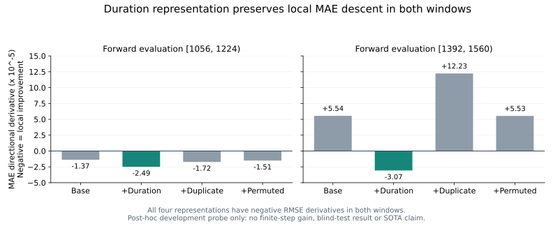

# 条件双风险方向探针：一次真实执行结果

**状态：MECHANISM_SUPPORTED_FOR_NEW_PROTOCOL_DESIGN。** 按真实运行前冻结的规则，时长相关表示在两个前向评价窗口均得到RMSE与MAE共同下降方向，且方向效率优于符合MAE下降条件的固定对照。本结果支持设计新方法协议，**尚未选定并实测可用的有限步长、≥1%收益、独立泛化或SOTA**；原V1/V2信息门和结构门不改判。

## 文献与理论如何反哺本次实验

[理论报告](JOURNAL_METHOD_REPORT_20260913.md)把问题从“时长与残差相关吗”改为“额外信息能否预测两种损失的共同下降方向”。来自评分决策论的区别是：平方风险取决于条件均值误差，绝对风险还取决于误差符号及零误差原子。此次分别估计这些量，再按同一公式构造方向，直接用后续窗口检验，而没有继续优化旧求解器。

令原生裁剪预测为p，拟合四输出 `(Y-p, 1[Y<p], 1[Y=p], 1[Y>p])`，分别得到均值误差m、符号不平衡s和原子概率π。用 `clip(m,-1,1) max(-s sign(m)-π,0)` 生成方向，再处理p=0/1的向内限制。该构造属于已有多目标共同下降思路的具体推导，不以其门控外形主张首创。

## 冻结与输入

执行前提交为 `4f559cd`，配置、36个输入文件身份和源码哈希见[冻结协议](../../../configs/research/DUAL_RISK_INFORMATION_PROBE_V1.json)。实际只读取六个既有truth文件和30个V1 α=1预测文件；没有读取原始O/D、基础模型完整缓存或V2选定预测。使用V1预测差，是为了避开用全部三个窗口选择过的V2 α。

四种表示是基础特征、基础＋时长预测差、基础＋重复特征预测差、基础＋错配时长预测差。差值不是已识别的纯时长创新，也不构成因果解释。

| 前向诊断 | 条件矩拟合窗口 | 评价窗口 |
|---|---|---|
| A | [720,888) | [1056,1224) |
| B | [720,888)与[1056,1224) | [1392,1560) |

每窗H3/H12各14个原点，间隔12小时，275区域。四输出ridge正则0.01、截距不罚，训练单元等权，标准化仅用较早窗口。共8次拟合。所有窗口已经用于前期研究，本轮是**后验设计、内部前向划分的开发诊断**，不是新盲测。

## 结果

下表的D_R、D_A分别是沿该方向的宏RMSE、宏MAE右导数；负数表示局部下降。效率为 `-D_R / sqrt(macromean(h²))`，是单位方向范数下的局部下降率，**不是误差改善百分比**。

| 评价窗口起点 | 表示 | D_R | D_A | 方向范数 | 归一化下降率 |
|---|---|---:|---:|---:|---:|
| 1056 | 基础 | −4.15611e−5 | −1.37214e−5 | 0.000441920 | 0.094047 |
| 1056 | **时长** | **−1.24629e−4** | **−2.48921e−5** | 0.001067556 | **0.116742** |
| 1056 | 重复 | −5.77899e−5 | −1.72495e−5 | 0.000965604 | 0.059848 |
| 1056 | 错配 | −4.39773e−5 | −1.50737e−5 | 0.000455569 | 0.096533 |
| 1392 | 基础 | −1.00711e−4 | +5.54471e−5 | 0.001777843 | 0.056648 |
| 1392 | **时长** | **−1.80401e−4** | **−3.06920e−5** | 0.001631116 | **0.110600** |
| 1392 | 重复 | −1.45164e−4 | +1.22306e−4 | 0.003457517 | 0.041985 |
| 1392 | 错配 | −1.04973e−4 | +5.53192e−5 | 0.001796635 | 0.058428 |

1056窗口三个对照都满足MAE下降，最佳对照效率0.096533，时长表示为0.116742。1392窗口三个对照均不满足MAE下降，因此按事先规则使用0作为兼容对照参考；这一比较条件应保留，不能将它省略后宣传成普遍优势。时长方向在两窗约47.46%/48.92%的条目为零。

两个评价窗口的native精确零误差比例分别约0.1353%和1.2262%（H等权）。这些原子质量已进入实际MAE导数计算，没有删除零误差或增损样本。全部16个“表示×窗口×视野”单元保留，见[方向报告](../../../artifacts/summaries/dual_risk_probe_v1/directional_risk_report.json)和[条件矩评分](../../../artifacts/summaries/dual_risk_probe_v1/moment_prediction_scores.csv)。宏门不意味着每个视野独立都通过。

## 证据边界与下一问题

此次新增证据是：在固定低维表示和学习规则下，时长相关预测差能够帮助估计一个跨两个开发窗口仍满足双损失局部下降的方向。它比旧的“平方残差相关”提供了更贴近任务的线索。

仍未回答的是：局部下降区间有多宽，有限移动后MAE是否保持，实际RMSE能否达到1%门，以及是否能在未参与方案设计的数据上复现。不得把导数线性外推到任意步长，也不据此重启V2或降低阈值。下一阶段应先冻结有限步长点预测规则、同信息条件分布/混合损失对照及新的评价方案；本次没有执行该阶段。

新颖性还受[PAR-LLM与CUP-EV等先例](JOURNAL_READING_NOTES_20260913.md)约束。只有证明额外信息在双风险约束下带来的可估计、可外推收益，才可能形成实质方法贡献；一般选择性修正、残差头或损失混合不够。

## 执行核验

11项定向合成测试通过，覆盖原子项、单侧导数、概率投影、边界方向、等单元权重、训练独立标准化、前向划分及8次拟合、完整白名单哈希检查和禁止基础模型导入。36个文件先全部通过既有哈希检查，再进行数值解码；实际线性求解计数8。未进行任何α搜索，也没有给α=1重新排名。

读取、拟合、导数汇总与结果写出约1.01秒（本次本地运行，不含预检与回执写出）；峰值内存未测量，没有将其报告为0。详细[执行回执](../../../artifacts/summaries/dual_risk_probe_v1/probe_receipt.json)和[测试记录](../../../artifacts/summaries/dual_risk_probe_v1/preflight_tests.txt)已保存。研究侧已复核执行源码、冻结配置及公开工件，接受本次限定的机制准入结论；未重读私有数组或重跑探针。

开发尾部、第三折验证/测试及Paris数据保持关闭；定时任务保持PAUSED，未使用额度重置卡。公开仅汇总、配置与源码，原始数组及本地协作材料不公开。

## 研究复核后的解释补充

本轮复核通过，无须修改实现或重跑。**对当前固定样本与固定方向，两个严格负右导数确实意味着存在足够小的正步长，使两项经验风险都下降。** 尚未解决的是可行区间宽度、只用较早数据选步长、达到1%收益及时间外推；不能否认局部存在性，也不能将其表述为已经取得可部署收益。

方向构造还可精确重写为：

$$
k=\begin{cases}[2P_+-1]_+,&m>0,\\
[2P_--1]_+,&m<0.\end{cases}
$$

m=0时最终方向为0。也就是说，它是一种均值方向与多数误差符号一致的规则；显式写入原子项不构成独立于一般条件符号门控的新颖机制。原子项在实际MAE右导数核算中仍不可省略。

[条件矩比较复核](../../../artifacts/summaries/dual_risk_probe_v1/moment_comparison_verification.json)显示：时长表示相对基础表示，在四个评价单元的残差均值MSE、总体Brier分数均较低，但原子概率MSE四个单元均略高。**因此，不能声称收益已被证明来自更准确的原子估计。** 概率投影只保证三分类输出合法，既不证明概率校准，也不等于估计了完整条件CDF，更不提供理论中的一致误差界。

下一协议必须分别回答局部兼容能否转为足量收益、增量来源能否超过普通条件符号门控、以及如何获得真正的时间外推证据。当前只完成报告发布，有限步长实验未获本轮执行放行。
