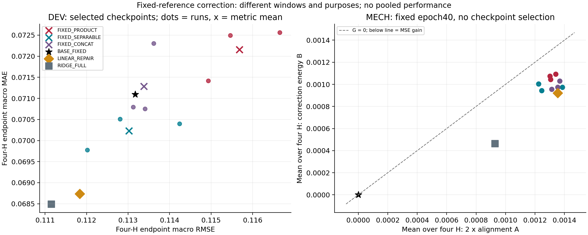

# 固定底座下的纠错信号：线性控制与固定epoch机制检查

上一轮前向监督的9个实例全部选择epoch0，迁移诊断随零纠错退化。本轮固定同一个未使用纠错标签拟合的底座，从残差生成到SELECT、机制检查及DEV都不更换它；检验O–D交互能否获得超出普通更新的非零收益。完整ridge仅作强参考，不替换主底座。

## 1. 理论对象与必要反证

设冻结底座为q_A，后续误差e_A=Y−q_A(X)，新增预测为q_A+s fθ(X)。由于参考固定，上一轮由更换底座引入的q_F−q_k项不再进入部署，但时间漂移和估计误差仍可能存在。固定底座、误差修正和分离训练本身不是原创方法。

本轮借鉴对未来观测评价已确定预测的prequential思想，而不继承普遍泛化保证。[Dawid原文](https://academic.oup.com/jrsssa/article/147/2/278/7106293)。额外参数的估计噪声也可能降低样本外准确度，简单强控制因而必要；本项目不直接套用线性嵌套模型的检验或调整实际分数。[Clark–West原研究](https://www.nber.org/papers/t0326)

主假说是：固定参考误差中存在可向后续窗口迁移的非零交互修正，并且其收益超出线性更新、可分离非线性和普通MLP。反证包括普通更新已足够、训练拟合但后续未保持、或者在当前预算中所有方法都未提取收益。有限负结果不能证明总体无信息。

## 2. 底座、纠错与三种变换

| 对象 | 训练原点（含端点） | 行数 | 最大训练标签 |
|---|---|---:|---:|
| BASE_FIXED（B_A） | 169…456 | 79,200 | 467 |
| 纠错集合M | 480…660、672…852、864…1044 | 149,325 | 1055 |
| RIDGE_FULL参考 | 169…1044 | 240,900 | 1055 |

B_A的拟合函数只接收O[0,468)、D[0,455)的局部副本，估计独立T_A与ridge参数后冻结。M沿用上一轮543个原点；底座标签与纠错标签间有[468,480)的12小时间隔，所有区域共同切分，不表示统计独立。

输入仍为168小时O、额外滞后1小时的168小时D、日/周相位和容量五维上下文。O最晚o−1、D最晚o−2；容量按TAZID加总，O以float32数量/容量后转float64，D用float64。近常数列固定置零。

纠错变换T_M只由M输入估计，全部纠错模型共享；完整参考的T_F只服务RIDGE_FULL，不能进入底座、纠错输入或尺度。完整ridge较B_A与M的原点并集多45个训练原点，因此不是严格等训练样本消融，而是更充分使用允许FIT的普通强参考。

尺度与标签为

\[
e_{64}=Y_{64}-q_{A,64},\quad
s=\max\{\sqrt{\operatorname{mean}(e_{64}^2)},10^{-6}\},\quad
t_{32}=\operatorname{float32}(e_{64}/s).
\]

float64 RMS在M的全部12步上计算一次，不逐块、逐H缩放，不借完整ridge的残差估计它。最终神经预测在CPU float64合成为q_A+s f32。改变参考会改变尺度与残差分布，因此跨历史实验的差异不能单独归因为取消底座迁移。

## 3. 三个神经族与普通强控制

| 系统 | 形式 | 可训练参数 |
|---|---|---:|
| FIXED_PRODUCT（主方法） | [u,v,u⊙v]→12 | 9,108 |
| FIXED_SEPARABLE | [u,v,(u²+v²)/2]→12 | 9,108 |
| FIXED_CONCAT | 341→24→24→12，两个Tanh | 9,108 |
| LINEAR_REPAIR | q_A+φ_M W，raw残差ridge | 4,104 |
| BASE_FIXED | 冻结较早ridge | 4,104个冻结系数 |
| RIDGE_FULL | 完整FIT重新估计ridge | 4,104 |

u=tanh(A_O[O;c]+a_O)，v=tanh(A_DD+a_D)。本轮不加入BC输入，否则同时依赖O/D的底座预测经过非线性编码器，会破坏可分离控制的含义。固定c时可分离映射raw四点混合差为0；PRODUCT可为C_X[(u₁−u₂)⊙(v₁−v₂)]。这是函数类性质，不是观测机制证明；clip本身可产生表观交互。

线性纠错使用相同M、T_M和raw残差，拟合

\[
\min_W N_M^{-1}\|e_A-\Phi_MW\|_F^2+0.01\|W_{nonintercept}\|_F^2.
\]

若相同活动坐标可表示q_A=p+φ_Mβ_A，则令β=β_A+W，等价于把新总系数向β_A而非零收缩的普通ridge。它不是新算法；若已解释收益，不能把增量归给交互。B_A与RIDGE_FULL也固定λ=0.01、截距不罚，三次确定性拟合均核验正规方程。

三个神经族各用20260915/16/17种子，全部MSE，40epoch、batch4096、37步/epoch、1,480步/次，总13,320步。隐藏层Xavier及seed+11/+13，输出层全零；同种子/epoch共用行排列，AdamW和固定余弦学习率沿用原规则。无POSREG、额外MAE项、修正L1、alpha或状态门。三个种子仅本轮配对，不与旧成绩混合。

每次训练结束后，额外一次完整M的无梯度前向，保存epoch40冻结参数对t32的MSE；它与遍历中的batch均值分列，不参与选择。神经计算使用现有RTX4060 float32，CPU两线程float64处理统计和ridge，关闭TF32/AMP/compile，无设备回退。

## 4. 选择与固定机制检查分离

| 用途 | 原点，stride12 | 标签范围 | 使用的模型 |
|---|---|---|---|
| SELECT | 1056…1212 | [1056,1224) | 从0/5/10/20/40选主部署checkpoint |
| MECH_FIXED40 | 1224…1380 | [1224,1392) | 预注册epoch40，不经过选择 |
| DEV_EVAL | 1392…1548 | [1392,1560) | 仅SELECT锁定的checkpoint |

SELECT只按raw四H末点宏RMSE逐模型/种子选择，完全并列取较早epoch。全部参数先冻结；机制分数不决定是否评价DEV，不更换checkpoint，不追加未选DEV诊断。机制窗不参与本轮拟合或选择，但属于长期开发流程，不宣传为盲测或独立统计确认。

机制窗口有九个epoch40神经实例与三个确定性系统，共48条raw末点评分。对固定函数δ=s f40，每H计算

\[
A_H=E[(Y-q_A)\delta],\quad B_H=E[\delta^2],\quad
G_H=2A_H-B_H=\operatorname{MSE}(q_A)-\operatorname{MSE}(q_A+\delta).
\]

A≤0表示该方向在本窗口没有正平方误差对齐；A>0而G≤0表示对齐被幅度代价抵消；G>0才是该固定函数在此窗口的MSE改善。δ=0则没有非零方向可分析。**不据A/B拟合新alpha、画步长搜索曲线或修改预测。**

主DEV完整报告raw/clip、末点/path、各H和各种子。12个本地系统产生192条分数，加native的H3/H12有效8条，共200有效及8缺失状态。神经SELECT720条、确定性参考48条。两个后续窗口不拼成一个更有利均值，固定40与选中模型的稳定性分开。

## 5. 访问、冻结与解释边界

顺序是：冻结B_A；构造M/T_M/s并拟合线性纠错及九神经轨迹；另拟合RIDGE_FULL并关闭拟合；SELECT锁定；保存机制epoch40与DEV选中预测；最后统一评分。

外层数值上限仍为FIT O1056/D1043、SELECT O1224/D1211、PREDICT O1548/D1547、SCORE O1560且D不扩展。PREDICT已含机制期观测，也含较晚原点合法使用的早期评价历史；保证的是每个原点只用过去、所有损失在预测冻结后计算，不能称冻结前未读取任何评价期数值。

机制12份raw预测和主DEV24份raw/clip预测只留本地；冻结后才读取四份原有1392 native/truth缓存。native没有H6/H9原调用，不切片填补。其他旧私有模型不读取，完整ridge仅对旧公开锚点评分核验。

胜过B_A不等于胜过LINEAR_REPAIR；胜过普通非线性不等于胜过RIDGE_FULL。即使局部全部胜出，也须完整可比前沿验证才能主张SOTA。本轮不恢复1%或MAE非劣门。

## 6. 实验结果

**固定底座上确有普通纠错收益，但交互结构优势未成立。** 线性纠错在机制窗和DEV均降低固定底座的宏RMSE/MAE；主交互模型在较早机制窗改善，后续DEV却恶化，并弱于普通控制与完整ridge。本轮消除了运行时更换底座，但没有消除收益跨时段不稳定，不能把失败唯一归因于迁移、漂移或优化。

### 6.1 选中模型的DEV主表

| 系统 | 四H raw RMSE | 四H raw MAE | RMSE种子标准差 | MAE种子标准差 |
|---|---:|---:|---:|---:|
| BASE_FIXED | 0.113173665 | 0.071097540 | — | — |
| LINEAR_REPAIR | 0.111834512 | 0.068737133 | — | — |
| RIDGE_FULL | 0.111146795 | 0.068494595 | — | — |
| FIXED_PRODUCT | 0.115683020 | 0.072157207 | 0.000879828 | 0.000643166 |
| FIXED_SEPARABLE | 0.113023432 | 0.070227837 | 0.001126790 | 0.000396258 |
| FIXED_CONCAT | 0.113383213 | 0.071285478 | 0.000247345 | 0.000884440 |

神经行是三种子指标均值和ddof=1描述性标准差，不是集成或置信区间。

| 模型 | 种子 | RMSE | MAE | SELECT选择epoch |
|---|---:|---:|---:|---:|
| FIXED_PRODUCT | 20260915 | 0.116651729 | 0.072561413 | 40 |
| FIXED_PRODUCT | 20260916 | 0.114933526 | 0.071415544 | 40 |
| FIXED_PRODUCT | 20260917 | 0.115463806 | 0.072494665 | 40 |
| FIXED_SEPARABLE | 20260915 | 0.114241936 | 0.070400340 | 40 |
| FIXED_SEPARABLE | 20260916 | 0.112809265 | 0.070508603 | 40 |
| FIXED_SEPARABLE | 20260917 | 0.112019095 | 0.069774567 | 20 |
| FIXED_CONCAT | 20260915 | 0.113616360 | 0.072306464 | 20 |
| FIXED_CONCAT | 20260916 | 0.113123771 | 0.070795591 | 20 |
| FIXED_CONCAT | 20260917 | 0.113409506 | 0.070754378 | 10 |

全部九个实例选择非零模型，无epoch0别名。主方法三种子均选epoch40，其四H宏RMSE和MAE在每个对应种子都弱于固定底座、分离控制、拼接MLP、线性纠错及完整ridge。

主方法平均相对BASE_FIXED的RMSE高2.217261%、MAE高1.490441%；相对LINEAR_REPAIR高3.441253%/4.975585%；相对RIDGE_FULL高4.081292%/5.347301%。这不是因低于旧1%收益门而失败，而是当前预测比较未支持交互优势。

LINEAR_REPAIR相对固定底座的RMSE降低1.183273%、MAE降低3.319957%，但仍弱于完整ridge。因其使用同一参考残差和纠错训练行，本轮不能笼统解释为“没有任何可利用纠错信号”。也不能把这个普通线性更新收益当作交互贡献或SOTA。

### 6.2 训练拟合确实改善，但不代表后续保持

| 模型 | 种子 | 完整M上冻结epoch40的归一化MSE |
|---|---:|---:|
| FIXED_PRODUCT | 20260915 | 0.815333192 |
| FIXED_PRODUCT | 20260916 | 0.818770495 |
| FIXED_PRODUCT | 20260917 | 0.818786072 |
| FIXED_SEPARABLE | 20260915 | 0.829922680 |
| FIXED_SEPARABLE | 20260916 | 0.834180256 |
| FIXED_SEPARABLE | 20260917 | 0.833063607 |
| FIXED_CONCAT | 20260915 | 0.829971120 |
| FIXED_CONCAT | 20260916 | 0.834998440 |
| FIXED_CONCAT | 20260917 | 0.836516114 |

每个实例都完成一次独立于训练遍历日志的完整M无梯度前向，初始零修正MSE约为1，epoch40降至0.815—0.837。主模型训练拟合更好，却没有获得更好的DEV成绩；它不是未训练或零输出退化，也没有证明已收敛或达到最佳优化结果。

### 6.3 固定epoch40机制窗：存在非零方向，收益未延续

下表是1224—1392机制窗，所有神经模型固定epoch40；其选择用途、窗口和权重身份与DEV分列，不拼接均值。

| 系统 | 四H宏RMSE | 宏MAE | 平均A | 平均B | 平均G=2A−B |
|---|---:|---:|---:|---:|---:|
| BASE_FIXED | 0.101555662 | 0.066052245 | 0.000000000 | 0.000000000 | 0.000000000 |
| LINEAR_REPAIR | 0.099259830 | 0.063508799 | 0.000676883 | 0.000921959 | 0.000431808 |
| RIDGE_FULL | 0.099113393 | 0.063161102 | 0.000463649 | 0.000463476 | 0.000463821 |
| FIXED_PRODUCT | 0.100324821 | 0.064777769 | 0.000658126 | 0.001070841 | 0.000245410 |
| FIXED_SEPARABLE | 0.099979187 | 0.064080419 | 0.000642469 | 0.000973623 | 0.000311315 |
| FIXED_CONCAT | 0.099676121 | 0.064067349 | 0.000672830 | 0.000986388 | 0.000359272 |

神经行对三个种子及四H等权平均；A/B/G是单点损失的平均，不是宏RMSE平方差。主方法三个种子的宏RMSE/MAE均好于固定底座，但均弱于线性纠错及完整ridge；分离与拼接网络的整体机制窗成绩也更好，不能把改善认定为专用乘积结构的价值。

主方法12个种子×H单元的A均为正，G有10正、2负；负值都在H6（种子15/17），说明这些固定方向有正对齐，但幅度代价抵消了它。没有据此求新alpha或修改输出。

主方法恰好三个种子都被SELECT选择epoch40，因此其MECH和DEV使用相同权重：机制窗改善、DEV恶化不能用这两窗的checkpoint不同来解释。其他控制的MECH固定40与DEV选中epoch可能不同，不作同权重比较。固定40窗口不参与本轮选择，也不是整个研究流程中从未曝光的独立确认。

左图点为DEV单次运行、叉号为指标均值；右图为机制窗四H平均的2A与B，虚线下方对应平均端点MSE改善。颜色含义一致；图的两侧不能合并成一个性能表，也不表示每个H都改善。

### 6.4 DEV状态贡献和稳定性

主方法相对固定底座的raw端点贡献，先对三个种子和四H平均、再保留组内和：

| 固定状态组 | MSE净收益和 | MAE净收益和 |
|---|---:|---:|
| 低占用下降 | −0.075292 | +0.655827 |
| 低占用非下降 | −2.938455 | −5.971338 |
| 高占用下降 | +0.046158 | −0.047621 |
| 高占用非下降 | +0.753594 | +1.283414 |

正值为改善；总和除3,850还原平均端点MSE差或宏MAE差。低占用非下降组增损突出，其余组无法抵消；这是结果描述，不作路由或新权重。每个视野、种子与原点的贡献完整保留。

主方法DEV各H的T/V非零，η约0.154—0.218；它不再是上一轮零修正别名。然而较小的相对分歧不代表准确，较一致的修正也可能一致地增损。MECH固定40的稳定性在独立字段保存，不与DEV混合。

### 6.5 其他口径和native共同支持

| 支持/后处理/范围 | 系统 | RMSE | MAE |
|---|---|---:|---:|
| FOUR_H/clip_0_1/terminal_H | BASE_FIXED | 0.113168699 | 0.071074900 |
| FOUR_H/clip_0_1/terminal_H | LINEAR_REPAIR | 0.111833797 | 0.068729528 |
| FOUR_H/clip_0_1/terminal_H | FIXED_PRODUCT | 0.115545236 | 0.072063953 |
| FOUR_H/clip_0_1/terminal_H | RIDGE_FULL | 0.111144400 | 0.068483636 |
| FOUR_H/raw/path_1_to_H | BASE_FIXED | 0.115205586 | 0.066635670 |
| FOUR_H/raw/path_1_to_H | LINEAR_REPAIR | 0.112997375 | 0.063753033 |
| FOUR_H/raw/path_1_to_H | FIXED_PRODUCT | 0.116386828 | 0.067057481 |
| FOUR_H/raw/path_1_to_H | RIDGE_FULL | 0.112923998 | 0.063822112 |
| H3_H12_COMMON/raw/terminal_H | BASE_FIXED | 0.114079805 | 0.071676904 |
| H3_H12_COMMON/raw/terminal_H | LINEAR_REPAIR | 0.112270390 | 0.068767094 |
| H3_H12_COMMON/raw/terminal_H | FIXED_PRODUCT | 0.115440604 | 0.071608463 |
| H3_H12_COMMON/raw/terminal_H | RIDGE_FULL | 0.111694520 | 0.068687138 |
| H3_H12_COMMON/raw/terminal_H | NATIVE | 0.111690275 | 0.060337619 |
| H3_H12_COMMON/clip_0_1/terminal_H | BASE_FIXED | 0.114071619 | 0.071649202 |
| H3_H12_COMMON/clip_0_1/terminal_H | LINEAR_REPAIR | 0.112269130 | 0.068756415 |
| H3_H12_COMMON/clip_0_1/terminal_H | FIXED_PRODUCT | 0.115299250 | 0.071521717 |
| H3_H12_COMMON/clip_0_1/terminal_H | RIDGE_FULL | 0.111690004 | 0.068670965 |
| H3_H12_COMMON/clip_0_1/terminal_H | NATIVE | 0.111686844 | 0.060289368 |

主方法行是三种子指标均值。相对底座的结论必须注明支持：H3/H12 raw的主方法平均MAE略低于固定底座，但RMSE更高；不能将四H双指标恶化推广为所有口径。native有不同预训练和信息范围，只在原调用H3/H12作参考，未补H6/H9推理。本轮没有SOTA证据。

### 6.6 执行核验与成本

两次底座拟合、一次线性纠错、九次神经训练、13,320步和九次固定40完整M核验全部完成。神经SELECT720条，确定性参考48条；主DEV200有效+8缺失；机制48条；24主轨+12机制预测保存后重评分误差均为0。三个正规方程通过，线性相对误差4.41×10⁻¹⁸，完整ridge锚点误差2.64×10⁻¹⁶，机制分解评分还原误差3.63×10⁻¹⁸。共同尺度s=0.083002288059391735。

底座构造/拟合/核验共6.226秒，线性纠错0.752秒，神经训练含固定FIT前向共80.002秒，后续批量神经推断0.160秒，总执行158.435秒。推断计时不含模型构造、checkpoint读取及CPU底座预测。PyTorch显存allocated/reserved峰值290,989,056/297,795,584字节；总进程内存未测，不作跨方法速度排名。

263项本地测试和隐私检查通过。旧历史署名例外保留，未宣称全历史清理完成；原始输入、标签、权重和预测均未上传，无新基础推理或重跑。

## 7. 研究含义与下一问题

本轮取得了非退化证据：普通线性纠错在两个后续窗口均有固定参考之上的整体收益，已训练的交互函数也曾在机制窗口改善，因此“完全没有可利用误差”不是对结果的合适概括。但专用交互在DEV所有配对种子中均不及普通对照，未建立交互必要性或稳定泛化。

消除运行时底座更换后，收益仍未跨时段保持；这限制了“只要解决迁移就能成功”的解释，却没有定位唯一原因。时间变化、表示及估计/优化误差仍需区分。本轮不依据机制诊断重新缩放、不补训练或更换底座。

[全部工件](../../../artifacts/summaries/fixed_reference_correction_v1/)、[主DEV成绩](../../../artifacts/summaries/fixed_reference_correction_v1/development_scores.csv)、[固定40机制成绩](../../../artifacts/summaries/fixed_reference_correction_v1/mechanism_fixed40_scores.csv)、[训练日志](../../../artifacts/summaries/fixed_reference_correction_v1/training_curves.csv)、[执行回执](../../../artifacts/summaries/fixed_reference_correction_v1/execution_receipt.json)。本轮结束后返回人工审核，定时保持暂停，未使用额度重置卡。
