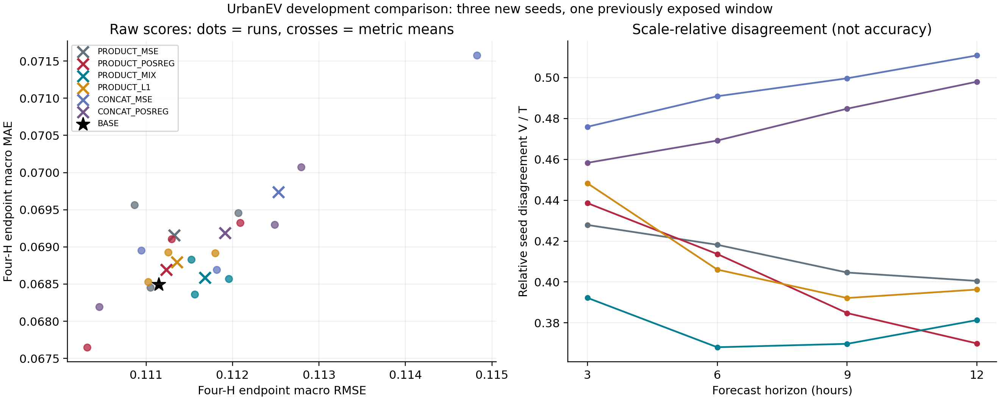

# 基于底座增损的交互稳定化：理论与真实实验

本轮检验：训练时单独惩罚相对共同底座新增的绝对误差，能否稳定O–D交互收益，以及这种作用是否超过普通MAE混合、统一收缩和通用MLP。[上一轮](CONDITIONAL_OD_INTERACTION_REPORT_20260913.md)存在RMSE开发信号，但种子、视野分化且平均MAE升高。本轮不按已见DEV状态损失设置路由，也不靠挑选种子刷新成绩。

## 1. 理论对象与目标

共同冻结的长OD ridge为q⁰，网络修正为f，预测q=q⁰+f。以FIT样本内底座残差e=Y−q⁰定义

\[
d_A=|e-f|-|e|,\quad h=[d_A]_+,\quad b=[-d_A]_+,\quad
A(q)-A(q^0)=E[h]-E[b].
\]

平均MAE反映收益和增损的净值。主方法额外惩罚逐条目的正增损，而非平均净变化的正部。两者不等价：不同条目的收益可以抵消后者。

先计算e32=float32(Y64−q⁰64)，冻结

\[
s=\max\{\sqrt{\operatorname{mean}(\operatorname{float64}(e32)^2)},10^{-6}\},\quad
\kappa=0.5,\quad \tau=\operatorname{float32}(\kappa s).
\]

主目标为

\[
J_{POSREG}=E[(e-f)^2]+\kappa s E[h].
\]

均值覆盖所有行和12输出。s使两个项具有平方误差量纲，只从FIT计算一次；不搜索κ，不使用SELECT或DEV估计尺度。底座在同一FIT估计，残差是样本内残差，不是总体可靠性的无偏估计。

必要对照为

\[
J_{MIX}=E[(e-f)^2]+\kappa sE[|e-f|-|e|],\quad
J_{L1}=E[(e-f)^2]+\kappa sE|f|.
\]

MIX减去固定常数，不改变普通MSE＋MAE优化；L1惩罚全部修正。逐函数由三角不等式得到

\[
[|e-f|-|e|]_+\le |f|,\qquad J_{MIX}\le J_{POSREG}\le J_{L1}.
\]

这不是三种训练结果的性能排序。若同一经验样本上的固定函数确实满足J_POSREG(f)≤J_POSREG(0)，才有

\[
\kappa sE[h]\le E[e^2]-E[(e-f)^2].
\]

神经优化、权重衰减、梯度截断与SELECT选择都不保证这个前提，更不提供DEV安全保证。反例：Y服从Bernoulli(0.1)、q⁰=0，限制常数q∈[0,1]。E[h]=0.9q，MSE=0.1−0.2q+q²，本轮κ与s下最优q≈0.028849，MSE下降而MAE从0.1升至约0.123079。因此本方法不是MAE非劣算法。

## 2. 与已有思想的关系

[Safe Policy Improvement by Minimizing Robust Baseline Regret，NeurIPS 2016](https://papers.nips.cc/paper_files/paper/2016/hash/9a3d458322d70046f63dfd8b0153ece4-Abstract.html)研究相对基线的稳健遗憾，其MDP模型与误差保证不能转移给这里的预测惩罚。[Sagawa等的group DRO研究](https://arxiv.org/abs/1911.08731)提示训练最差组风险与泛化仍有差距。本轮不复现这些算法，也不将正部、残差训练或损失混合本身称作原创理论。可能的贡献在于这一目标与交互预测器的适配价值，必须通过强对照建立；不是穷尽查新。

## 3. 六方案的结构与目标对照

| 方案 | 结构 | 目标 | 要排除的解释 |
|---|---|---|---|
| PRODUCT_MSE | 原OD_PRODUCT | MSE | 原方法在新种子下表现 |
| PRODUCT_POSREG（主方法） | 原OD_PRODUCT | 正增损 | 主假说 |
| PRODUCT_MIX | 原OD_PRODUCT | MSE＋MAE | 普通损失混合已足够 |
| PRODUCT_L1 | 原OD_PRODUCT | MSE＋修正L1 | 只是缩小修正 |
| CONCAT_MSE | 原拼接MLP | MSE | 普通非线性已足够 |
| CONCAT_POSREG | 原拼接MLP | 正增损 | 目标是通用收益而非交互特有 |

各网络9,108参数，同一架构同一种子完全同初值、同数据顺序；不同结构不声称逐参数相同。全部共用一次新拟合的4,104系数长OD ridge与FIT变换，随后冻结。原模型源和旧实验保持原样。

固定三个新种子20260915/16/17，不与旧两个种子混成事后五种子赢家。18次训练，每次40epoch、batch4096、2,360步，共42,480步。复用原Xavier子种子、零输出层、AdamW、余弦学习率及全局梯度截断1；abs/relu用PyTorch默认零点次梯度。细节全部登记于[配置](../../../configs/research/REFERENCE_HARM_STABILITY_V1.json)。

FIT原点169…1044，240,900行；SELECT1056…1212和DEV1392…1548各14原点，间隔12小时。O168、额外滞后1小时的D168、五维相位/容量上下文与归一化原样继承。所有窗口已曝光，仅为新开发比较。O数值阶段上限1056/1224/1548/1560，D上限1043/1211/1547且SCORE不扩展。保护尾部、后续验证/测试及Paris保持关闭。

先完成全部18训练，才在SELECT从epoch0/5/10/20/40按raw四H末点宏RMSE分别选择，完全并列取较早者。MAE、增损和状态组不参与选择；epoch0明确记底座别名，不称稳定化成功。无重训、最好种子、集成或新损失权重搜索。

全部预测冻结后才扩展最终SCORE前缀及读取四个原有1392 native/truth缓存。native仅有原调用的H3/H12，不切片制造H6/H9。四H和共同支持分别报告raw/clip、末点/路径。正常有1,440个选择评分、16个底座参考评分、312个有效DEV评分及8个缺失状态。

## 4. 稳定性诊断与反证

对每个H的三个种子修正a_s=q_s−q⁰，定义

\[
T_H=\frac13\sum_sE[a_s^2],\quad
V_H=\frac19\sum_{s<t}E[(a_s-a_t)^2],\quad
\eta_H=V_H/T_H\ (T_H>0).
\]

V是以1/3归约的跨种子预测方差。共同缩放a_s→ca_s时T、V同比缩放，而η不变。T=0时η记null并标为全退回底座。因此方差下降不自动意味着更稳定的非零信息；η下降也不保证准确度。用配对预测差计算，不产生或评分种子集成。raw与clip各自减去同后处理的底座。

另外报告逐H风险分解H_A=E[h]、B_A=E[b]并核对MAE差=H_A−B_A。降低增损若损失更多收益，不能称风险权衡改善。每epoch日志是训练遍历中的批量均值，不是冻结参数下完整FIT目标或泛化界。

结构×目标差为I_R=[R(PRODUCT_MSE)−R(PRODUCT_POSREG)]−[R(CONCAT_MSE)−R(CONCAT_POSREG)]，仅是描述性作用差，不是因果识别。三种子的指标均值、范围、样本标准差(ddof=1)与每个种子方向都保留。

沿用p<0.5/≥0.5与24小时变化<0/≥0四组，只做冻结后的贡献诊断，不进入训练或路由。四H平均的组损失和除3,850还原宏MAE差或平均端点MSE差；不能用宏RMSE平方差替代。没有新的状态阈值、聚类或有利原点选择。

MIX/L1或CONCAT_POSREG同样好，将分别限制正增损必要性、非统一收缩解释及交互特有性。若DEV未保持SELECT收益，或改进仍靠局部状态补偿，需明确记录。旧1%和MAE零恶化门不恢复。

## 5. 执行结果

**实验完整执行，但整体稳定化主张未成立。** 主方法较原PRODUCT_MSE略有平均误差改善，也减少了增损；然而仍未超过ridge底座，成绩的跨种子离散度反而增加，通用MLP从相同惩罚获得的平均收益更大。本轮不以此否定全部交互方法，也不改选其他方案作为事后主方法。

### 5.1 主表：四H raw末点

| 系统 | RMSE均值 | MAE均值 | RMSE标准差 | MAE标准差 |
|---|---:|---:|---:|---:|
| BASE_OD | 0.111146795 | 0.068494595 | — | — |
| PRODUCT_MSE | 0.111326341 | 0.069159118 | 0.000645350 | 0.000613471 |
| PRODUCT_POSREG | 0.111233446 | 0.068693831 | 0.000887675 | 0.000910639 |
| PRODUCT_MIX | 0.111680392 | 0.068587528 | 0.000239479 | 0.000233148 |
| PRODUCT_L1 | 0.111357572 | 0.068792693 | 0.000397389 | 0.000226477 |
| CONCAT_MSE | 0.112528269 | 0.069739519 | 0.002035584 | 0.001595324 |
| CONCAT_POSREG | 0.111912206 | 0.069188786 | 0.001269763 | 0.000946182 |

均值和ddof=1标准差来自三个预注册新种子的指标，不是预测集成或置信区间。旧两个种子未合并。

| 方案 | 种子 | raw RMSE | raw MAE | SELECT选择epoch |
|---|---:|---:|---:|---:|
| PRODUCT_MSE | 20260915 | 0.112064104 | 0.069457534 | 40 |
| PRODUCT_MSE | 20260916 | 0.111048321 | 0.068453531 | 20 |
| PRODUCT_MSE | 20260917 | 0.110866598 | 0.069566289 | 40 |
| PRODUCT_POSREG | 20260915 | 0.112088806 | 0.069327013 | 40 |
| PRODUCT_POSREG | 20260916 | 0.110316649 | 0.067650209 | 20 |
| PRODUCT_POSREG | 20260917 | 0.111294882 | 0.069104271 | 20 |
| PRODUCT_MIX | 20260915 | 0.111955836 | 0.068568727 | 40 |
| PRODUCT_MIX | 20260916 | 0.111521499 | 0.068829507 | 20 |
| PRODUCT_MIX | 20260917 | 0.111563840 | 0.068364350 | 40 |
| PRODUCT_L1 | 20260915 | 0.111022016 | 0.068531222 | 40 |
| PRODUCT_L1 | 20260916 | 0.111254297 | 0.068927474 | 40 |
| PRODUCT_L1 | 20260917 | 0.111796404 | 0.068919384 | 40 |
| CONCAT_MSE | 20260915 | 0.111815110 | 0.068690937 | 5 |
| CONCAT_MSE | 20260916 | 0.114824476 | 0.071575457 | 20 |
| CONCAT_MSE | 20260917 | 0.110945222 | 0.068952164 | 10 |
| CONCAT_POSREG | 20260915 | 0.112488436 | 0.069299487 | 20 |
| CONCAT_POSREG | 20260916 | 0.112791682 | 0.070074747 | 40 |
| CONCAT_POSREG | 20260917 | 0.110456500 | 0.068192123 | 40 |

主方法相对PRODUCT_MSE，平均RMSE降低0.083444%、MAE降低0.672777%；相对BASE，RMSE增加0.077960%、MAE增加0.290878%。三个种子中只有20260916同时优于BASE的两项指标；没有epoch0别名，不能把收缩解释为全退回底座。主方法对原MSE的MAE在三个配对种子均下降，但RMSE仅一个种子下降。

主方法具有本轮六个神经方案中最低的平均四H raw RMSE，但普通MIX的MAE更低：POSREG对MIX的RMSE低0.400201%，MAE高0.154989%。对L1，平均RMSE/MAE分别低0.111467%/0.143711%。这些是本次结果的权衡，不能据此宣称POSREG稳定支配强对照。

### 5.2 稳定性：幅度下降不等于成绩更稳

| 目标 | H3 η | H6 η | H9 η | H12 η |
|---|---:|---:|---:|---:|
| PRODUCT_MSE | 0.427911 | 0.418212 | 0.404627 | 0.400522 |
| PRODUCT_POSREG | 0.438597 | 0.413682 | 0.384785 | 0.369931 |
| PRODUCT_MIX | 0.392264 | 0.368084 | 0.369746 | 0.381372 |
| PRODUCT_L1 | 0.448307 | 0.406074 | 0.392163 | 0.396305 |
| CONCAT_MSE | 0.475929 | 0.490874 | 0.499641 | 0.510830 |
| CONCAT_POSREG | 0.458294 | 0.469184 | 0.484777 | 0.497996 |

POSREG相对原MSE的T与V在四H均降低，但η只在H6/H9/H12下降，H3反而升高。其四H宏RMSE标准差由0.000645350升至0.000887675，MAE标准差由0.000613471升至0.000910639。预测分歧与指标波动是不同量，不能用前者下降证明后者下降。

MIX的成绩标准差更小，H3/H6/H9的η也低于POSREG；L1的修正幅度更小，但η并非所有H更低。这限制了“正增损特别适合稳定交互”的解释。相对BASE，主方法三种子平均只有H3的RMSE与MAE均改善，其余H均更高；相对PRODUCT_MSE，它降低H6/H9/H12平均RMSE，却提高H3平均RMSE。

图中点为单次运行，叉号为三个运行指标均值，星号为底座；不展示或评价任何集成。右图是相对分歧，不是准确度或置信度。

### 5.3 增损、收益和交互特有性

| 方案 | 相对BASE正增损H_A | 收益B_A | 平均绝对修正 |
|---|---:|---:|---:|
| PRODUCT_MSE | 0.008424060 | 0.007759538 | 0.017821691 |
| PRODUCT_POSREG | 0.006252186 | 0.006052951 | 0.013183784 |
| PRODUCT_MIX | 0.008277028 | 0.008184095 | 0.017958075 |
| PRODUCT_L1 | 0.003889629 | 0.003591531 | 0.007866347 |
| CONCAT_MSE | 0.006892117 | 0.005647193 | 0.013483154 |
| CONCAT_POSREG | 0.005829857 | 0.005135667 | 0.011639080 |

表中同时对四H和三个种子平均，H_A−B_A还原相应MAE变化。POSREG比MSE少增损，但也丢失收益，最终H_A仍大于B_A。L1的增损更少，但收益也更少；不能只看单边增损排行。

结构×目标的平均I_R=−0.000523167，MAE对应差为−0.000085447：本次相同正增损目标对CONCAT的平均帮助更大，而非PRODUCT。因不同优化轨迹和checkpoint选择均可能影响差异，这不是因果机制否证，但不支持交互专属适配优势。

固定状态组、相对BASE、raw末点的净贡献（先对四H和三个种子平均，再保留组内和）如下：

| 状态组 | MSE净收益和 | MAE净收益和 |
|---|---:|---:|
| 低占用下降 | +0.150899 | +1.050343 |
| 低占用非下降 | −0.762406 | −2.072381 |
| 高占用下降 | −0.003269 | −0.179770 |
| 高占用非下降 | +0.532758 | +0.434750 |

正值表示改善；除3,850还原对应平均损失差。高占用非下降仍提供正贡献，低占用非下降的增损仍大，整体净增损没有解除。不调整分组，也不据此生成事后路由。完整各种子、视野和原点贡献均保留。

### 5.4 后处理、路径与native共同支持

| 支持/后处理/范围 | 系统 | RMSE | MAE |
|---|---|---:|---:|
| FOUR_H/clip_0_1/terminal_H | BASE_OD | 0.111144400 | 0.068483636 |
| FOUR_H/clip_0_1/terminal_H | PRODUCT_POSREG | 0.111222066 | 0.068664599 |
| FOUR_H/raw/path_1_to_H | BASE_OD | 0.112923998 | 0.063822112 |
| FOUR_H/raw/path_1_to_H | PRODUCT_POSREG | 0.112740947 | 0.063707375 |
| H3_H12_COMMON/raw/terminal_H | BASE_OD | 0.111694520 | 0.068687138 |
| H3_H12_COMMON/raw/terminal_H | PRODUCT_POSREG | 0.111504046 | 0.068618379 |
| H3_H12_COMMON/raw/terminal_H | NATIVE | 0.111690275 | 0.060337619 |
| H3_H12_COMMON/clip_0_1/terminal_H | BASE_OD | 0.111690004 | 0.068670965 |
| H3_H12_COMMON/clip_0_1/terminal_H | PRODUCT_POSREG | 0.111496568 | 0.068598704 |
| H3_H12_COMMON/clip_0_1/terminal_H | NATIVE | 0.111686844 | 0.060289368 |

PRODUCT_POSREG行均为三种子指标均值。H3/H12共同支持raw端点相对native，RMSE低0.166737%，MAE高13.724042%；不能称总体超过native。native拥有不同预训练/信息范围，不是等预算消融，更没有H6/H9原调用成绩。

### 5.5 执行与核验

一次底座、18次神经训练、42,480步全部完成。1,440条神经SELECT与16条BASE参考、312条有效DEV与8条缺失状态、38份保存预测、312个损失比较及4,368条原点记录齐全。预测重评分误差0，cache标签误差0，底座重建2.64×10⁻¹⁶，直接损失归约3.23×10⁻¹⁷。FIT尺度s=0.079648563356454385，未触发下限；tau=0.039824280887842178。

本机底座拟合0.605秒、18次同步神经训练合计263.656秒、批量推断0.206秒、总执行336.671秒。推断不包含模型构造、checkpoint读取和CPU底座预测。PyTorch显存allocated/reserved峰值分别421,907,456/436,207,616字节；进程总内存未测，不作跨方法速度排名。

本地241项测试与隐私检查通过。代码、配置、源身份、全部指标与实际训练轨迹公开，私有数组和权重未上传；旧历史署名例外未重写，不宣称全历史清理完成。

## 6. 研究含义

本轮成功检验并限制了一个方法假说：控制训练样本的正增损，确实可减少开发端部分增损，但尚未转化为跨种子、时距稳定的整体优势。更小的预测分歧、更小的增损、更低的平均误差分别是不同主张，不能相互替代。当前底座仍是本轮平均四H raw RMSE/MAE更好的参照。

这些结果不证明时长、非线性交互或所有参考风险方法无效，也不把普通MIX/L1事后升级为新主方法。下一研究问题需先辨别训练参照残差与评价期误差结构的差异，或固定信息下的优化/选择波动，而不是继续增加惩罚强度试到成功；本轮没有授权自动开展下一协议。

[全部结果与回执](../../../artifacts/summaries/reference_harm_stability_v1/)、[冻结配置](../../../configs/research/REFERENCE_HARM_STABILITY_V1.json)、[源码](../../../src/urbanev_forecast/reference_harm.py)。本轮没有SOTA证据；保护数据保持关闭，完成后返回人工审核，定时任务暂停，未使用额度重置卡。
