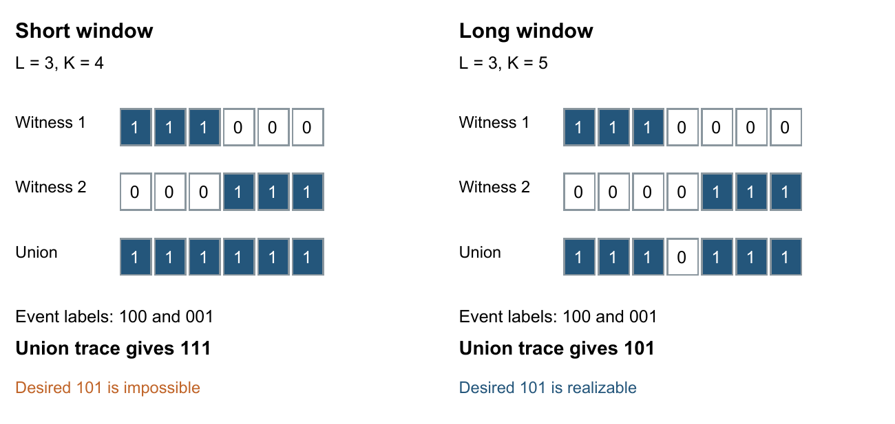
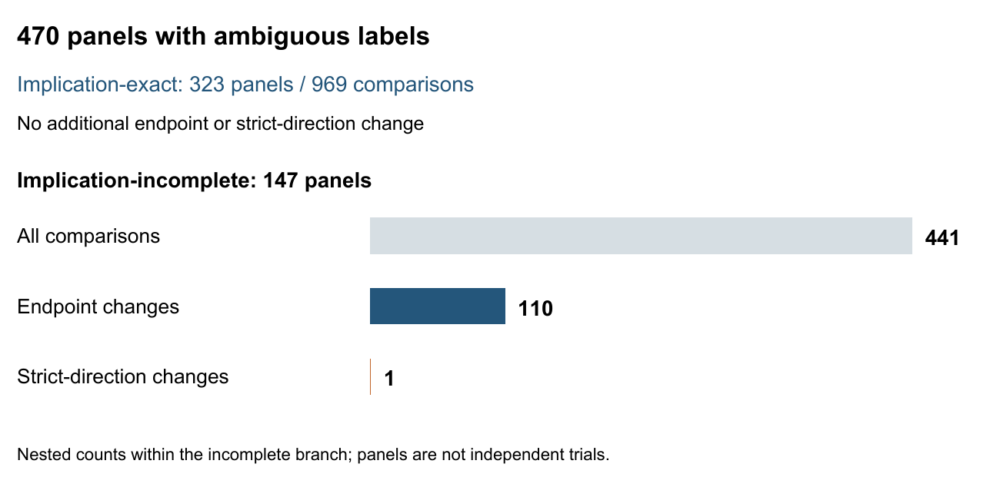
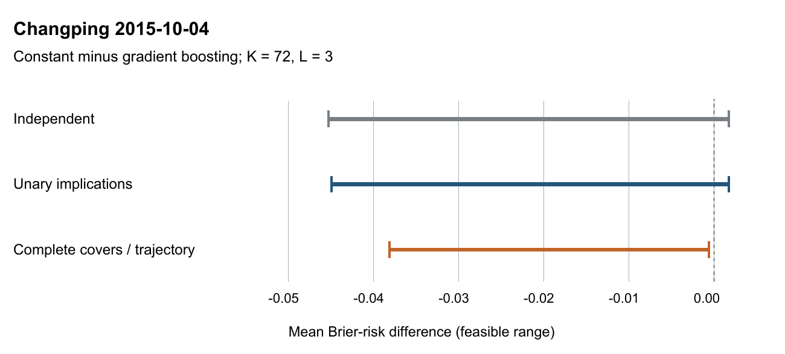

# Abstract

We characterize the feasible label patterns produced by a sliding persistent-event operator when its underlying binary sequence is only partially observed. Each label records whether a window of length $K$ contains $L$ consecutive ones. Because overlapping windows share missing positions, their labels cannot generally be completed independently. We prove that, for every fixed partial observation, the binary label image is described exactly by determined labels, unary implications, and two-point cover constraints whenever $K\geq 2L-1$. This universal threshold is sharp: for every shorter admissible window with $L\geq2$, a three-label counterexample violates union closure. A minimal-run interval representation makes the result constructive. Combining it with the classical principal-state view of union-closed families yields a directly checkable geometric criterion for implication sufficiency. We apply the characterization to paired Brier-risk evaluation of fixed forecasts in two temporally ordered evaluations of air-quality and household-power data. Among 470 panels with ambiguous labels, 323 are implication-exact and 147 are not. The latter account for all 110 comparisons with tighter exact risk intervals and the single additional strict decision beyond implications. Complete cover linear programs match trajectory-optimal endpoints for every one of the 8,352 frozen natural comparisons, although a classical polyhedral counterexample rules out this equality in general. The results separate structural insufficiency, objective sensitivity, and decision change.

**Keywords:** persistent events; partial observations; feasible label image; overlapping windows; dual-Horn constraints; robust forecast evaluation

# 1 Introduction

A forecast of a persistent event is often evaluated against a label derived from several consecutive sensor readings. An hourly air-quality forecast, for example, may ask whether the next day contains three consecutive readings above a fixed threshold. If evaluation readings are missing, the event label can remain ambiguous. More importantly, adjacent forecast labels share readings. An assignment that makes one label positive may force another label to be positive, even if both labels are individually uncertain. Treating their uncertainty independently therefore admits label patterns that no single completed sensor trace can produce.

Existing work provides principled ways to evaluate classifiers with missing labels [1] and to compare predictive performance under common uncertainty [2,3]. These developments establish that it can be valuable to optimize a performance difference directly over a shared latent state. They do not, by themselves, explain the geometry of the label patterns induced by a particular sliding event definition. For persistent events, the remaining question is concrete: when do simple relations between labels describe every completion-compatible output pattern, and when is a richer representation necessary?

We study the image of a partially fixed binary sequence under the operator that reports whether each $K$-window contains an all-one run of length $L$. Our main result identifies a sharp structural regime. If $K\geq2L-1$, every feasible binary label pattern is characterized by determined coordinates and valid constraints of the forms $y_j\leq y_i$ and $y_j\leq y_i+y_k$. A constraint in the second form has two covering points but three label variables. The result holds uniformly over the sequence length and every layout of observed zeros, observed ones, and missing positions. If $L\leq K<2L-1$ and $L\geq2$, that uniform guarantee fails.

The proof uses minimal witnesses. To make an ambiguous label positive, it is enough to set one available length-$L$ run to one and all other unknown positions to zero. Observed ones adjacent to the run can extend its influence. Accounting for those extensions produces an interval of affected label origins. All witness intervals for a target label contain that target, so any valid cover has a subcover of at most two points. The substantive step is a safe-union argument: in the long-window regime, witnesses that individually avoid prescribed zero labels can be combined without creating an unintended event inside a zero window.

This characterization also explains when unary implications already suffice. Classical theories of union-closed families, atoms, and quasi-orders describe the abstract principal-state condition [4–6]. We instantiate that condition through the witness intervals, obtaining a test that reads only the observation geometry. It uses neither forecast probabilities nor the objective of a risk optimization problem. Consequently, it separates panels whose implication model is exact for every linear objective from panels whose apparent equality depends on the particular forecasts being compared.

The distinction matters empirically. Across two fixed evaluation years, 323 of 470 ambiguous panels satisfy the geometric sufficiency criterion. Their 969 model comparisons show no gap between implications and exact trajectory optimization. The remaining 147 panels generate 441 comparisons; 110 have a risk-endpoint difference, but only one changes strict model ordering. Adding the complete two-point cover family recovers the exact endpoints for every frozen natural objective, including that decision-changing example. Thus the empirical role of the theory is to explain which dependencies are available, which affect current losses, and which are large enough to change a decision.

The paper makes three contributions with different roles. First, it proves an exact, constructive characterization of the persistent-event label image and a sharp universal threshold. Second, it derives a concrete run-geometric implication-sufficiency criterion using classical union-family structure. Third, it connects these results to frozen forecast comparisons, reporting both changes and absences of change. We do not claim a new general theory of dual-Horn relations, paired partial identification, or automaton optimization. Nor does binary representability imply that the natural continuous cover relaxation is the convex hull. Sections 2–6 develop these distinctions, Section 7 reports the evaluations, and Appendix A gives the full proofs.

# 2 Related work

## 2.1 Evaluation with missing labels and shared uncertainty

Dervovic and Cashmore study classifier metrics under missing evaluation labels, including robust metric bounds and distributions obtained by multiple imputation [1]. Their work establishes that missing-label evaluation is an existing methodological problem. Our uncertainty is more specific: a single missing trace position may influence many event labels, so the feasible label set is a structured image rather than a Cartesian product of uncertain labels. The distinction concerns dependence among evaluation truths, not merely the choice between an interval and a point estimate.

Direct comparison under shared uncertainty is also established. Guerdan et al. bound predictive-performance differences between decision policies under confounding and identify uncertainty that cancels in a comparison [2]. The public OnsetBounds implementation evaluates two warning policies at the same latent onset time before taking extrema [3]. We retain this shared-state principle. Our mathematical object is the complete partially observed binary trace and its overlapping persistent-event labels, rather than a policy-dependent potential outcome or one interval-uncertain onset. The contributions therefore reside in the structure of this particular output image and its consequences for fixed forecast comparisons.

## 2.2 Boolean images and word occurrences

Boolean relation description is a mature subject. Gil et al. construct dual-Horn descriptions for disjunction-closed sets of vectors [4], and Creignou et al. study structure identification and plain bases for Boolean co-clones [5]. A valid cover $y_j\leq y_i+y_k$ is the clause $\neg y_j\lor y_i\lor y_k$. The new question here is not whether a union-closed relation has a dual-Horn description. It is when the persistent-event image under arbitrary fixed partial observations belongs to a class whose necessary cover clauses have at most two positive literals and are complete.

The operator can also be viewed as mapping a word to the occurrences of $1^L$ and then aggregating those occurrences over windows. Partial-word literature must nevertheless be compared at the level of semantics. Crochemore et al. define covers of partial words through compatible occurrences [7]. Their example allows the same hole to match different characters in different occurrences. In the present problem, all labels must arise from one globally consistent completion. General disjunctive Boolean networks provide another useful perspective: their images consist of unions of generator neighborhoods, with image membership characterized through a maximal preimage [8]. This becomes applicable after our safe-union result; treating the overlapping run indicators as independent inputs before proving that result would erase the short-window obstruction.

## 2.3 Implications and exact optimization

The principal-state criterion underlying our geometric corollary is classical. In knowledge-space terminology, the feasible positive-label sets in the long regime form a finite union-closed family, and an atom at an item is an inclusion-minimal state containing it. Quasi-order representations describe the intersection-closed subclass [6]. The order-polytope formulation of implication systems has integral vertices [9], after equivalent coordinates are identified when necessary. We use these facts to explain why implication sufficiency is a structural guarantee for all linear weights. We do not present the abstract atom criterion as an independent new theory.

Regular-language constraints already support weighted sequence optimization. Cost-Regular uses shortest and longest paths in layered graphs [10], and recent work develops extended formulations for control languages defined by finite-state automata [11]. These methods supply a natural exact computational realization of our finite problem. Likewise, alternating inequalities for min-up/min-down polytopes were established by Lee et al. [12]. Our example distinguishing binary cover completeness from continuous exactness is an instance of that classical polyhedral mechanism. These connections locate the paper's main result in the direct description of a particular output relation, rather than in a new general-purpose solver.

# 3 Problem and notation

Let $T,K,L$ be integers satisfying $1\leq L\leq K\leq T$. An observation vector $o\in\{-1,0,1\}^T$ uses $-1$ for a missing value. Its completion set is

$$
\mathcal Z(o)=\{z\in\{0,1\}^T:z_t=o_t\text{ whenever }o_t\neq-1\}. \tag{1}
$$

Unknown positions have no additional dynamics, count, or cross-series constraints. In particular, the model is a finite combinatorial uncertainty set, not a stochastic missingness model. Set $N=T-K+1$ and $S=\{0,\ldots,N-1\}$. The event at origin $s$ is

$$
e_s(z)=\bigvee_{r=s}^{s+K-L}\ \bigwedge_{t=r}^{r+L-1}z_t,
\qquad \mathcal E(o)=\{e(z):z\in\mathcal Z(o)\}. \tag{2}
$$

All interval endpoints are inclusive. A label is positive if its window contains at least one all-one run of length $L$; a longer run also qualifies. We study the entire binary image $\mathcal E(o)$, with one common pair $(K,L)$ for the panel.

Define the minimal and maximal completions by $b_t=\mathbf1\{o_t=1\}$ and $u_t=\mathbf1\{o_t\neq0\}$. Since the event map is monotone, its coordinatewise bounds are $\underline e=e(b)$ and $\overline e=e(u)$. The ambiguous origins are

$$
\mathcal A=\{s\in S: \underline e_s<\overline e_s\}. \tag{3}
$$

The other labels are fixed in every completion. This notation makes a useful distinction: ambiguity is a property of an output label, whereas missingness is a property of an input position. A window can contain missing input positions and still have a determined event label.

For fixed forecast probabilities $a,b\in[0,1]^N$, write the mean Brier-risk difference as

$$
D(y)=\frac1N\sum_{s=0}^{N-1}\big[(a_s-y_s)^2-(b_s-y_s)^2\big]
=\frac1N\left(d_0+\sum_s c_s y_s\right), \tag{4}
$$

where $d_0=\sum_s(a_s^2-b_s^2)$ and $c_s=2(b_s-a_s)$. The sharp finite-panel interval is $[\min_{y\in\mathcal E(o)}D(y),\max_{y\in\mathcal E(o)}D(y)]$. A strictly negative upper endpoint favors forecast $a$ uniformly over completions; a strictly positive lower endpoint favors $b$. This ordering is conditional on the fixed forecasts and uncertainty set. It is not a confidence statement about a future population.

# 4 A sharp characterization of the label image

## 4.1 Minimal run witnesses

Put $M=K-L+1$. A run start $r$ is available if $0\leq r\leq T-L$ and $[r,r+L-1]$ contains no observed zero. Its minimal witness $z^{(r)}$ sets that run to one, preserves all observations, and leaves every other missing position at zero. Let $[\alpha_r,\beta_r]$ be the maximal all-one segment of this witness that contains the designated run. Equivalently, extend the run only through the adjacent observed-one segments on its left and right. Define

$$
J_r=S\cap[\alpha_r-K+L,\ \beta_r-L+1]. \tag{5}
$$

**Theorem 1 — Minimal-run representation.** For every available run start $r$ and every $s\in S$,

$$
e_s(z^{(r)})=\underline e_s\lor\mathbf1\{s\in J_r\}. \tag{6}
$$

For an ambiguous origin $j$, let $R_j$ be the available starts in $[j,j+M-1]$. This set is nonempty. Every completion with $e_j=1$ contains a run starting at some $r\in R_j$, and the corresponding minimal witness satisfies $z^{(r)}\leq z$ coordinatewise.

The statement accounts for observed-one extensions. Using only the nominal interval $[r,r+L-1]$ can miss additional positive labels and produce invalid covers. The proof is elementary: a window intersects the extended segment in at least $L$ consecutive positions exactly when $s\leq\beta_r-L+1$ and $s+K-1\geq\alpha_r+L-1$. Other positive events already occur in $b$. Appendix A.1 supplies the complete argument.

## 4.2 Covers and the safe-union mechanism

For $j\in\mathcal A$ and $C\subseteq\mathcal A\setminus\{j\}$, call $C$ a valid cover of $j$ if $e_j\leq\sum_{i\in C}e_i$ in every completion. Theorem 1 yields the exact equivalence

$$
C\text{ covers }j\quad\Longleftrightarrow\quad
J_r\cap C\neq\emptyset\ \text{for every }r\in R_j. \tag{7}
$$

All these intervals contain $j$. If a cover contains multiple points to the left of $j$, retaining only the nearest one preserves every intersection; the same holds on the right. Hence every nontrivial valid cover has a valid subcover of size one or two. This interval observation holds for all $K,L$. It does not yet show that cover constraints describe every dependence between labels.

The additional issue is realizability after combining witnesses. Suppose several minimal witnesses individually keep a target window $W$ negative. No designated length-$L$ run can lie completely in $W$. Each can enter $W$ only as a prefix or suffix of length at most $L-1$. In a short window, the two sides can join and create an unintended event. For $K\geq2L-1$, such a bridge cannot arise without already making one of the individual witnesses positive in $W$. The proof also covers a middle region consisting of observed ones; omitting that case would make the argument incomplete. This is the safe-union lemma proved in Appendix A.3.

**Figure 1.** A short-window obstruction and the long-window condition. The displayed binary example is a proof illustration, not an additional empirical experiment.

## 4.3 The main theorem

**Theorem 2 — Sharp structural regime.** If $K\geq2L-1$, a vector $y\in\{0,1\}^N$ belongs to $\mathcal E(o)$ if and only if it satisfies all determined labels and all valid constraints

$$
y_j\leq y_i,\qquad y_j\leq y_i+y_k. \tag{8}
$$

The nontrivial constraints use $j\in\mathcal A$ and distinct covering origins $i,k\in\mathcal A\setminus\{j\}$. Every such vector has a constructible completion. The image $\mathcal E(o)$ is closed under coordinatewise OR and has a dual-Horn representation with at most one negative and two positive literals per nontrivial clause. The universal parameter guarantee is sharp: for every $L\geq2$ and $L\leq K<2L-1$, there exists a partial observation with a label image that is not OR-closed and is not described by all single-target cover constraints, meaning covers with one label on the left-hand side.

To prove sufficiency, fix the zero coordinates of a candidate $y$. For each ambiguous positive coordinate, choose a minimal witness that avoids all these zeros. If no such witness existed, the zero coordinates would form a valid cover, and the two-point reduction would expose a violated constraint in (8). The safe-union lemma then combines the selected witnesses into one completion. All intended positives remain positive by monotonicity; no intended zero becomes positive. OR closure follows because the constraints in (8) are preserved by OR.

For sharpness, let $T=K+2$ and make every input unknown. There are three labels. Writing $M=K-L+1$, the run beginning at 0 realizes $(1,0,0)$, while the run beginning at $M+1$ realizes $(0,0,1)$. Their OR, $(1,0,1)$, would require both extreme runs while prohibiting every intermediate run. When $M+1\leq L$, the extreme runs touch or overlap and force an intermediate event. This gives one counterexample for each short-window parameter pair, rather than a claim that every short-window observation fails.

Theorem 2 concerns the output image, not homomorphism of the original trace map. In general $e(z\lor z')$ need not equal $e(z)\lor e(z')$, even in the long regime. The construction discards irrelevant input ones before combining minimal witnesses. Nor does the theorem state that the continuous relaxation of (8) is integral; Section 6.2 addresses that separate question.

# 5 A geometric criterion for implication sufficiency

Let $\mathcal V_2(o)$ be the binary vectors satisfying the determined labels and every valid unary implication. The subscript denotes pairwise label relations, not the number of covering points. On ambiguous coordinates the all-zero and all-one vectors are feasible, so a nontrivial restriction involving only two labels can exclude only one of the two mixed patterns. Such an exclusion is exactly a unary implication. Thus this definition captures all pairwise label information in the present monotone free-completion model.

For each ambiguous $j$, define the interval intersection and its ambiguous coordinates by

$$
\lambda_j=\max_{r\in R_j}(\alpha_r-K+L),\qquad
\rho_j=\min_{r\in R_j}(\beta_r-L+1),\qquad
P_j=\mathcal A\cap[\lambda_j,\rho_j]. \tag{9}
$$

By (7), $P_j$ is exactly the set of ambiguous labels implied by $j$, including $j$ itself. Call a run $r\in R_j$ private for $j$ when $J_r\cap\mathcal A=P_j$. Privacy here means that the witness adds no avoidable positive label; it does not require the physical run start to be unique.

**Corollary 1 — Geometric implication sufficiency.** Under $K\geq2L-1$,

$$
\mathcal E(o)=\mathcal V_2(o)
\quad\Longleftrightarrow\quad
\forall j\in\mathcal A\ \exists r\in R_j:\ J_r\cap\mathcal A=P_j. \tag{10}
$$

The abstract structure behind this statement is classical [6,8]. For any finite family of generators $G_r$, let $F$ be all their unions and let $P_j$ be the intersection of all generators containing $j$. The family $F$ equals the models of its unary implications exactly when each $P_j$ is itself a generator. In atom terminology, each item then has a unique minimal containing state. Theorem 2 supplies the problem-specific justification for viewing the feasible event patterns as unions of run-witness effects. Appendix A.5 proves the generic statement and its precise connection to the run formulation.

The condition can be checked without enumerating complete label patterns. Let $p_j$ be the closest ambiguous origin strictly left of $\lambda_j$, and $q_j$ the closest one strictly right of $\rho_j$, when they exist. A private run exists if and only if some $r\in R_j$ has

$$
\alpha_r-K+L>p_j,\qquad \beta_r-L+1<q_j, \tag{11}
$$

with the absent-side test omitted. If no private run exists, both neighbors exist and $e_j\leq e_{p_j}+e_{q_j}$ is valid, although neither corresponding unary implication is valid. This provides a concrete certificate that the implication layer is incomplete.

Observed-one prefix and suffix lengths and available runs can be preprocessed in $O(T)$ time. Inspecting at most $M$ starts per ambiguous label and locating its boundary neighbors gives $O(T+|\mathcal A|(M+\log T))$ time and $O(T+|\mathcal A|)$ working space. This bound is for the geometric decision, not for enumerating all cover inequalities or optimizing every risk objective. The corollary's utility is the observation-only criterion; its generic logical skeleton is not claimed as an independent foundational contribution.

# 6 From feasible labels to risk intervals

## 6.1 Distinguishing structural and objective exactness

Let $P_{\mathrm{ind}}$ be the box $\underline e\leq x\leq\overline e$, let $P_{\mathrm{imp}}$ add every unary implication, and let $P_{\mathrm{cov}}$ additionally impose all valid two-point covers. For all parameters,

$$
\operatorname{conv}\mathcal E(o)\subseteq P_{\mathrm{cov}}\subseteq P_{\mathrm{imp}}\subseteq P_{\mathrm{ind}}. \tag{12}
$$

In the long regime, Theorem 2 gives $P_{\mathrm{cov}}\cap\{0,1\}^N=\mathcal E(o)$. The binary cover formulation optimizes over this intersection, while cover LP permits continuous coordinates. The theorem does not replace the first inclusion in (12) by equality. By contrast, the implication polytope is integral by its order-constraint structure [9]. Therefore, if Corollary 1 holds, implication linear programming is exact for every linear objective, including every fixed Brier difference.

Within the long regime, if the private-run condition fails, some separating linear objective exists, but a given forecast pair need not expose it. Even when endpoints differ, both intervals may favor the same model or remain unresolved. We distinguish structural exactness (all objectives), objective exactness (the current weights), and decision agreement (the current strict sign). The independent baseline already compares the same label in the two losses. It is not the looser procedure of independently optimizing two models and subtracting their marginal risk intervals.

When an exact interval contains strictly negative and strictly positive attained values, two compatible completions demonstrate that the available observations do not determine the ordering. An endpoint trajectory proves attainability, while a claim of robust dominance additionally requires a valid global bound. A tie or a one-sided zero boundary need not admit strictly opposite signs. These outcome categories and the separate property of relaxation insufficiency are not a mutually exclusive three-certificate taxonomy.

## 6.2 A classical boundary for the cover relaxation

Take $K=6$, $L=3$, and ten unknown input bits, giving five labels. There are 16 feasible binary patterns; their zero coordinates form an interval or are empty. All ten inequalities $y_j\leq y_i+y_k$ for $i<j<k$ are valid and describe these binary patterns, but the continuous point $x=(1/2,1,1/2,1,1/2)$ satisfies them as well. For $c=(1,-1,1,-1,1)$,

$$
\min_{y\in\mathcal E}c^Ty=0,
\qquad \min_{x\in P_{\mathrm{cov}}}c^Tx=-\tfrac12. \tag{13}
$$

Set $a=(0,3/4,0,3/4,0)$ and $b=(1/2,1/4,1/2,1/4,1/2)$. Then $5D(y)=1/4+c^Ty$. The true lower endpoint is $+0.05$, whereas the cover-LP lower endpoint is $-0.05$. The relaxation loses a strict direction; it does not certify an opposite winner.

This example is a boundary illustration with explicit prior attribution. Its 16 patterns coincide with the five-period min-up/min-down instance with minimum up-time 4 and down-time 1 under the boundary convention of Lee et al. [12]. The missing inequality is their five-index alternating-up inequality, $-y_0+y_1-y_2+y_3-y_4\leq0$. Appendix A.6 verifies the mapping and the values in (13). We make no claim of a new general nonintegrality mechanism or cut family.

## 6.3 Computational realization

Exact trajectory optimization unfolds a finite event automaton along the observed sequence. An observed bit permits only its matching transition; a missing bit permits both. At each completed window, the transition contributes its label's coefficient from (4). Shortest and longest path values plus $d_0$ give the endpoints, and traceback supplies compatible completions. This is a problem-specific implementation of established weighted regular-language optimization [10,11]. The state records a capped trailing run length and an age since the most recent completed length-$L$ run. The general slot bound is $L(K-L+2)$, although only reachable states are stored.

For the complete cover comparison, we used finite constraint generation rather than materializing every valid cover in large panels. The family itself depends only on observations. After solving a restricted LP or integer problem, an exact geometric separation scan checks all unary-irreducible two-point covers; violated constraints are added until none remain beyond the numerical tolerance. A restricted optimum that passes the full-family check is also an optimum of the complete formulation up to solver error. Integer optima are reconstructed into traces and re-evaluated. Appendix B gives the separation condition and reproducible settings. Constraint generation is an implementation choice, not an additional algorithmic contribution.

# 7 Frozen empirical evaluation

## 7.1 Data and fixed forecasts

We use two public UCI series collections with native missing readings: hourly PM2.5 at 12 Beijing stations [13] and one-minute household global active power [14]. Measurements are thresholded only for defining events. Missing values remain unknown in the evaluation truth. Table 1 fixes the event parameters and evaluation periods. These operational thresholds define the mathematical task; they are not recommendations about exposure or electricity use.

**Table 1.** Event settings and evaluation periods. Intervals include the first date and exclude the last. The two window lengths in each domain use the same persistence length and threshold.

| Domain | Sampling | Threshold | $K$ | $L$ | Evaluation I | Evaluation II |
|---|---|---|---|---|---|---|
| Beijing PM2.5 | 1 hour | 75 µg/m³ | 24 and 72 | 3 | 2014-03-01 to 2015-03-01 | 2015-03-01 to 2016-03-01 |
| Household power | 1 minute | 3 kW | 60 and 180 | 5 | 2007-07-01 to 2008-07-01 | 2008-07-01 to 2009-07-01 |

Each setting uses a constant predictor, logistic regression, and histogram gradient boosting. A separate model family is fitted for each domain and window length; Beijing observations are pooled across stations with station indicators. The constant is a Laplace-smoothed frequency of identified training labels. Logistic regularization and tree leaf limits are selected using identified labels in the earlier selection segment. No evaluation outcome, interval width, or number of decisive comparisons is used for selection. Evaluation II reloads the models used in Evaluation I without fitting, reselection, or recalibration.

The Beijing fitting segment consists of the first 6,600 records per station, followed by selection through record 8,759. Household fitting uses the first 194,400 records and selection through record 259,199; the calendar evaluation starts at record 282,636. Forecast features use observations strictly before the forecast origin, with causal forward filling and training-segment fallback medians. They include lagged values, rolling summaries, missingness and observation-age features, and calendar terms. Appendix B specifies the indices and candidate grids. Identified-label selection may be biased; this evaluation does not correct it, and the predictors are fixed comparison objects rather than claims to domain-leading accuracy.

Local panels are nonoverlapping seven-day blocks of forecast origins, with the final shorter block retained. A panel of $P$ origins uses $P+K-1$ input records. Adjacent panels can therefore share label-support observations. Station-year panels are optimized separately; their bounds are not obtained by summing weekly bounds. Each evaluation contains 1,392 panels and three unordered model pairs per panel: 4,098 weekly comparisons and 78 annual comparisons. The same construction yields 2,784 panels and 8,352 natural comparisons across the two evaluations.

The forecasts and time periods were fixed before the corresponding evaluation. The structural theorem and complete-cover diagnostic were developed after these observations had been examined. Their application to the cached panels is therefore a post hoc explanatory analysis of frozen objectives, not an independent prospective validation of a structure-discovery procedure. Repository provenance labels these evaluations AP1 and AP2; the earlier AP0 pilot is not included in the main denominators.

## 7.2 Structural sufficiency and objective sensitivity

Of the 2,784 natural panels, 470 contain at least one ambiguous label. Table 2 applies Corollary 1 to exactly this subset. All event settings satisfy $K\geq2L-1$. The criterion classifies every ambiguous panel: 323 are implication-exact and 147 are implication-incomplete. It also agrees with the previously conclusive small-component certificates, while resolving the panels that had previously been left undecided by an enumeration budget.

**Table 2.** Structure and its transmission to fixed risk comparisons. Endpoint differences use interval-width improvement above $10^{-10}$. The decision column counts additional strict directions relative to the implication layer.

| Eval. | Structure | Panels | Comparisons | Endpoint differences | Additional decisions |
|---|---|---:|---:|---:|---:|
| I | Implication-exact | 122 | 366 | 0 | 0 |
| I | Implication-incomplete | 78 | 234 | 49 | 0 |
| II | Implication-exact | 201 | 603 | 0 | 0 |
| II | Implication-incomplete | 69 | 207 | 61 | 1 |
| Both | All ambiguous panels | 470 | 1,410 | 110 | 1 |

All 969 comparisons from implication-exact panels have identical implication and trajectory endpoints, as the theorem predicts for any linear weights. Among the 441 comparisons from incomplete panels, 110 have a smaller exact interval, but only one gains a strict direction. These are nested descriptive counts, not independent Bernoulli trials: models share panels, annual and weekly supports overlap, and stations can be contemporaneous. We report counts rather than confidence intervals based on an unsupported independence assumption.

**Figure 2.** Observation geometry, objective sensitivity, and decision change. The nesting shows why structural incompleteness cannot be read as a model-selection benefit rate. Complete cover-LP endpoints equal trajectory endpoints for all comparisons in both branches.

## 7.3 Complete covers recover all frozen natural endpoints

We compared the complete cover LP, the binary cover formulation, and recomputed trajectory endpoints for all natural panels. On the 1,410 ambiguous comparisons, both cover formulations were optimized at both endpoints. The other 6,942 comparisons have determined labels and were evaluated directly. The maximum absolute difference between cover-ILP and trajectory mean-risk endpoints was $6.79\times10^{-15}$; for cover-LP it was $6.80\times10^{-15}$. No cover-LP gap was detected at thresholds $10^{-10}$, $10^{-9}$, or $10^{-8}$, and no strict-direction difference remained.

This establishes objective equality for the complete frozen comparison set, not polytope integrality. The optimization returned integer LP optima for these particular objectives, but neither that observation nor the endpoint agreement excludes fractional vertices exposed by other weights. The example in Section 6.2 demonstrates why the distinction must remain explicit.

**Table 3.** Numbers of comparisons without a strict uniform direction. Each row contains 4,176 natural comparisons. Complete cover-LP and binary cover endpoints both match the trajectory endpoints.

| Evaluation | Independent labels | Unary implications | Complete cover LP | Binary covers | Trajectory |
|---|---:|---:|---:|---:|---:|
| I | 160 | 154 | 154 | 154 | 154 |
| II | 159 | 142 | 141 | 141 | 141 |

Relative to independent labels, Evaluation I adds five weekly directions and one station-year direction; Evaluation II adds 17 weekly directions and one station-year direction. These are 24 additional decisions across two overlapping levels of aggregation, not 24 independent replications. Unary implications recover 23; complete covers recover all 24. Among weekly comparisons that were independently unresolved, the respective additions are 5 of 146 and 17 of 154. The corresponding denominators over all weekly comparisons are 4,098 in each evaluation. Power comparisons and cross-station annual pooling yield no additional strict direction.

Every remaining exact unresolved comparison has two legal completions with strictly opposite risk differences: 154 in Evaluation I and 141 in Evaluation II. Thus, for these 295 fixed comparisons, unresolved ordering is supported by attainable counterexamples under the declared uncertainty set. This empirical fact does not imply that every unresolved problem in general has opposite signs; ties and non-strict boundaries remain separate possibilities.

## 7.4 A natural decision-changing cover example

The sole decision beyond unary implications occurs at Changping in the Beijing $K=72,L=3$ panel beginning 2015-10-04. It contains 168 origins, 239 supporting readings, and a contiguous gap of 153 readings. For the constant predictor minus gradient boosting, the implication interval still crosses zero. Complete covers make its upper endpoint negative (Table 4).

**Table 4.** Mean Brier-risk difference for the Changping example. Negative values favor the constant predictor. Display rounding is separate from the strict sign test.

| Layer | Lower endpoint | Upper endpoint |
|---|---:|---:|
| Independent paired labels | −0.04529502 | +0.00173654 |
| Unary implication LP | −0.04493719 | +0.00173654 |
| Complete two-point cover LP | −0.03811577 | −0.00059009 |
| Binary covers | −0.03811577 | −0.00059009 |
| Trajectory optimum | −0.03811577 | −0.00059009 |

An impossible pattern requires label offsets 80, 145, and 150 to be 0, 1, and 0. Every pair is realizable, but the triple violates $e_{145}\leq e_{80}+e_{150}$. Adding only that explanatory inequality leaves the upper endpoint positive, approximately $0.00148277$. The complete cover family is needed to recover the reported interval. The example therefore demonstrates insufficiency of unary implications, not indispensability of the trajectory algorithm or the presence of unbounded-arity Boolean relations.

**Figure 3.** Complete covers explain the Changping change in strict direction. The dotted line is zero. Binary covers and trajectory optimization coincide with the complete cover-LP interval and are overlaid in the lower row.

The local undominated candidate set changes from the constant and boosting predictors to the constant alone. Across weekly panels, the independent-to-exact comparison shrinks candidate sets in five panels in Evaluation I and 13 in Evaluation II, producing three and ten newly unique candidates respectively. A candidate is retained when no other model is proven uniformly better. This is not the set of models that can all be justified as best under some single shared completion; the latter requires an additional joint feasibility condition across opponents.

## 7.5 Artificial masking and the negative domain boundary

Artificial masking is reported separately because complete truth is available there. For each series and setting, the original protocol chooses a naturally complete evaluation segment and applies fixed-seed independent masks at 10% and 30%, or a nominal 10% block mask. Each evaluation contains 234 masked model comparisons. The independent, implication, and trajectory intervals contain the corresponding complete-data risk differences in every case. Complete covers were not newly evaluated on these artificial panels in the final natural-cache diagnostic.

In Evaluation I, implication and trajectory constraints each add six directions over independent bounds; no further direction is gained by trajectories. Last-observation-carried-forward labels produce ten wrong directions, while restricting the point comparison to identified labels produces 24. In Evaluation II, independent intervals direct 165 of 234 comparisons and implication/trajectory intervals direct 177, all without a wrong direction. The two point procedures direct all 234 comparisons but make three and 17 wrong directions respectively. These deterministic containment checks illustrate the cost of committing to a point comparison; they are not nominal 95% coverage experiments.

The household results provide a useful negative boundary. Its evaluation periods contain 168 and 3,505 missing minutes respectively. Despite the larger number in the second year, none of its nine independently unresolved natural comparisons acquires a strict direction, and opposite completions remain attainable. Missingness quantity alone therefore does not determine decision value. Conversely, one household and two periods cannot establish that the method is unnecessary for power data generally.

## 7.6 Numerical and implementation checks

The structure implementation was checked on all ternary observations and admissible parameters through $T=6$: 19,956 configurations, 46,495 subset-cover checks, and 140,460 label-pattern inversion checks. Sixty-six short-window counterexample-family members and the cover-LP example were also checked. These finite checks support the implementation; the unbounded theorem relies on Appendix A. The new complete-family separator additionally passed 102 small layouts and 156 objective comparisons against explicit formulations.

All 2,820 cached ambiguous comparison endpoints had matching observation and forecast hashes. Integer cover solutions were reconstructed into traces, checked against observed bits, relabeled, and rescored. Sixty declared input files, including 52 forecast arrays, retained identical hashes before and after the natural diagnostic. Recomputed independent and trajectory endpoints differed from their cached values by at most $3.25\times10^{-15}$. The code records solver tolerances and primal–dual residuals; strict direction uses $10^{-10}$. Earlier near-zero checks use conservative integer-grid enclosures, and opposite-completion witness signs are evaluated exactly over stored binary floating-point probabilities.

The full natural diagnostic took approximately 224 seconds on the development machine, including data loading and bookkeeping. This is not a comparative runtime claim. In an earlier same-kernel experiment, generic automaton compilation recovered isomorphic minimized state graphs in all 25 tested parameter settings, with a median generic-to-handwritten warm-kernel time ratio of 0.986 over 150 scenarios. These observations support using trajectory optimization as an exact reference, not claiming a separate general algorithmic speed advantage.

# 8 Discussion

The main theorem changes the interpretation of stronger consistency constraints. In the long-window regime, the complete binary trajectory image has a direct description using fixed labels and at most three-variable cover clauses. A natural failure of unary implications need not reflect a dependence that can only be expressed by arbitrarily large Boolean constraints. The Changping panel illustrates this precisely: completing the cover family resolves the comparison, and trajectory optimization contributes no further endpoint improvement.

The geometric criterion distinguishes two reasons why a simpler comparison can work. In implication-exact panels, all linear objectives are protected by structure. In incomplete panels, equality for a particular model pair is contingent on its weights. The observed transition from 441 structurally susceptible comparisons to 110 endpoint changes and one decision change quantifies that distinction for the frozen study. The substantial reduction between these levels is as relevant as the positive example: a structural improvement need not have immediate model-selection value.

Several limits are integral to the interpretation. The theory assumes binary free completion, fixed common window parameters, and no dynamics or cross-series constraints. Additional physically motivated restrictions may shrink the completion set but can alter its closure structure. The empirical observations were already exposed when the structural analysis was developed. The predictors are lightweight fixed systems, the power dataset represents one household, and related weekly and annual panels are not independent samples. Consequently, the findings do not establish general prevalence, operational benefit, or a statistical guarantee for future forecasting environments.

Requiring robustness to every free completion can leave many decisions unresolved. This is a deliberate consequence of the stated information model. Narrower uncertainty models could be useful where justified by external knowledge, but would answer a different question and require separate assumptions. Similarly, the absence of cover-LP gaps on the evaluated objectives should not motivate a universal replacement of exact methods without checking the relevant structure or objective. The counterexample shows that such a replacement lacks a general guarantee.

Finally, the private-run condition should be read with its classical provenance. Its benefit is to express a principal-state/atom condition directly in observation geometry. The paper's core theoretical contribution is the sharp image characterization that makes this specialization valid. Further generalizations to other event operators would require new structural arguments; they do not follow merely from representing those operators with automata.

# 9 Conclusion

Partially observed traces induce dependent event labels through their shared missing positions. For the contains-$L$-run operator, a sharp long-window condition makes these dependencies exactly representable at the binary level by determined labels, unary implications, and two-point covers. The constructive proof yields an observation-only implication-sufficiency criterion with a classical union-family interpretation. Frozen evaluations show that structural incompleteness, endpoint improvement, and decision change are distinct: most incomplete comparisons do not change their ordering, and complete cover LPs recover every examined natural trajectory endpoint despite lacking general integrality. The resulting framework makes the structural content of an evaluation assumption visible before interpreting a sharper risk interval as a better model-selection decision.

# Data and code availability

The two datasets are available from the UCI Machine Learning Repository under its stated CC BY 4.0 licenses [13,14]. Source code, fixed configurations, aggregate results, witness assignments, the complete-cover validator, and commands for regenerating forecasts and manuscript figures are provided at https://github.com/FreeSakura/UrbanEV. The persistent-event manuscript and reproduction guide are under `paper/persistent_events/`. Raw downloaded data and trained forecast bundles are generated locally by the reproduction workflow. The public numerical summaries identify the frozen analysis; independently regenerated training artifacts may differ across software versions and should retain their own provenance. Original result files are preserved rather than overwritten.

# Generative AI assistance

Generative AI tools assisted with mathematical drafting, literature screening, code development, and manuscript preparation. Automated mathematical review, numerical checks, and rendering checks were used during preparation; they are not external peer review or formal proof verification. The manuscript is supplied anonymously for author review. Authorship, accountability, declarations, and any journal-specific disclosure requirements must be finalized by the submitting author.

# References

[1] D. Dervovic and M. Cashmore, “Model Evaluation in the Dark: Robust Classifier Metrics with Missing Labels,” *Proceedings of AISTATS*, PMLR 258, pp. 1909–1917, 2025. https://proceedings.mlr.press/v258/dervovic25a.html

[2] L. Guerdan, A. Coston, K. Holstein, and Z. S. Wu, “Predictive Performance Comparison of Decision Policies Under Confounding,” *Proceedings of ICML*, PMLR 235, pp. 16673–16705, 2024. https://proceedings.mlr.press/v235/guerdan24a.html

[3] Z. Gao and W. Sun, *OnsetBounds: Sharp performance bounds for clinical early-warning systems with interval-uncertain event onset*, public research software, 2026. https://github.com/gaozw23/OnsetBounds

[4] Á. J. Gil, M. Hermann, G. Salzer, and B. Zanuttini, “Efficient Algorithms for Description Problems over Finite Totally Ordered Domains,” *SIAM Journal on Computing*, vol. 38, no. 3, pp. 922–945, 2008. https://doi.org/10.1137/050635900

[5] N. Creignou, P. Kolaitis, and B. Zanuttini, “Structure identification of Boolean relations and plain bases for co-clones,” *Journal of Computer and System Sciences*, vol. 74, no. 7, pp. 1103–1115, 2008. https://doi.org/10.1016/j.jcss.2008.02.005

[6] J.-P. Doignon and J.-C. Falmagne, “Knowledge spaces and learning spaces,” in *New Handbook of Mathematical Psychology*, Cambridge University Press, pp. 274–321, 2016. https://doi.org/10.1017/9781139245913.006. Author manuscript: https://arxiv.org/abs/1511.06757

[7] M. Crochemore, C. S. Iliopoulos, T. Kociumaka, J. Radoszewski, W. Rytter, and T. Waleń, “Covering problems for partial words and for indeterminate strings,” *Theoretical Computer Science*, vol. 698, pp. 25–39, 2017. https://doi.org/10.1016/j.tcs.2017.05.026

[8] M. Gadouleau, “Dynamical Properties of Disjunctive Boolean Networks,” *OASIcs AUTOMATA*, vol. 90, article 1, pp. 1:1–1:15, 2021. https://doi.org/10.4230/OASIcs.AUTOMATA.2021.1

[9] R. P. Stanley, “Two poset polytopes,” *Discrete & Computational Geometry*, vol. 1, pp. 9–23, 1986. https://doi.org/10.1007/BF02187680

[10] S. Demassey, G. Pesant, and L.-M. Rousseau, “A Cost-Regular Based Hybrid Column Generation Approach,” *Constraints*, vol. 11, no. 4, pp. 315–333, 2006. https://doi.org/10.1007/s10601-006-9003-7

[11] C. Buchheim and M. Merkert, “Extended formulations for control languages defined by finite-state automata,” *Mathematical Programming*, vol. 218, pp. 213–243, 2026; published online in 2025. https://doi.org/10.1007/s10107-025-02263-8

[12] J. Lee, J. Leung, and F. Margot, “Min-up/min-down polytopes,” *Discrete Optimization*, vol. 1, no. 1, pp. 77–85, 2004. https://doi.org/10.1016/j.disopt.2003.12.001

[13] S. Chen, *Beijing Multi-Site Air Quality*, UCI Machine Learning Repository, dataset 501, 2017. https://doi.org/10.24432/C5RK5G

[14] G. Hebrail and A. Berard, *Individual Household Electric Power Consumption*, UCI Machine Learning Repository, dataset 235, 2006. https://doi.org/10.24432/C58K54

# Appendix A Complete proofs

This appendix proves the results stated in Sections 4–6 under exactly the assumptions of Section 3. All labels use the same $K,L$; completions preserve observed bits and are otherwise unrestricted. Write $\mathcal A$ for the ambiguous origins. Determined coordinates are restored whenever a positive-label set is used to represent a vector.

## A.1 Proof of Theorem 1

Fix an available start $r$. Relative to the minimal completion $b$, the only positions that can change are inside $[r,r+L-1]$. Every newly created all-one run must intersect that designated segment and is therefore contained in the maximal all-one segment $[\alpha_r,\beta_r]$ of $z^{(r)}$ that contains it. Conversely, this whole segment is one in the witness. A window $[s,s+K-1]$ intersects it in at least $L$ consecutive positions exactly when

$$
s\leq\beta_r-L+1\quad\text{and}\quad s+K-1\geq\alpha_r+L-1.
$$

These inequalities are equivalent to $s\in J_r$. A positive event outside this newly affected segment already exists in $b$ and is represented by $\underline e_s$. This proves (6) in both directions, including any already positive event that also lies in $J_r$.

If $j\in\mathcal A$, the maximal completion has $e_j(u)=1$, so it contains an all-one length-$L$ segment starting in $[j,j+K-L]$. Such a segment contains no observed zero and is available, proving $R_j\neq\emptyset$. Every completion with $e_j=1$ similarly contains some available $r\in R_j$. Its minimal witness has no input one absent from that completion: observed ones are preserved, its designated run is present, and all remaining unknown bits are zero. Hence $z^{(r)}\leq z$. ∎

## A.2 Exact covers and the two-point reduction

Take $j\in\mathcal A$ and $C\subseteq\mathcal A\setminus\{j\}$. If some witness interval $J_r$, $r\in R_j$, misses $C$, then (6) gives a completion with $e_j=1$ and $e_i=0$ for all $i\in C$. Thus the cover is invalid. Conversely, if every such interval meets $C$, any completion with $e_j=1$ contains a minimal witness from $R_j$. That witness activates some $i\in C$ by Theorem 1, and monotonicity preserves this positive label in the original completion. This proves (7).

For a valid cover, retain its nearest point $i^-$ strictly left of $j$ and nearest point $i^+$ strictly right of $j$, omitting a side if empty. Every witness interval contains $j$. If it contains any cover point on one side, interval convexity makes it contain the retained nearest point on that side. Thus each witness interval still meets the retained set, which is a valid cover by (7). Its size is at most two.

Determined labels cause only degenerate cases. A determined-zero target admits an empty cover. A cover containing a determined-one label is already valid with that one label. A determined-one target cannot be covered solely by ambiguous or determined-zero labels, since the minimal completion $b$ refutes such a proposed cover. Hence restricting the nontrivial argument to ambiguous coordinates loses no necessary constraint. ∎

## A.3 Safe union of minimal witnesses

Assume $K\geq2L-1$. Fix a window $W=[s,s+K-1]$ that is negative in every selected minimal witness. Each designated length-$L$ segment is either disjoint from $W$ or intersects it in a proper prefix or suffix. An intersection entirely inside $W$ would be the whole designated run and would make the window positive. Each prefix or suffix intersection therefore has length at most $L-1$.

Let $p$ and $q$ be the maximum prefix and suffix lengths among the selected runs, using zero for an absent side. Their union inside $W$ changes unknown bits only in that prefix and suffix; the middle retains the base completion $b$. Since $p+q\leq2L-2<K$, the two changed regions are disjoint and have a middle region between them. Suppose their union with $b$ creates an all-one length-$L$ segment in $W$.

If that segment touches neither changed side, it already occurs in $b$ and hence in every witness, a contradiction. If it touches only one side, choose a witness attaining the maximal changed length on that side. The alleged segment is already present in that witness, again a contradiction. The remaining case is a segment touching both changed sides. Every middle position then lies in that all-one segment and must have been an observed one, because all unassigned unknown middle positions remain zero. A witness attaining prefix length $p$ consequently contains an all-one initial segment of $W$ of length at least

$$
p+(K-p-q)=K-q\geq K-(L-1)\geq L.
$$

That witness would already make $W$ positive. If either $p$ or $q$ is zero, the two-sided case cannot occur. All cases are impossible. The union keeps $W$ negative.

Apply this argument separately to every desired zero window. The same collection of selected witnesses therefore preserves all zero labels simultaneously. Observed zeros never change, because each selected run is available; observed ones are included through $b$. ∎

## A.4 Proof of Theorem 2

Necessity of determined coordinates and valid inequalities is immediate. For sufficiency, let a binary $y$ satisfy all of them and let $Z=\{i\in\mathcal A:y_i=0\}$. For an ambiguous $j$ with $y_j=1$, suppose that every minimal witness from $R_j$ activated a label in $Z$. By (7), $Z$ would be a valid cover of $j$. Appendix A.2 would reduce it to at most two points, giving a constraint of (8) violated by $y$. Therefore each ambiguous positive target has a minimal witness avoiding all zeros in $Z$.

Combine the designated runs of one such witness per positive target with $b$. Each positive target remains positive. The safe-union lemma preserves the ambiguous zero labels. A determined-zero label is zero in every legal completion, and a determined-one label is already positive in $b$. Thus the constructed completion has exactly the full label vector $y$. If there are no ambiguous positive targets, use $b$ directly.

To prove OR closure, take two feasible vectors. Their coordinatewise OR preserves determined labels. Whenever its target coordinate in a cover is one, at least one input vector has that coordinate one and therefore activates some covering coordinate. The OR also activates that covering coordinate. All covers remain satisfied, so the sufficiency result makes the OR feasible. Translating (8) into Boolean clauses gives the stated dual-Horn syntax. This implication uses the event-specific completeness argument, not merely the general existence of a dual-Horn representation [4,5].

For sharpness, fix $L\geq2$ and $L\leq K\leq2L-2$, put $M=K-L+1$, and let all $T=K+2$ input bits be unknown. The only origins are 0, 1, and 2. Setting only $[0,L-1]$ to one realizes $(1,0,0)$; setting only $[M+1,M+L]$ to one realizes $(0,0,1)$. If $(1,0,1)$ were realizable, the middle zero would prohibit all runs starting at $1,\ldots,M$. The first positive would then require the run at 0, while the last positive would require the run at $M+1$. Since $M+1\leq L$, the two runs touch or overlap and force the entire interval $[0,M+L]$ to one. This includes a forbidden middle run.

The pattern $(1,0,1)$ nevertheless satisfies every valid single-target cover. A cover it violates would have a positive target at an end and only the middle zero on its right-hand side. Either such unary implication is refuted by one of the two feasible patterns just exhibited. Thus even all cover constraints fail to characterize the short-window image. This construction proves failure of the universal guarantee for every short parameter pair; it does not assert failure for every fixed observation in that range. ∎

## A.5 Principal generators and proof of Corollary 1

We first state the general finite-set argument to make its classical role explicit. Let $\Gamma$ be a finite family of subsets of a finite set $A$, with each $j\in A$ in at least one generator. Let $F$ be all unions of members of $\Gamma$, including the empty union, and put

$$
P_j=\bigcap\{G\in\Gamma:j\in G\},\qquad
U=\{X\subseteq A: j\in X\Rightarrow P_j\subseteq X\}.
$$

Every generator, and therefore its every union, satisfies these implications; hence $F\subseteq U$. The implication relation is transitive: if $i\in P_j$ and $k\in P_i$, each generator containing $j$ also contains $i$ and $k$, so $k\in P_j$. Consequently $P_j\in U$. If $F=U$, express $P_j$ as a union of generators. One of those generators contains $j$ and so contains $P_j$ by its definition; it is also contained in the union $P_j$. It equals $P_j$. Conversely, if every $P_j$ is a generator, any $X\in U$ satisfies $X=\bigcup_{j\in X}P_j\in F$. This proves the criterion.

In the language of [6], the finite union-closed family is a knowledge space. A feasible $P_j$ is the unique minimal state containing $j$, and the unary representation is its quasi-order representation. No new abstract closure principle is needed.

For the event operator, apply (7) with a singleton cover. It shows that $j$ implies precisely the ambiguous origins in every $J_r$, $r\in R_j$, giving (9). A pattern supported on $P_j$ satisfies every unary implication by transitivity. If $\mathcal E=\mathcal V_2$, this pattern has a legal completion. Because it makes $j$ positive, it contains some run from $R_j$. Its minimal witness activates no ambiguous coordinate outside $P_j$, but it must activate every coordinate implied by $j$. Its effect is therefore exactly $P_j$, proving necessity of a private run.

For sufficiency, take any binary pattern satisfying all unary implications. For every positive ambiguous $j$, choose a private run. Its affected ambiguous set $P_j$ lies within the desired positives. Each witness avoids every desired zero, so the safe-union lemma combines them into a legal completion. Determined labels are handled as in Appendix A.4. This proves (10), including the vacuous determined-label case $\mathcal A=\emptyset$.

It remains to justify the finite geometric test. Every witness interval for $j$ contains $[\lambda_j,\rho_j]$. Any extra ambiguous coordinate on its left forces inclusion of the nearest extra point $p_j$, and likewise on the right for $q_j$. Hence the interval contains no extra ambiguous point exactly when (11) holds. If no private run exists and only one extra-side neighbor exists, each witness must contain that same neighbor; it would then belong to the intersection $P_j$, a contradiction. Thus both neighbors exist. Every witness contains at least one, yielding a valid two-point cover. Neither neighbor lies in $P_j$, so neither is individually implied. The failure certificate is valid for all parameters, whereas the sufficiency argument requires the long-window safe-union lemma. ∎

## A.6 Complete binary description and the LP boundary

For $K=6,L=3,T=10$, a minimal length-three run induces an interval of four label origins, truncated at the boundary. Any three distinct origins $i<j<k$ among the five span at most four positions. An interval induced by a run that contains $j$ must also meet $i$ or $k$, so the ten two-point covers are valid. Extreme run positions refute every nontrivial unary implication. Theorem 2 makes these constraints complete for binary feasibility.

A binary vector satisfies all these covers exactly when its zero coordinates form an interval or are empty: a positive between two zeros violates a cover, and every other arrangement satisfies all of them. There are $5\cdot6/2+1=16$ such patterns. This is also the min-up-time 4, min-down-time 1 binary family over five periods with no initial dwell constraint and with terminal runs truncated at the horizon [12]. It is a direct instance of that established polytope.

For $c=(1,-1,1,-1,1)$, the all-one vector has objective 1. Removing an interval of coordinates subtracts an alternating sum that is at most 1. Thus $c^Ty\geq0$ for every feasible binary vector, with equality, for example, at $(0,1,1,1,1)$. For the fractional point in Section 6.2, each cover's right-hand side is at least one, so all constraints hold and the objective is $-1/2$.

To show this is the LP optimum, set $v=x_1+x_3$ and $S=x_0+x_2+x_4$. Summing the adjacent covers gives $v\leq S+x_2$, while the two covers using endpoints 0 and 4 give $v\leq2S-2x_2$. A weighted sum with weights $2/3$ and $1/3$ yields $v\leq4S/3$. Since $v\leq2$, it follows that $S-v\geq-v/4\geq-1/2$. The displayed point attains the bound. Finally, the specified valid probability vectors have coefficient vector $c$ and fixed term $1/4$ in $5D$. They therefore give true and relaxed lower endpoints $+1/20$ and $-1/20$. The exact interval is contained in the relaxed one, so the latter also contains a positive attainable value. Its failure is loss of a strict direction, not certification of the opposite direction. ∎

# Appendix B Experimental and computational specification

## B.1 Data partitions and feature construction

Records are indexed from zero in their original regular time order. The Beijing prefix used through Evaluation II contains 26,304 hourly records per station, starting 2013-03-01; the household prefix contains 1,335,276 minute records, starting 2006-12-16 17:24. For each setting, training origins are from the history length through `train_end − K`, inclusive. Selection origins are from `train_end` through `selection_end − K`, inclusive. Only origins with determined labels are retained in these two stages, ensuring the label-support window stays inside its stage.

Beijing uses history length 168, `train_end = 6600`, and `selection_end = 8760`. Its evaluation starts are 8,760 and 17,520. Household uses history length 1,440, `train_end = 194400`, and `selection_end = 259200`; its evaluation starts are 282,636 and 809,676. The household records between the selection endpoint and calendar evaluation start are not used to select parameters. They can contribute causal history to later forecast features, as can other earlier observations.

Beijing lag features use offsets 1, 2, 3, 6, 12, 24, 48, and 168; household lags use 1, 2, 5, 15, 30, 60, 180, and 1,440. Rolling mean, population standard deviation, minimum, maximum, and missingness proportion use windows of 6, 24, and 168 records for Beijing, and 15, 60, and 1,440 for household power. Every rolling value is shifted by one record. Forward filling uses only preceding observations; missing history is initialized with the median of the earlier training segment. Filled values are divided by the event threshold. Features also include the previous input's missing indicator, capped time since last observed input, sine/cosine hour-of-day and day-of-week encodings, and station indicators.

Logistic regression uses a standard-scaling pipeline, `lbfgs`, at most 500 iterations, and $C\in\{0.01,0.1,1,10\}$. Histogram gradient boosting uses maximum leaf counts in $\{7,15,31,63\}$, 100 iterations, learning rate 0.05, minimum leaf size 50, L2 regularization 1, no early stopping, and seed 20260916. Selection minimizes Brier loss over the fixed identified selection origins. This yields 32 candidate learner fits across two domains, two window sizes, and two learner families; eight selected learners plus four constants are reused in Evaluation II. The exact selected settings, identification rates, and saved model hashes remain in the public evidence tables.

Artificial masks use the earliest longest naturally complete evaluation segment, truncated to 2,048 supporting records for Beijing and 4,096 for household data. The mask seed is fixed at 20260916. Each domain's event definition and forecasts remain fixed; hidden complete truth is used only to score containment and direction errors after masking. Actual mask layouts and rates are recorded, so a nominal 10% block mask need not be interpreted as an exact 10% sample fraction.

## B.2 Complete-family separation and numerical tolerances

For target $j$, let the intersection of its minimal witness intervals have endpoints $\lambda_j,\rho_j$. A two-point cover not already implied by a singleton must have a left point $i<\lambda_j$ and a right point $k>\rho_j$. Because each witness contains $j$, witnesses not hit by $i$ are exactly those whose left endpoint exceeds $i$. The pair is valid precisely when

$$
k\leq\min\{\beta_r-L+1:r\in R_j,\ \alpha_r-K+L>i\}. \tag{14}
$$

For the specified range $i<\lambda_j$, the set minimized in (14) is nonempty by the definition of $\lambda_j$. If a candidate left point hits every witness, it already defines a unary cover and is handled by that layer. The separator scans all admissible left points and the minimum candidate right value in the range defined by (14). It adds a most-violated cover per target in each round. All unary implications are present initially, and nonnegativity makes singleton-dominated covers redundant. A complete scan with no violated cover certifies feasibility for the entire family to the stated tolerance, even if only a small subset of constraints was materialized.

The diagnostic uses SciPy 1.15.3 and its HiGHS solvers. LP primal and dual feasibility tolerances are $10^{-9}$; the complete-family separation threshold is $10^{-9}$; integer runs request zero relative MIP gap and a 120-second limit per restricted solve. No natural endpoint is left unresolved by a limit. Label integrality and explicit-row residuals are checked after each final solve. LP box-Lagrangian residuals and MIP lower bounds are saved as numerical diagnostics. Risk comparisons are normalized by the full number of evaluated origins, not just ambiguous ones. A $10^{-10}$ mean-risk margin is required for a strict decision.

The frozen diagnostic environment was Python 3.10.8, NumPy 2.2.6, pandas 2.3.3, SciPy 1.15.3, Numba 0.65.1, scikit-learn 1.7.2, and threadpoolctl 3.6.0. These versions describe the recorded run, not a proof that all platforms will produce identical floating-point training artifacts. The reproduction guide separates rebuilding the fixed analysis from generating fresh forecast caches and preserves the hashes of each run.

## B.3 Evidence and reproduction

The repository provides three complementary routes. A small constructed verification requires no raw dataset. A frozen-table route regenerates the manuscript figures and checks the counts in Tables 2–4. A data route downloads the original UCI archives, rebuilds Evaluation I forecasts under the fixed selection protocol, reuses those fitted models for Evaluation II, and evaluates the complete cover and trajectory formulations using the new cache directories. The scientific data and forecast-generation stages are separate from document formatting.

The public final-cover summaries contain one row per natural comparison and per panel, including all endpoint differences and numerical tolerances. Earlier result directories retain candidate-set tables, artificial-mask trade-offs, exact-sign completion witnesses, and independent MILP checks. The original short enumeration verification and the complete-family separator checks are executable. These checks cover finite instances and implementation agreement; the mathematical guarantee for arbitrary $T$ remains the proof in Appendix A.

Exact replication of recorded numerical tables uses the declared frozen probabilities. Rebuilding forecasts from raw data is a separate reproducibility route that may incur platform-level floating-point variation; its outputs must be checked against their own saved hierarchy before comparing them with the historical tables. Neither route treats an optimization cutoff as a mathematical counterexample or silently changes an event threshold to produce a decision.

# 中文摘要

本文研究部分观测二元序列经过持续事件滑动算子后产生的可行标签结构。每个标签表示长度为 $K$ 的窗口内是否存在连续 $L$ 个1。由于重叠窗口共享缺失位置，各标签的未知状态不能任意独立组合。我们证明，当 $K\geq2L-1$ 时，对任意固定部分观测，确定标签、一元蕴含及两点覆盖约束完整描述全部二元输出像，并可构造相容的底层轨迹；对每个较短的合法窗口参数，均存在破坏统一保证的三标签反例，因此该阈值是尖锐的。在此基础上，结合经典并封闭集合族的主状态与原子表示，得到可直接从观测几何检查一元蕴含是否充分的私人游程判据。两轮固定时间评价共包含2,784个自然面板、8,352个模型比较。470个含模糊标签的面板中，323个一元蕴含结构精确，147个不完整；后者对应441个比较，其中110个产生风险端点差异，仅1个增加严格判向。完整覆盖线性规划在全部冻结自然目标上与精确轨迹端点一致，但经典多面体反例表明这种精确性不能普遍保证。本文据此区分结构不充分、当前风险目标敏感性与实际模型决策变化。

**关键词：** 持续事件；部分观测；可行标签像；重叠窗口；覆盖约束；稳健预测评价
